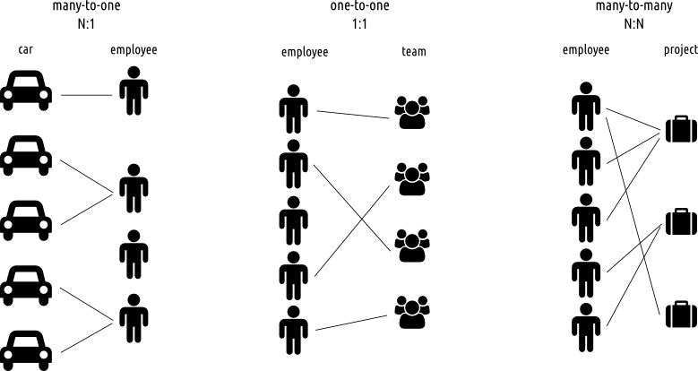
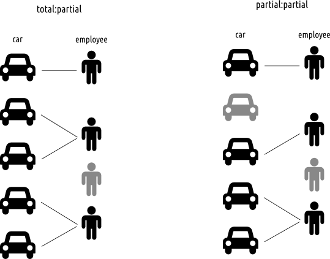
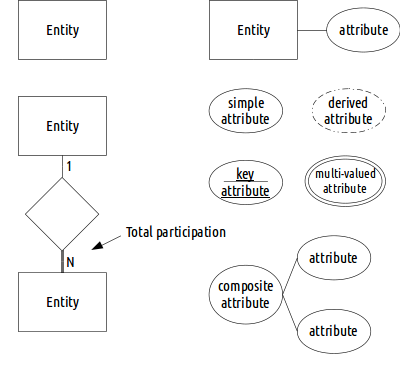
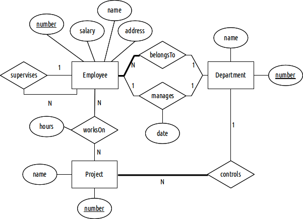

name: inverse
layout: true
class: center, middle, inverse
.indexlink[[<i class="fa fa-home"></i>](#) [<i class="fa fa-list"></i>](#index) [<i class="fa fa-paint-brush"></i>](../change-color.php)]

---

name: normal
layout: true
class: left, middle
.indexlink[[<i class="fa fa-home"></i>](#) [<i class="fa fa-list"></i>](#index) [<i class="fa fa-paint-brush"></i>](../change-color.php)]

---

template:inverse
# Entity-Relationship
<a href="http://www.fe.up.pt/~arestivo">André Restivo</a>

---

template:inverse
name:index
# Index

.indexlist[
1. [Introduction](#intro)
1. [Attributes](#attributes)
1. [Entities](#entities)
1. [Relationships](#relationships)
1. [Example](#example)
1. [Visual Notation](#notation)
]

---

template: inverse
name: intro
# Introduction

---

# Entity-Relationship Model

* Abstract and conceptual model for data representation.
* Database perspective as seen by the **developer**.
* Based on three key concepts: **entities**, **attributes** and **relationships**.

---

# Entities

Object or concept from the real world with an independent existence:

.box_example[**Physical** entity: car, employee, student, ...]

.box_example[**Conceptual** entity: class, profession, type, ...]

---

# Relationships and Attributes

**Relationships**: represent interactions between 2 or more entities.

.box_example[
car belongs to person.
]

**Attributes**: properties that describe an entity.

.box_example[
person has a name and an address.
]

---

template: inverse
name: attributes
# Attributes

---

# Attribute Domain

* In an entity-relationship schema, attributes represent the **values** that
will be stored in the database.
* An attribute should **never** be a reference to another entity.
* Attribute **domain**: The set of possible values for that attribute.

.box_example[
The email address attribute can only contain valid email addresses.
]

---

# Attributes: Simple and Composite

* **Simple**: Only one atomic component.
* **Composite**: Composed of several attributes.

.box_example[
Address is composed by a street name, a door number, an appartment
number and a zip code.
]

---

# Attributes: Single or Multi-Valued

* Single Valued: Only one value per entity.
* Multi-Valued: Possibly more than one value per entity.

.box_example[
A person can have several phone numbers.
]

---

# Attributes: Derived

* Attributes that can be calculated from other attributes or entities.
* They don’t need to be a part of the database.
* Nevertheless, they are commonly represented in the entity relationship model for completness sake.

.box_example[
A person’s age can be calculated from that person’s birth date.
]

---

# Attributes: Null

* Some attributes might allow null values.
* A null value can represent an **unknown** value or that the value is not **appliable**.

---

# Attributes: Keys

* Attribute, or set of attributes, that **uniquely** identifies an entity.
* No two entities of the same type, can have the same set of key values.

.box_example[
Two different cars cannot have the same plate number. If we know the
plate number we can identify the car it belongs to.
]

---

template: inverse
name: entities
# Entities

---

# Entity-Type

* The schema of a set of entities that share the same structure.
* Carachterized by the entity’s name and it’s attributes.

.box_example[
Employee (name, address, city)
]

---

# Notation
* Key Attribute: **underlined**.
* Composite Attribute: attribute name and **list** of composing attributes.
* Multi-valued Attribute: between **curly brackets**.

.small.box_example[
Employee (.key[number], name, address(street, number, apartment), {phone})
]

---

template: inverse
name: relationships
# Relationships

---

# Relationships
* A relationship is an association between one or more entity-types.
* Should be used instead of having attributes that reference other entities.

.box_example[
A car belongs to an employee.
]

* Never use the key attribute of another entity to mimic a relationship.

.box_error[Car (.key[plate], make, model, employee_num)]

.box_example[
Students are enrolled in a class.
]

---

#Notation

* Relationships are described by a name, the list of participant entities and its attributes.
* The name is normally an expression that makes sense when read in the following order:

.box_info[Entity1 → relationship → Entity2]

Examples:

.box_example[
belongsTo(Car, Person)
]
.box_example[
enrolled(Students, Class)
]

---

# Degree

Unary

.box_example[
supervises(Employee, Employee)
]

Binary (the most common)

.box_example[
belongsTo(Car, Person)
]

Ternary (can be transformed into binaries)

.box_example[
supplied(Supplier, Product, Project)
]

---

# Constraints

Allows us to limit the possible combinations between entities participating in a relationship.

Constraint types:
* Relationship **cardinality**.
* Entity **participation** in a relationship.

---

# Cardinality

N:1 ou 1:N (many-to-one) ou (one-to-many)
.box_example[
belongsTo(Car, Person) N:1
]

1:1 (one-to-one)
.box_example[
leaderOf(Employee, Team) 1:1
]

N:N (many-to-many)
.box_example[
worksOn(Employee, Project) N:N
]

---

# Cardinality

---

# Participation

* Total (existencial dependency): All entities of this type must participate in the relationship.
* Partial: Entities may not participate in the relationship.

.box_example[
belongsTo(Car, Person) N:1 t/p
]
.box_info[
All cars in the database must have an owner. Not all persons have to own cars.
]

---

# Participation

---

# Total Participation
* We should **only** label a participation as total when it is necessary to ensure that all entities participate in a relationship.
* A total participation is a **constraint**. It restricts the possible values for an attribute.
* It is most common in **N:1** relationships in the **many** side.

---

template: inverse
name: example
# Example

---

# Example
* A company has several departments.
* Each department has a name, a number and a manager. The date
when the manager was assigned to the department should also be
stored.
* A department controls a number of projects. Each project has a
name and a number.
* Each employee has a name, a number, an address and a salary.
* An employee belongs to a department but can work in many projects
(some of them from different departments).
* The number of hours each employee is supposed to work in each
project should also be saved.
* Each employee can have a supervisor assigned to him.

---

# Solution

##Entities

* Employee (.key[number], name, address, salary)
* Project (.key[number], name)
* Department (.key[number], name)

##Relationships

* manages (Employee, Department) 1:1 p/p
* controls (Department, Project) 1:N p/t
* belongsTo (Employee, Department) N:1 t/p
* worksOn (Employee, Project) N:N p/p
* supervises (Employee, Employee) 1:N p/p

---

template: inverse
name: notation
# Visual Notation

---

# Visual Notation

---

# Example

