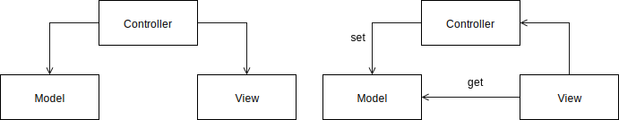
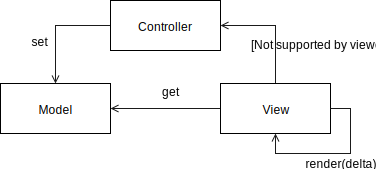
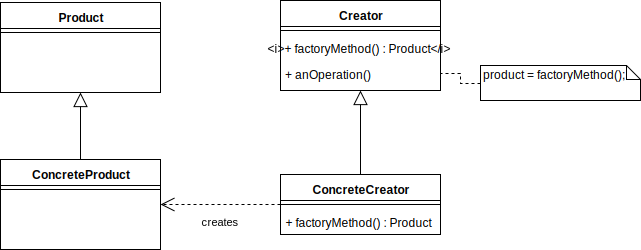
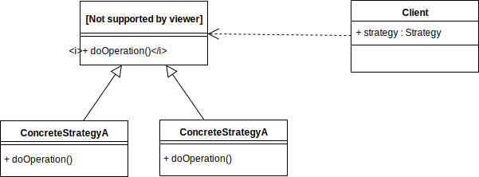
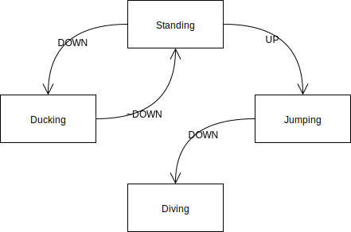
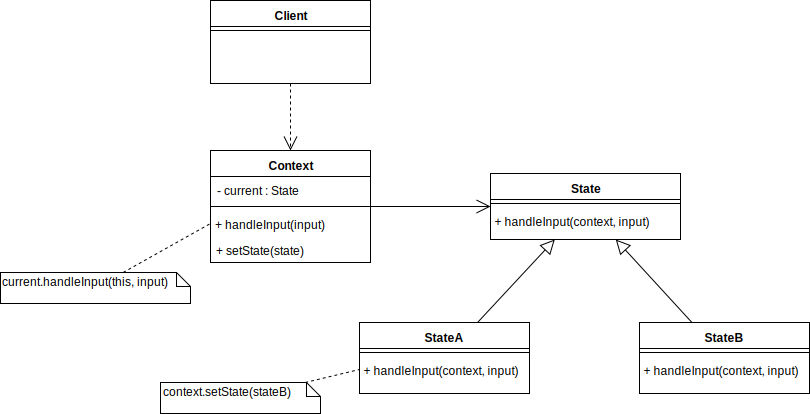
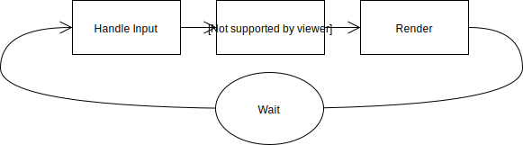
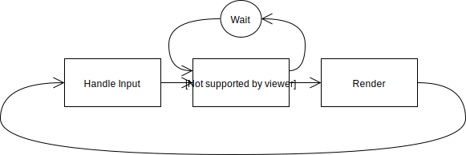
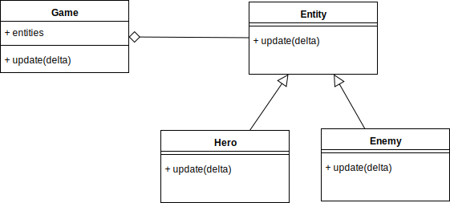
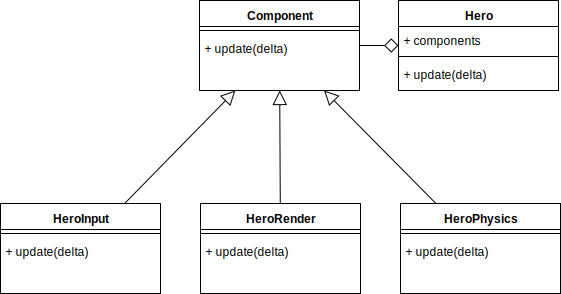

name: inverse
layout: true
class: center, middle, inverse
.indexlink[[<i class="fa fa-arrow-circle-o-up"></i>](#) [<i class="fa fa-list-ul"></i>](#index) [<i class="fa fa-tint"></i>](../change-color.php)[<i class="fa fa-file-pdf-o"></i>](download)]

---

name: normal
layout: true
class: left, middle
.indexlink[[<i class="fa fa-arrow-circle-o-up"></i>](#) [<i class="fa fa-list-ul"></i>](#index) [<i class="fa fa-tint"></i>](../change-color.php)[<i class="fa fa-file-pdf-o"></i>](download)]

---

template:inverse
# Design Patterns for Game Development
<a href="http://www.fe.up.pt/~arestivo">André Restivo</a>

---

template:inverse
name:index
# Index

.indexlist[
1. [Introduction](#intro)
1. [Singleton](#singleton)
1. [Observer](#observer)
1. [Factory](#factory)
1. [Flyweight](#flyweight)
1. [Object Pool](#pool)
1. [State](#state)
1. [Strategy](#strategy)
1. [Game Loop](#loop)
1. [Double Buffer](#buffer)
1. [Component](#component)
1. [Update Method](#update)
]

---

template:inverse
name:intro
# Patterns in Games

---

# Types of patterns

* Patterns for game designers: how should the game work

* Patterns for game **developers**: how should it be implemented

---

# Game Design Design Patterns

* High Level: FPS, Endless Runner, Platform, Shoot 'Em Up, Puzzle

* Low Level: Lives, Energy, Double Jump, Wall Jump, Stomp to Kill, ...

---

# Game Development Design Patterns

* What this presentation is about
* Writing maintanable code
* Writing efficient code
* Writing testable code

---

# References

* Design Patterns: Elements of Reusable Object-Oriented Software, GoF, 1994

* [Game Programming Patterns](http://gameprogrammingpatterns.com/contents.html), Robert (Bob) Nystrom

* [Source Making: Design Patterns](https://sourcemaking.com/design_patterns)

---

template:inverse
name:singleton

# Keep 'em Separated

---

# Motivation

Applications normally have a **data model** and a **user interface**.

In some cases, the application displays the **same data in different ways**.

User interface logic tends to **change** more frequently, be more **device-dependent** and be harder to **test** than business logic.

The way in which data is **presented** to the user should be **independent** from the data **representation**.

---

# Model View Controller (MVC)

There are [several different](http://homepage.lnu.se/staff/daweaa/papers/2014WICSA.pdf) interpretations of what constitutes a MVC architecture.

The most important aspect is that the model represents the data, and does nothing else. The model does **not** depend on the controller or the view.

The controller can either serve as **glue** between the model and the view or just be a **bridge** between user interaction and the model.

---

# Implementation

In the [AsteroidArena](https://github.com/arestivo/AsteroidArena) example, when the render method of the view is called is gets the data to be rendered from the model, advances the simulation by calling the controller and passes it any user inputs. The controller updates the model accordingly.

---

template:inverse
name:singleton

# One to rule them All 

---

# Motivation

Game needs **one, and only one**, instance of the GameModel, GameController and GameView classes. Theses classes are accessed in **several** different places of our code.

---

# Singleton .badge[GoF] .badge[Pattern]

Ensure a class has only one instance, and provide a global point of access to it.

.right.small[
[Singleton Pattern](https://sourcemaking.com/design_patterns/singleton), [Singleton in Games](http://gameprogrammingpatterns.com/singleton.html)
]

---

# Implementation

~~~java
public class GameController {
  private static GameController instance;

  public static GameController getInstance() {
    if (instance == null)
      instance = new GameController();
    return instance;
  }
}
~~~

~~~java
public class GameView {
  public void render(float delta) {
    GameController.getInstance().update(delta);
    /* ... */
  }
}
~~~

---

# Consequences

* They hide dependencies and promote bad code.

* They control their own creation and lifecycle.

* Code is tightly coupled; they make tests harder.

.right.small[
[Patterns I Hate #1: Singleton, Alex Miller](http://puredanger.github.io/tech.puredanger.com/2007/07/03/pattern-hate-singleton/)
]

---

template:inverse
name:observer
# I see You

---

# Motivation

Events in the physics engine, like collisions, must be **reflected** in the game model **without** keeping the objects **tightly coupled**. 

---

# Observer .badge[GoF] .badge[Pattern]

Define a one-to-many dependency between objects so that when **one** object changes state, all its **dependents** are **notified** and updated automatically.

.right.small[
[Observer Pattern](https://sourcemaking.com/design_patterns/observer), [Observer in Games](http://gameprogrammingpatterns.com/observer.html)
]

---

# Implementation

~~~java
world.setContactListener(new ContactListener() {
  @Override
  public void beginContact(Contact contact) {
  }

  @Override
  public void endContact(Contact contact) {
  }

  @Override
  public void preSolve(Contact contact, Manifold oldManifold) {
  }

  @Override
  public void postSolve(Contact contact, ContactImpulse impulse) {
  }
});

~~~

---

template:inverse
name:factory
#Just gimme one with 4 wheels

---

# Motivation

The *GameView* class knows when a *EntityView* needs to be created but not which one to create, as this depends on the *Model* the view will draw.

The *EntityView* class knows it has to create a *Sprite* but not how to create it, as it depends on its concrete subclasses.

---

# Factory .badge[GoF] .badge[Pattern]

Three similar patterns:

* **Factory**: Creates objects without exposing the instantiation logic to the client (not GoF).

* **Factory Method** : Define an interface for creating an object, but let the subclasses decide which class to instantiate. The Factory method lets a class defer instantiation to subclasses

* **Abstract Factory**: Provides an interface for creating families of related or dependent objects without specifying their concrete classes.

.right.small[
[Factory Method Pattern](https://sourcemaking.com/design_patterns/factory_method), [Abstract Factory Pattern](https://sourcemaking.com/design_patterns/abstract_factory)
]

---

# Factory: Implementation

~~~java
for (AsteroidModel asteroid : asteroids) {
  EntityView view = ViewFactory.makeView(game, asteroid);
  view.update(asteroid);
  view.draw(game.getBatch());
}
~~~

---

# Factory Method .badge[GoF] .badge[Pattern]

---

# Factory Method: Implementation

~~~java
public abstract class EntityView{
  EntityView(AsteroidArena game) {
      sprite = createSprite(game);
  }

  public void draw(SpriteBatch batch) {
      sprite.draw(batch);
  }

  public abstract Sprite createSprite(AsteroidArena game);
}
~~~

Also an instance of the [Template Method](https://sourcemaking.com/design_patterns/template_method) pattern.

---

template:inverse
name:flyweight
# The Forest for the Trees

---

# Motivation

We need to maintain a lot of asteroid objects but maintaining a sprite and/or texture for each one of them is expensive.

---

# Flyweight .badge[GoF] .badge[Pattern]

Use sharing to support large numbers of fine-grained objects efficiently.

.right.small[
[Flyweight Pattern](https://sourcemaking.com/design_patterns/flyweight), [Flyweight in Games](http://gameprogrammingpatterns.com/flyweight.html)
]

---

# Flyweight

Each **flyweight** object is divided into two pieces: the state-dependent (extrinsic) part, and the state-independent (intrinsic) part:

* Intrinsic state is stored (shared) in the Flyweight object.
* Extrinsic state is passed when operations are invoked.

---

# Implementation

~~~java
public class ViewFactory {
  private static Map<EntityModel.ModelType, EntityView> cache =
    new HashMap<EntityModel.ModelType, EntityView>();

  public static EntityView makeView(AsteroidArena game, EntityModel model) {
      if (!cache.containsKey(model.getType())) {
        if (model.getType() == BIGASTEROID) 
          cache.put(model.getType(), new BigAsteroidView(game));
        if (model.getType() == MEDIUMASTEROID) 
          cache.put(model.getType(), new MediumAsteroidView(game));
        /* ... */
      }
      return cache.get(model.getType());
  }
}
~~~

~~~java
for (AsteroidModel asteroid : asteroids) {
  EntityView view = ViewFactory.makeView(game, asteroid);
  view.update(asteroid);
  view.draw(game.getBatch());
}
~~~

---

template:inverse
name:pool
# Reuse. Restore. Recycle.

---

# Motivation

There are **never** a lot of *bullets* flying at one given moment; but they are created and destroyed at a very **high rate**. The cost of instantiating a class makes this prohibitive.

---

# Object Pool .badge[Pattern]

Improve **performance** and **memory** use by reusing objects from a fixed pool instead of allocating and freeing them individually.

.right.small[
[Object Pool Pattern](https://sourcemaking.com/design_patterns/object_pool), [Object Pool in Games](http://gameprogrammingpatterns.com/object-pool.html)
]

---

# Implementation

Using the *LibGDX Pool* class:

~~~java
Pool<BulletModel> bulletPool = new Pool<BulletModel>() {
  @Override
  protected BulletModel newObject() {
      return new BulletModel(0, 0, 0);
  }
};
~~~

Using the pool:

~~~java
BulletModel bullet = bulletPool.obtain();

bullet.setPosition(x, y);
bullet.setRotation(rotation);

bullets.add(bullet);
~~~

~~~java
bullets.remove(bullet);
bulletPool.free(bullet);
~~~

---

template:inverse
name:strategy
# Be Different

---

# Motivation

We have a mix of different enemies that perform several actions. For each action, each enemy can execute it using a **different** strategy / algorithm. We want to be able to **mix** those strategies in order to create more complex and diverse enemies.

Enemies can also **change** strategy depending on their current context.

---

# Strategy .badge[GoF] .badge[Pattern]

Define a family of algorithms, encapsulate each one, and make them interchangeable. Strategy lets the algorithm vary independently from the clients that use it.

.right.small[
[Strategy Pattern](https://sourcemaking.com/design_patterns/strategy)
]

---

template:inverse
name:state
# Running while Jumping

---

# Motivation

Our hero can walk, run, jump, shoot, duck but the ability to do each one of these things depends on its current state.

The next example was adapted from [here](http://gameprogrammingpatterns.com/state.html).

---

# Motivation

What's the problem with this code:

~~~java
if (Gdx.input.isKeyPressed(Input.Keys.UP)) {
  hero.setVerticalVelocity(JUMP_VELOCITY);
  setSprite(JUMP_SPRITE);
}
~~~

---

# Motivation

~~~java
if (Gdx.input.isKeyPressed(Input.Keys.UP)) {
  if (!jumping) {
    jumping = true;
    hero.setVerticalVelocity(JUMP_VELOCITY);
    setSprite(JUMP_SPRITE);
  }
}
~~~

Now lets add ducking!

---

# Motivation

Spot the problem:

~~~java
if (Gdx.input.isKeyPressed(Input.Keys.UP)) {
  /* Jump Code */
}
if (Gdx.input.isKeyPressed(Input.Keys.DOWN)) {
  if (!jumping) {
    setSprite(DUCK_SPRITE);
  }
}
if (Gdx.input.isKeyReleased(Input.Keys.DOWN)) {
    setSprite(STAND_SPRITE);
}
~~~

---

# Motivation

~~~java
if (Gdx.input.isKeyPressed(Input.Keys.UP)) {
  if (!jumping && !ducking) {
  /* Jump Code */
  }
}
if (Gdx.input.isKeyPressed(Input.Keys.DOWN)) {
  if (!jumping) {
    ducking = true;
    setSprite(DUCK_SPRITE);
  }
}
if (Gdx.input.isKeyReleased(Input.Keys.DOWN)) {
  if (ducking) {
    ducking = false;
    setSprite(STAND_SPRITE);
  }
}
~~~

Now the dive attack...

---

# Motivation

Bug hunting time:

~~~java
if (Gdx.input.isKeyPressed(Input.Keys.UP)) {
  if (!jumping && !ducking) {
  /* Jump Code */
  }
}
if (Gdx.input.isKeyPressed(Input.Keys.DOWN)) {
  if (!jumping) {
    ducking = true;
    setSprite(DUCK_SPRITE);
  } else {
    jumping = false;
    hero.setVerticalVelocity(-JUMP_VELOCITY);
    setSprite(DIVE_SPRITE);
  }
}
if (Gdx.input.isKeyReleased(Input.Keys.DOWN)) {
  /* Standing Code */
}
~~~

---

# Maybe we are doing it wrong

---

# State .badge[GoF] .badge[Pattern]

Allow an object to alter its behavior when its internal state changes. The object will appear to change its class.

.right.small[
[State Pattern](https://sourcemaking.com/design_patterns/state), [State Pattern in Games](http://gameprogrammingpatterns.com/state.html)
]

---

template:inverse
name:loop
# Groundhog Day

---

# Motivation

You have a **loop** that controls your game logic but you have **no control** over how **fast** the game runs. 

On a fast machine, that loop will spin so fast users won’t be able to see what’s going on. On a slow machine, the game will crawl. 

---

# Game Loop .badge[Pattern]

Decouple the progression of game time from user input and processor speed.

~~~java
while (true)
{
  double start = getCurrentTime();

  processInput();
  update();
  render();

  sleep(start + MS_PER_FRAME - getCurrentTime());
}
~~~

---

# Game Loop

The game logic/physics step is the one that is most vulnerable to hardware changes.

.right.small[
[Game Loop Pattern](http://gameprogrammingpatterns.com/game-loop.html), [Fix your Timestep](http://gafferongames.com/game-physics/fix-your-timestep/)
]

---

template:inverse
name:buffer
# Make it Smooth

---

# Motivation

When the game draws the world the users see, it does so **one piece at a time**. If the user watched the view draw incrementally like that, the **illusion** of a coherent world would be **shattered**. 

---

# Double Buffer .badge[Pattern]

Instead of drawing directly into the screen, use an intermediate buffer instead; then swap the screen contents with the buffer instantaneously. 

* Done automatically by most game engines

* Not only for graphics

.right.small[
[Double Buffer Pattern](http://gameprogrammingpatterns.com/double-buffer.html)
]

---

template:inverse
name:update
# Time goes by

---

# Motivation

Our game needs enemies. Making an enemy go back and fourth is
straightforward but keeps the game in an infinite loop.

~~~java
while (true)
{
  for (double x = 0; x < 100; x++)
    enemy.setX(x);

  for (double x = 100; x > 0; x--)
    enemy.setX(x);
}
~~~

---

# Update Method .badge[Pattern]

The game world maintains a collection of objects. Each object implements an update method that simulates one frame of the object’s behavior. Each frame, the game updates every object in the collection.

---

template:inverse
name:component
# Many Making One

---

# Motivation

We create a *Hero* class. 

Since the player controls him, that means reading **controller input** and translating that input into **motion**. He needs to interact with the level, that means some **physics** and **collision** detection. He also has to show up on screen, so we add **animation** and **rendering**. 

This leads to unmaintanable code very fast.

---

# Component .badge[Pattern]

Allow a single entity to span multiple domains without coupling the domains to each other.

.right.small[
[Component Pattern](http://gameprogrammingpatterns.com/component.html)]
