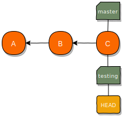
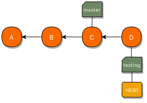
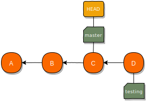
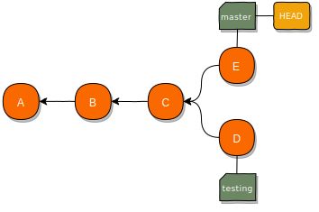
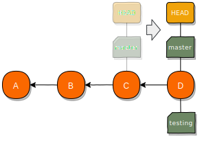
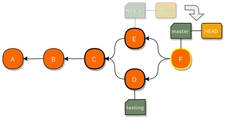
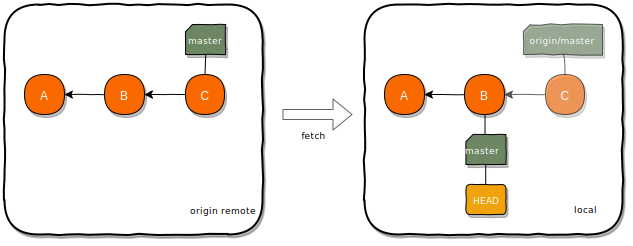
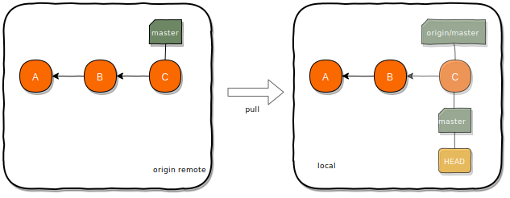
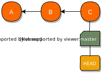

name: inverse
layout: true
class: center, middle, inverse
.indexlink[[<i class="fa fa-arrow-circle-o-up"></i>](#) [<i class="fa fa-list-ul"></i>](#index) [<i class="fa fa-tint"></i>](../change-color.php)[<i class="fa fa-file-pdf-o"></i>](download)]

---

name: normal
layout: true
class: left, middle
.indexlink[[<i class="fa fa-arrow-circle-o-up"></i>](#) [<i class="fa fa-list-ul"></i>](#index) [<i class="fa fa-tint"></i>](../change-color.php)[<i class="fa fa-file-pdf-o"></i>](download)]

---

template:inverse
# Git
<a href="http://www.fe.up.pt/~arestivo">André Restivo</a>

---

template:inverse
name:index
# Index

.indexlist[
1. [Introduction](#intro)
1. [Git Basics](#basics)
2. [Local](#local)
3. [Branches](#branches)
4. [Remotes](#remotes)
4. [Reverting](#reverting)
6. [Workflows](#workflows)
6. [More](#more)
]

---

template:inverse
name:intro
# Introduction

---

# Version Control Systems (VCS)

A system that records changes to a file or set of files over time.


It allows you to:

- **revert** selected files, or a project, back to a previous state
- **compare** changes over time
- see **who modified** something
- ...

AKA Source Control Management (**SCM**)

---

# Local VCS

* Local VCS use a simple database that keeps all changes to files under revision control.
* Most store only the differences between files instead of copies of each version.
* Examples: [RCS](https://www.gnu.org/software/rcs/)


---

# Centralized VCS

* A **single server** that contains all the versioned files.
* Computers can **checkout** a particular file version.
* Examples: [CVS](http://cvs.nongnu.org/), [Subversion](https://subversion.apache.org/)


---

# Centralized VCS 

Advantages:

* Everyone knows what everyone is doing.
* **Fine grained control** over who can do what.

Disadvantages:

* Single point of **failure**.
* Needs constant **connectivity**.
* Backups are **mandatory**.

---

# Distributed VCS

* All clients **fully mirror** the repository, including its **full history**.
* There is **no difference** between a server and a client.
* But one, or more, computers can be used as a **central point** of synchronization.
* Allows lots of different **workflows**.


Examples: [Git](https://git-scm.com/), [Mercurial](https://www.mercurial-scm.org/), [Bazaar](http://bazaar.canonical.com/en/), [Darcs](http://darcs.net/)


---

template:inverse
name:basics
# Git Basics

---

# Basics

**Snapshots**:
  * Does **not** store only the differences between versions of a file. 
  * Instead, it saves them as a series of **snapshots**.
  * But, if files have not changed, it does not store them again (**link**).

**Local**: Most Git operations are **local**.

**Integrity**: 
  * Everything in Git is *checksummed* (**SHA-1**) before it is stored.
  * Everything is then **referred** to by that **checksum**.
  * Checksum example: <code>7e16b5527c77ea58bac36dddda6f5b444f32e81b</code>

---

# Versions

Each version (aka a **commit**) is a snapshot of that version files.

If not changed, files are just **links** to a previous version.

All objects (files, commits, ...) have an **hash** identifier.


---

# Git Areas

The **Git directory** is where Git stores the metadata and object database for your project.

The **working tree** is a single **checkout** of one version of the project. 

The **staging area** (or **index**) is a file in your Git directory that stores information about what will go into your next commit.


---

# File States

Files in the working directory can be in different states:


---

template:inverse
name:local
# Local Git
Git as a **local** VCS

---

# Create a Repository

Enter a local directory, currently not under version control:

```bash
cd project
```

And turn it into a Git repository:

```bash
git init
```

This will create an hidden *.git* subdirectory containing all of your necessary repository files.

---

# Add

The [add](https://git-scm.com/docs/git-add) command can be used to:
  1. **Track** and **stage** a file that is currently **not tracked** by Git.
  2. Stage a file that has been **modified**.

```bash
$ echo "hello git" > README    # File is created
$ git add README               # File is now tracked and staged
```

You can use the **--all** or **-A** flag to stage all untracked **or** modified files.

```bash
$ echo "hello git" > README    # File is created
$ git add --all                # File is now tracked and staged
```

---

# Commit

The [commit](https://git-scm.com/docs/git-commit) command records a new snapshot to the repository:

```bash
$ echo "hello git" > README    # File is created
$ git add README               # File is now tracked and staged
$ git commit                   # Commits the file
```

After running commit, Git will open your [predefined](https://git-scm.com/book/en/v2/Customizing-Git-Git-Configuration) text editor so that you can write a small commit message (or use the **--message** or **-m** flag).

The **--all** or **-a** flag automatically stages any **modified** (tracked) files:

```bash
$ echo "goodbye git" > README      # Already tracked file is modified
$ git commit -a -m "Edited README" # Stages and commits the file
```

---

# Status

The [status](https://git-scm.com/docs/git-status) command can be used to determine which files are in which state:

```bash
$ echo "hello git" > README    # File is created
$ git status                   # Asking for file status
On branch master

No commits yet

Untracked files:
  (use "git add <file>..." to include in what will be committed)


        README

nothing added to commit but untracked files present (use "git add" to track)
```

The **--short** (or **-s**) flag can be used to get a more concise output:

```bash
$ git status --short            # Asking for file status
?? README
$ git add README                # File is now tracked and staged
$ git status --short            # Asking for file status
A  README
```

---

# Status

Notice that the **git status -s** command consists of two columns for each file.

```bash
$ echo "hello git" > README      # File is created
$ git status -s
?? README                        # File is untracked
```

The first column has information about the **staging area** and the second one about
the **working directory**. In this case the file is untracked on both.

```bash
$ git add README                 # Modifications are staged
$ git status -s
A  README                        # File added to staging area
```

Now the file has been added in the staging area.

```bash
$ git commit -m "Added README"   # Commiting changes
$ git status -s
```

Now the file has been commited and is unmodified.

---

# Partially Staged Files

A file can be partially staged:

```bash
$ echo "some text" > README     # File is modified
$ git add README                # Modifications are staged
$ echo "another text" >> README # File is modified again
$ git status -s
AM README                       # Added to staging area and modified
```

.small[
  
1) Commiting again would only commit the initial staged edits:

```bash
$ git commit -m "Added some text"      # Commiting initial edit
$ git status -s
 M README                              # File now still has changes
$ git add README                       # Staging those changes
M  README
$ git commit -m "Added another text"   # Commiting following edits
```

2) We can also only commit once:

```bash
$ git add README                               # Staging following changes
$ git status -s
A  README                                      # All changes staged
$ git commit -m "Added some and another text"  # Commiting both changes at once
```
]

---

# Remove

If you delete a file from your working area, it will appear as a change that needs to be staged in order to be reflected in the repository:

```bash
$ rm README                       # File is removed from working directory
$ git status -s
 D README                         # File removed in working tree
$ git add README                  # File removal is staged
$ git status -s
D  README                         # File removed in staging area
$ git commit -m "Removed README"  # File removal is committed
```

The **git rm** command simplifies this operation by removing the file from the working directory and staging that change at the same time.

```bash
$ git rm README                   # Removed from working directory and staged
$ git status -s
D  README                         # File removed in staging area
$ git commit -m "Removed README"  # File removal is committed
```

---

# History

The **log** command allows you to see the **commit history** of a repository.

```bash
$ git log
commit 41138ac70c5b32239c0000824d8d64315cb50d84 (HEAD -> master)
Author: User <user@email.com>
Date:   Thu Feb 7 09:55:36 2019 +0000

    Modified README

commit 5621668b7f21c4a06385e123d6ee20d1beb6fa1d
Author: User <user@email.com>
Date:   Thu Feb 7 09:55:15 2019 +0000

    Added README
```

* We can see by **whom** and **when** each commit was made.
* We can see the commit **message**.
* And also the **hash** of each commit.

---

# Simplified History

The **--oneline** flag produces a simplified version of the log.

```bash
$ git log --oneline
41138ac (HEAD -> master) Modified README
5621668 Added README
```

We can also limit the number of entries to be shown.

```bash
$ git log --oneline -1
41138ac (HEAD -> master) Modified README
```

---

# Patches

The **--patch** (or **-p**) flag  shows the difference (the [patch](http://savannah.gnu.org/projects/patch/) output) introduced in each commit.

```bash
$ git log -1 -p
commit 41138ac70c5b32239c0000824d8d64315cb50d84 (HEAD -> master)
Author: User <user@email.com>
Date:   Thu Feb 7 09:55:36 2019 +0000

    Modified README

diff --git a/README b/README
index 7b57bd2..2e24352 100644
--- a/README
+++ b/README
@@ -1 +1,2 @@
 some text
+another text
```

The output is rather intimidating but it allows you to see what changed in each commit.

---

template:inverse
name:branches
# Branches

---

# Commits

As we have seen before, files are stored as **blobs** and identified by an **hash**.

Versions (or commits) are just a **snapshot**, also identified by an **hash**, pointing to a series of blobs.


Each commit contains the author’s **name** and **email** address, the **message** that was typed, and pointers to the commit (or commits) that directly came before this commit (its **parent** or parents).

---

# Commits

In this specific example we have 3 commits:

1. **3523e920** - The initial commit where a README file was added.
2. **70aca513** - A second commit where a LICENSE file was added.
3. **f4d54ef1** - A third commit where the README file was modified.


From now on, we will use a simplified version of this commit tree:


---

# Branches

A **branch** in Git is simply a lightweight movable **pointer** to one of these commits. 

The **default** branch name in Git is *master*. 

As you start making commits, you’re given a *master* branch that points to the **last** commit you made. 


Every time you commit, the *current* branch pointer moves **forward** **automatically**.

---

# Head

Git uses a special pointer called HEAD that always points to your current branch.


And now this makes a little bit more sense:

```bash
$ git log --oneline
f4d54ef (HEAD -> master) Modified README
70aca51 Added LICENSE
3523e92 Added README
```

---

# Creating Branches

To create a branch we use the **branch** command. This only creates the branch, it does not move the HEAD:

```bash
$ git branch testing
```


The **branch** command can also show the current local branches.

```bash
$ git branch
* master                  # The asterisk (*) represents the HEAD
  testing
```

---

# Checkout

To change to another branch we can use the **checkout** command:

```bash
$ git checkout testing
  master
* testing
```




We can also create and checkout a new branch using the **-b** flag: 

```bash
$ git checkout -b testing
```

---

# Moving the HEAD

If we create a new commit now:

```bash
$ echo "more license info" >> LICENSE
git commit -a -m "Testing LICENSE"
```



We can see that **only the current branch**, the one pointed by the HEAD, **moved**.

---

# Checkout

If we **checkout** the *master* branch again, two things happen:

```bash
$ git checkout master
```

1. The HEAD moves to the commit pointed by the **master** branch.
2. Our files are reverted to the snapshot that **master** points to.



This means we are now working on top of a version that has **already been changed**. Any changes we make will create a **divergent history**.

---

# Divergent Histories

Now that we are back to our master branch, lets do some more changes:

```bash
$ git checkout master
$ echo "license looks better this way" >> LICENSE
git commit -a -m "Better LICENSE"
```



Now we have two divergent histories that have to be **merged** together.

---

# Merging

Merging is done by using the merge command:

```bash
$ git checkout master
$ git merge testing
```

Git merges the **identified** branch **into** the **current** branch.

Git uses **two main strategies** to merge branches:
  * Fast-forward merge: when there is **no divergent** work
  * Three-way merge: when there is **divergent** work

---

# Fast-forward Merge

When you merge one commit with a commit that can be reached by following the first commit’s history because there is **no divergent work** to merge together, Git just **moves the branch pointer forward**.

```bash
$ git checkout master
$ git merge testing
```




---

# Three-way Merge

When the commit on the branch you’re on **isn’t a direct ancestor** of the branch you’re merging in, Git uses the **two** snapshots pointed to by the **branch tips** and the **common ancestor** of the two to create **a new commit**.

```bash
$ git checkout master
$ git merge testing
```



---

# Deleting Branches

If you do not need a branch any longer, you can just delete it.

Deleting a branch leaves all commits alone and only deletes the pointer.

```bash
$ git branch -d testing
```

---

# Conflicts

If you changed the **same part** of the **same file** differently in the two branches you’re merging, Git **won’t be able** to merge them cleanly:

```bash
$ git merge testing
Auto-merging README
CONFLICT (content): Merge conflict in README
Automatic merge failed; fix conflicts and then commit the result.
```

You can use the **status** command to see which files have conflicts:

```bash
$ git status
On branch master
You have unmerged paths.
  (fix conflicts and run "git commit")
  (use "git merge --abort" to abort the merge)

Unmerged paths:
  (use "git add <file>..." to mark resolution)

        both modified:   README

no changes added to commit (use "git add" and/or "git commit -a")
```

---

# Resolving Conflicts

Editing the file with conflicts we can see the conflict:

```txt
This is a README file
<<<<<<< HEAD
This was added in the master branch
=======
This was added in the testing branch
>>>>>>> testing
```

To solve it we just have to edit the file:

```txt
This is a README file
This was added in the master branch
This was added in the testing branch
```

And commit the merge:

```bash
$ git commit
```

---

# Git Ignore

* A *.gitignore* file specifies intentionally untracked files that **Git should ignore**. Files already tracked by Git are not affected.

* Each line in a *.gitignore* file specifies a [pattern](https://git-scm.com/docs/gitignore#_pattern_format).

* Some examples:

```bash
# this is a comment
docs/          # everything inside root directory docs
**/docs/       # any docs directory
!docs/**/*.txt # don't ignore (!) any .txt files inside directory docs
```

**What** files to ignore: 1) not used by your project, 2) not used by anyone else and 3) generated by another process.

---

template:inverse
name:remotes
# Remotes

---

# Remotes

Remote repositories are **versions** of your project that are hosted **elsewhere** (another folder, the local network, the internel, ...).

You can push and pull data to and from remotes but first you need to learn how to configure them properly.

---

# Cloning

The easiest way to end up with a remote, is to **clone** another repository.

```bash
$ git clone https://example.com/test-repository
Cloning into 'test-repository'...
remote: Enumerating objects: 129, done.
remote: Counting objects: 100% (129/129), done.
remote: Compressing objects: 100% (73/73), done.
remote: Total 129 (delta 54), reused 115 (delta 44), pack-reused 0
Receiving objects: 100% (129/129), 46.90 KiB | 565.00 KiB/s, done.
Resolving deltas: 100% (54/54), done.
```

To list our remotes (the verbose **-v** flag gives us some info about the URL):

```bash
$ git remote -v
origin  https://example.com/test-repository (fetch)
origin  https://example.com/test-repository (push)
```

We can see that git named our remote **origin** and set it up for both **fetching** and **pushing** data.

---

# Protocols

Git can use **four** major network protocols to transfer data to and from **remotes**:

* **Local** - Useful if you have access to a shared mounted directory.
* **Git** - A special daemon that comes packaged with Git. SSH but without authentication or encryption.
* **SSH** - The most commonly used protocol.
* **HTTP** - Easiest to setup for read-only scenarios but very slow.

---

# Adding Remotes

Besides the origin remote from where we cloned our project, we can add more remotes:

```bash
git remote add john http://john-laptop.org/test-repository
```

In this example, we added a new remote and gave it the alias *john*:


```bash
$ git remote -v
origin  https://example.com/test-repository (fetch)
origin  https://example.com/test-repository (push)
john  http://john-laptop.org/test-repository (fetch)
john  http://john-laptop.org/test-repository (push)
```

---

# Fetching

Fetching pulls down all the data from a remote project that you don’t have yet. 

After fetching, you will also have references to all the branches from that remote.

```bash
$ git fetch origin
```

.smaller[

]

Fetching **only downloads** the data to your local repository. It doesn’t automatically merge it with any of your work or modify what you’re currently working on. 

---

# Tracking Branches

Tracking branches are local branches that have a **direct relationship** to a remote branch.

When you clone a repository, it generally **automatically** creates a **master** branch that tracks **origin/master**.

You can set up other tracking branches:

```bash
$ git checkout --track origin/feature # creates a local feature branch
                                    # that tracks origin/feature
```

---

# Pulling

If your current branch is set up to **track** a remote branch, you can use the **git pull** command to automatically **fetch** and then **merge** that remote branch into your current branch.

```bash
$ git pull origin master # fetches and merges origin/master
```

.smaller[

]

This fetches data from the server you originally cloned from and automatically tries to merge it into the code you are currently working on.

```bash
$ git pull # uses default values for current local branch 
```

---

# Pushing

Pushes local modifications to a remote. Only fast-forward merges are allowed so you might need to fetch and merge locally first.

```bash
$ git pull # or git pull origin master
$ echo "some changes" >> README
$ git commit -a -m "Made some changes"
$ git push # or git push origin master
```

.smaller[

]


With the **-u** flag, it also sets the local branch to track the remote branch.

---

# Git Hosts

Some free (for **open** source, **education** and **small** projects) git hosts you can use:

* [GitHub](https://github.com/)
* [BitBucket](https://bitbucket.org/)
* [GitLab](https://gitlab.com/)
* [SourceForge](https://sourceforge.net/)

---

template:inverse
name:reverting
# Reverting

---

# Reset 

The **reset** command resets the current branch HEAD to a certain commit.

These are some of the many different modes it can operate under:

* **--soft** - Does not touch the index<sup>1</sup> file or the working tree at all.
* **--hard** - Resets the index and working tree.
* **--mixed** - Resets the index but not the working tree (**default mode**).

<sup>1</sup> The staging area.
---

# Local unstaged changes

If you haven't staged or commited the changes you want to revert you can:

```bash
$ git checkout -- README # undo changes to a single file
```

```bash  
$ git reset --hard       # discard all local changes
```

---

# Staged but uncommited changes

If you have staged the changes you want to revert but haven't commited them yet, you can:

```bash
$ git reset HEAD <file>  # unstage changes to a single file
```

```bash
$ git reset # unstage all changes
```

---

# Commited but not pushed

If you have already commited the changes you want to revert but haven't pushed them to a remote yet, you can find the *commit-id* you want to revert to and:

```bash
$ git reset --hard <commit-id>
```

---

# Commited and already pushed

You should try, **really hard**, to never rewrite public history.

For that reason, if you want to revert a file that was already pushed, your best bet is to use revert:

```bash
$ git revert <commit-id>
```

This will introduce the changes needed to revert the ones done by the commit without deleting the commit from history.

---

# Relative commits

The ~(tilde) and ^(caret) symbols are used to point to a position relative to a specific commit.

* COMMIT^ refers to the previous commit to COMMIT.
* COMMIT^^ refers to the previous commit to COMMIT^.
* COMMIT~2 refers to two commit previous to COMMIT.
* And so on...



---

template:inverse
name:workflows
# Workflows

---

# Workflows

There are endless different ways to use Git. For example:

* Having **feature branches** for each new feature.
* Having **release branches** where releases can be maintained. 
* Hot fix branches to quickly patch production releases. 

---

# Git Flow

Git Flow is one way, but not the only one, of using git.

.smaller[

]

What's important is that you are consistent in the way you use Git.

---

template:inverse
name:more
# More

---

# More stuff

Things we haven't talked about:

* [Tags](https://git-scm.com/book/en/v2/Git-Basics-Tagging) - Really just unmovable branches. Useful for marking releases.
* [Rebase](https://git-scm.com/book/en/v2/Git-Branching-Rebasing) - A different and cleaner way to merge.
* [Hooks](https://git-scm.com/book/en/v2/Customizing-Git-Git-Hooks) - IFTTT for Git.
* [Blame](https://git-scm.com/docs/git-blame) - Who broke the code?
* [Bisect](https://git-scm.com/book/en/v2/Git-Tools-Debugging-with-Git) - Finding a bad commit.
* [Stash](https://git-scm.com/book/en/v1/Git-Tools-Stashing) - Save these changes for later.
* [Pull requests](https://help.github.com/articles/about-pull-requests/) - Please take my code...
* And so much more...