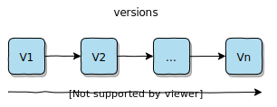
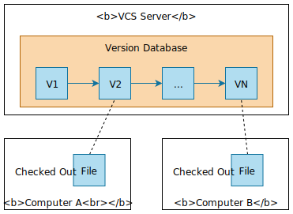
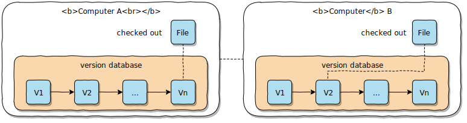
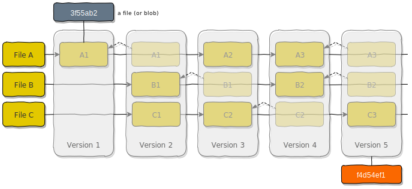
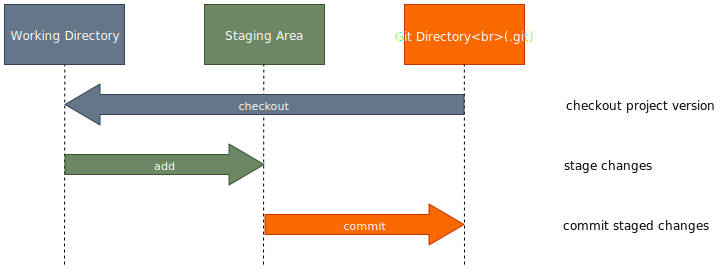
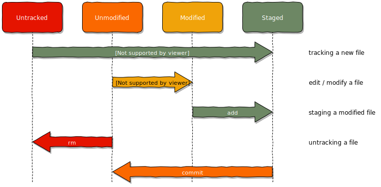
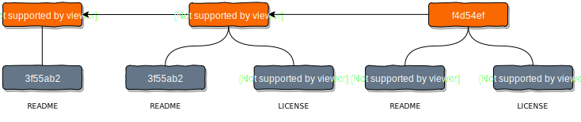
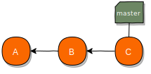
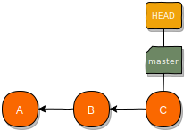
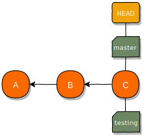

name: inverse
layout: true
class: center, middle, inverse
.indexlink[[<i class="fa fa-arrow-circle-o-up"></i>](#) [<i class="fa fa-list-ul"></i>](#index) [<i class="fa fa-tint"></i>](../change-color.php)[<i class="fa fa-file-pdf-o"></i>](download)]

---

name: normal
layout: true
class: left, middle
.indexlink[[<i class="fa fa-arrow-circle-o-up"></i>](#) [<i class="fa fa-list-ul"></i>](#index) [<i class="fa fa-tint"></i>](../change-color.php)[<i class="fa fa-file-pdf-o"></i>](download)]

---

template:inverse
# Git
<a href="http://www.fe.up.pt/~arestivo">André Restivo</a>

---

template:inverse
name:index
# Index

.indexlist[
1. [Introduction](#intro)
1. [Git Basics](#basics)
2. [Local](#local)
3. [Branches](#branches)
4. [Remotes](#remotes)
5. [Servers](#servers)
6. [Workflows](#workflows)
]

---

template:inverse
name:intro
# Introduction

---

# Version Control Systems (VCS)

A system that records changes to a file or set of files over time.



It allows you to:

- **revert** selected files, or a project, back to a previous state
- **compare** changes over time
- see **who modified** something
- ...

AKA Source Control Management (**SCM**)

---

# Local VCS

* Local VCS use a simple database that keeps all changes to files under revision control.
* Most store only the differences between files instead of copies of each version.
* Examples: [RCS](https://www.gnu.org/software/rcs/)


---

# Centralized VCS

* A **single server** that contains all the versioned files.
* Computers can **checkout** a particular file version.
* Examples: [CVS](http://cvs.nongnu.org/), [Subversion](https://subversion.apache.org/)



---

# Centralized VCS 

Advantages:

* Everyone knows what everyone is doing.
* **Fine grained control** over who can do what.

Disadvantages:

* Single point of **failure**.
* Needs constant **connectivity**.
* Backups are **mandatory**.

---

# Distributed VCS

* All clients **fully mirror** the repository, including its **full history**.
* There is **no difference** between a server and a client.
* But one, or more, computers can be used as a **central point** of synchronization.
* Allows lots of different **workflows**.



Examples: [Git](https://git-scm.com/), [Mercurial](https://www.mercurial-scm.org/), [Bazaar](http://bazaar.canonical.com/en/), [Darcs](http://darcs.net/)


---

template:inverse
name:basics
# Git Basics

---

# Basics

**Snapshots**:
  * Does **not** store only the differences between versions of a file. 
  * Instead, it saves them as a series of **snapshots**.
  * But, if files have not changed, it does not store them again (**link**).

**Local**: Most Git operations are **local**.

**Integrity**: 
  * Everything in Git is *checksummed* (**SHA-1**) before it is stored.
  * Everything is then **referred** to by that **checksum**.
  * Checksum example: <code>7e16b5527c77ea58bac36dddda6f5b444f32e81b</code>

---

# Versions

Each version (aka a **commit**) is a snapshot of that version files.

If not changed, files are just **links** to a previous version.

All objects (files, commits, ...) have an **hash** identifier.



---

# Git Areas

The **Git directory** is where Git stores the metadata and object database for your project.

The **working tree** is a single **checkout** of one version of the project. 

The **staging area** (or **index**) is a file in your Git directory that stores information about what will go into your next commit.



---

# File States

Files in the working directory can be in different states:



---

template:inverse
name:local
# Local Git
Git as a **local** VCS

---

# Create a Repository

Enter a local directory, currently not under version control:

```bash
cd project
```

And turn it into a Git repository:

```bash
git init
```

This will create an hidden *.git* subdirectory containing all of your necessary repository files.

---

# Add

The [add](https://git-scm.com/docs/git-add) command can be used to:
  1. **Track** and **stage** a file that is currently **not tracked** by Git.
  2. Stage a file that has been **modified**.

```bash
$ echo "hello git" > README    # File is created
$ git add README               # File is now tracked and staged
```

You can use the **--all** or **-A** flag to stage all untracked **or** modified files.

```bash
$ echo "hello git" > README    # File is created
$ git add --all                # File is now tracked and staged
```

---

# Commit

The [commit](https://git-scm.com/docs/git-commit) command records a new snapshot to the repository:

```bash
$ echo "hello git" > README    # File is created
$ git add README               # File is now tracked and staged
$ git commit                   # Commits the file
```

After running commit, Git will open your [predefined](https://git-scm.com/book/en/v2/Customizing-Git-Git-Configuration) text editor so that you can write a small commit message (or use the **--message** or **-m** flag).

The **--all** or **-a** flag automatically stages any **modified** (tracked) files:

```bash
$ echo "goodbye git" > README      # Already tracked file is modified
$ git commit -a -m "Edited README" # Stages and commits the file
```

---

# Status

The [status](https://git-scm.com/docs/git-status) command can be used to determine which files are in which state:

```bash
$ echo "hello git" > README    # File is created
$ git status                   # Asking for file status
On branch master

No commits yet

Untracked files:
  (use "git add <file>..." to include in what will be committed)


        README

nothing added to commit but untracked files present (use "git add" to track)
```

The **--short** (or **-s**) flag can be used to get a more concise output:

```bash
$ git status --short            # Asking for file status
?? README
$ git add README                # File is now tracked and staged
$ git status --short            # Asking for file status
A  README
```

---

# Status

Notice that the **git status -s** command consists of two columns for each file.

```bash
$ echo "hello git" > README      # File is created
$ git status -s
?? README                        # File is untracked
```

The first column has information about the **staging area** and the second one about
the **working directory**. In this case the file is untracked on both.

```bash
$ git add README                 # Modifications are staged
$ git status -s
A  README                        # File added to staging area
```

Now the file has been added in the staging area.

```bash
$ git commit -m "Added README"   # Commiting changes
$ git status -s
```

Now the file has been commited and is unmodified.

---

# Partially Staged Files

A file can be partially staged:

```bash
$ echo "some text" > README    # File is modified
$ git add README               # Modifications are staged
$ echo "another text" > README # File is modified again
$ git status -s
AM README                      # Added to staging area and modified
```

1) Commiting again would only commit the initial staged edits:

```bash
$ git commit                   # Commiting initial edit
$ git status -s
 M README                      # File now still has changes
$ git add README               # Staging those changes
M  README
$ git commit                   # Commiting following edits
```

2) We can also only commit once:

```bash
$ git add README               # Staging following changes
$ git status -s
A  README                      # All changes staged
$ git commit                   # Commiting both changes at once
```

---

# Remove

If you delete a file from your working area, it will appear as a change that needs to be staged in order to be reflected in the repository:

```bash
$ rm README                       # File is removed from working directory
$ git status -s
 D README                         # File removed in working tree
$ git add README                  # File removal is staged
$ git status -s
D  README                         # File removed in staging area
$ git commit -m "Removed README"  # File removal is committed
```

The **git rm** command simplifies this operation by removing the file from the working directory and staging that change at the same time.

```bash
$ git rm README                   # Removed from working directory and staged
$ git status -s
D  README                         # File removed in staging area
$ git commit -m "Removed README"  # File removal is committed
```

---

# History

The **log** command allows you to see the **commit history** of a repository.

```bash
$ git log
commit 41138ac70c5b32239c0000824d8d64315cb50d84 (HEAD -> master)
Author: User <user@email.com>
Date:   Thu Feb 7 09:55:36 2019 +0000

    Modified README

commit 5621668b7f21c4a06385e123d6ee20d1beb6fa1d
Author: User <user@email.com>
Date:   Thu Feb 7 09:55:15 2019 +0000

    Added README
```

* We can see by **whom** and **when** each commit was made.
* We can see the commit **message**.
* And also the **hash** of each commit.

---

# Simplified History

The **--oneline** flag produces a simplified version of the log.

```bash
$ git log --oneline
41138ac (HEAD -> master) Modified README
5621668 Added README
```

We can also limit the number of entries to be shown.

```bash
$ git log --oneline -1
41138ac (HEAD -> master) Modified README
```

---

# Patches

The **--patch** (or **--p**) flag  shows the difference (the [patch](http://savannah.gnu.org/projects/patch/) output) introduced in each commit.

```bash
$ git log -1 -p
commit 41138ac70c5b32239c0000824d8d64315cb50d84 (HEAD -> master)
Author: User <user@email.com>
Date:   Thu Feb 7 09:55:36 2019 +0000

    Modified README

diff --git a/README b/README
index 7b57bd2..2e24352 100644
--- a/README
+++ b/README
@@ -1 +1 @@
-some text
+another text
```

The output is rather intimidating but it allows you to see what changed in each commit.

---

template:inverse
name:branches
# Branches

---

# Commits

As we have seen before, files are stored as **blobs** and identified by an **hash**.

Versions (or commits) are just a **snapshot**, also identified by an **hash**, pointing to a series of blobs.



Each commit contains the author’s **name** and **email** address, the **message** that was typed, and pointers to the commit (or commits) that directly came before this commit (its **parent** or parents).

---

# Commits

In this specific example we have 3 commits:

1. **3523e920** - The initial commit where a README file was added.
1. **70aca513** - A second commit where a LICENSE file was added.
1. **f4d54ef1** - A third commit where the README file was modified.


From now on, we will use a simplified version of this commit tree:


---

# Branches

A **branch** in Git is simply a lightweight movable **pointer** to one of these commits. 

The **default** branch name in Git is *master*. 

As you start making commits, you’re given a *master* branch that points to the **last** commit you made. 



Every time you commit, the *current* branch pointer moves **forward** **automatically**.

---

# Head

Git uses a special pointer called HEAD that always points to your current branch.



And now this makes a little bit more sense:

```bash
$ git log --oneline
f4d54ef (HEAD -> master) Modified README
70aca51 Added LICENSE
3523e92 Added README
```

---

# Creating Branches

To create a branch we use the **branch** command:

```bash
git branch testing
```

This only creates the branch, it does not move the HEAD:



```bash
$ git branch
* master
  testing
```