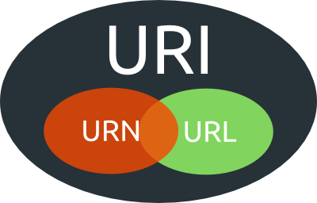
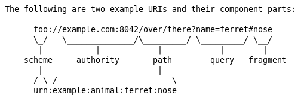
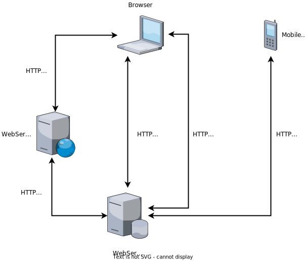

name: inverse
layout: true
class: center, middle, inverse
.indexlink[[<i class="fa fa-arrow-circle-o-up"></i>](#) [<i class="fa fa-list-ul"></i>](#index) [<i class="fa fa-tint"></i>](../change-color.php)[<i class="fa fa-file-pdf-o"></i>](download)]


---

name: normal
layout: true
class: left, middle
.indexlink[[<i class="fa fa-arrow-circle-o-up"></i>](#) [<i class="fa fa-list-ul"></i>](#index) [<i class="fa fa-tint"></i>](../change-color.php)[<i class="fa fa-file-pdf-o"></i>](download)]


---

template:inverse
# HTTP
<a href="http://www.fe.up.pt/~arestivo">André Restivo</a>

---

template: inverse
name:index
# Index

.indexlist[
1. [Introduction](#intro)
1. [URIs and URLs](#urls)
1. [HTTP URL](#httpurl)
1. [Session](#session)
1. [Request](#request)
1. [Methods](#methods)
1. [Response](#response)
1. [Response Codes](#codes)
1. [Headers](#headers)
1. [REST](#rest)
1. [PHP and HTTP](#php)
]

---

template: inverse
name:intro
# Introduction

---

# HTTP

* **H**yper **T**ext **T**ransfer **P**rotocol.
* **Application-layer** protocol for transmitting hypermedia documents.
* **Client-server** model.
* **Stateless** protocol.

---

# History

* **HTTP/0.9** (1991) Only **GET** method
* **HTTP/1.0** (1992&ndash;96) Files of different types. **HEAD** and **POST**.
* **HTTP/1.1** (1995&ndash;97) Reuse connections. **Host** header.

Since then, the **HTTP 1.1** protocol evolved by adding new headers.

* **HTTP/2.0** (2014&ndash;15) A major revision of the **HTTP** network protocol.
* **HTTP/3** (2019&ndash;) Or just **H3**, a HTTP mapping over **QUIC** (a general-purpose transport layer network protocol designed by Jim Roskind at Google).

---

template: inverse
name: urls

# URIs and URLs

---

# URI

**U**niform **R**esource **I**dentifier

* An identifier is an object that can act as a **reference** to something that has **identity**.
* In the case of a URI, the object is a sequence of characters with a restricted **syntax** [RFC3986](http://tools.ietf.org/html/rfc3986).
* A URI can be further classified as a locator (**URL**), a name (**URN**), or both.
* URI components: scheme, authority, path, query, fragment



---

# URN

**U**niform **R**esource **N**ames are intended to serve as **persistent**, **location-independent**,
resource **identifiers** [RFC2141](http://tools.ietf.org/html/rfc2141).


Source: [RFC3986](https://tools.ietf.org/html/rfc3986)

---

# URL

**U**niform **R**esource **L**ocator

URL refers to the **subset** of URI that identify resources via a representation of
their primary access mechanism (e.g., their network *location*), rather than
identifying the resource by name or by some other attribute(s) of that resource.

A Uniform Resource Name (URN) functions like a person’s **name**, while a Uniform Resource Locator (URL) resembles that person’s unique **address**.

---

template: inverse
name: httpurl

# HTTP URL

---

# HTTP URL

Every **HTTP URL** consists of the following, in the given order:

* the **scheme** name (or protocol, *i.e.*, http or https)
* a colon (:), two slashes (//)
* a **host** (domain name or IP address)
* optionally a colon (:) followed by a **port** number
* the full **path** of the resource
* optionally a **query** string
* optionally a **fragment** identifier

.box_info[scheme://domain:port/path?query_string#fragment_id]

---

# Scheme Name

* For HTTP connections the scheme name can be either **http** or **https**.
* **H**yper**t**ext **T**ransfer **P**rotocol **S**ecure (HTTPS) is just HTTP on top of the **SSL/TLS** protocol.

.box_info[http://]

---

# Hostname

* The hostname as either a registered name or an IP address.

.box_info[www.google.com]

.box_info[127.0.0.1]

---

# Port

* The **default port** for a HTTP server on a computer is port **80**.
* Others are also normally used: 8080, 8000.
* The port number can be **omitted** from the URL if it is the default one.

.box_info[:80]

---

# Path

* The full path of the resource.
* A sequence of segments separated by slashes.
* **May** resemble or map exactly to a file system path **but not necessarily**.

.box_info[/somewhere/on/this/server.php]

---

# Query String

* The query string contains **data** to be passed to software running on the server.
* It may contain **name/value pairs** separated by ampersands.

For example:

.box_info[?first_name=John&last_name=Doe]

---

# Fragment Identifier

* The fragment identifier, if present, specifies a **part** or a **position** within the overall resource or document.
* If used with HTML, represents an element in the page identified by its **id**.

.box_info[\#content]

---

template: inverse
name: session

# Session

---

# Session

A **HTTP** session consists of three phases:

* The client establishes a TCP **connection**.
* The client sends its **request** and then waits for the answer.
* The server processes the request and sends back its **response**, containing a **status code** and the appropriate data.

The session then ends. The HTTP protocol is **stateless**. No state is kept on the server about the session.

---

template: inverse
name: request

# HTTP Request

---

# Request

The first line contains a request **method** followed by its parameters:
  * the **path** of the document (an absolute URL without the protocol and the domain name).
  * the HTTP protocol **version** used.

```http
GET /~arestivo/index.php HTTP/1.1
```

The subsequent lines each represent a specific HTTP **header**.

The final block is the optional **data block**. Its separated from the headers by a blank line and contains further data. Mainly used by the POST method.

---

# Examples

A **GET** request:

```http
GET /search.php?name=john HTTP/1.1
Host: www.example.com
Accept-Language: pt
```

A **POST** request:

```http
POST /path/save.php HTTP/1.1
Host: www.example.com
Content-Type: application/x-www-form-urlencoded

name=John%20Doe&username=johndoe
```

HTTP 1.1 **requires** the Host header.

---

template: inverse
name: methods

# Methods

---

# Methods

* The request method indicates the **action** to be performed by the server.
* The HTTP/1.1 standard defines **nine** methods.
* Other standards can add extra methods.

---

# Safe Methods

A **safe** method is a method that **doesn't have** any **side-effects** on the server:

* **GET**: used to retrieve information identified by the request URI.
* **HEAD**: identical to GET but without the message body sent.

All HTTP servers must implements these methods.

---

# Idempotent Methods

A idempotent method is a method where the side-effects on the server of several identical
requests with the method are the same as the side-effects of one single request.

* **PUT** requests that the enclosed entity be stored under the supplied URI.
* **DELETE** used to delete the resource identified by the URI.

These methods are **optional**.

* **HEAD** and **GET** are also idempotent.

---

# Other Methods

* **POST**: used to request that the server accept the entity enclosed in the request as a new subordinate of the resource identified by the URI.
* **OPTIONS**, **TRACE**, **CONNECT** and **PATCH**.

These methods are **optional**.

[All methods](https://www.w3.org/Protocols/rfc2616/rfc2616-sec9.html)

---

template: inverse
name: response

# Response

---

# Response

* When answering a client request, the server sends back a **three-digit** number indicating whether the request was successfully processed.

* Responses can be grouped in five categories: **informational** (1xx), **success** (2xx), **redirection** (3xx), **client error** (4xx) and **server error** (5xx).

[All response codes](http://www.w3.org/Protocols/rfc2616/rfc2616-sec10.html)

---

# Response Example

```http
HTTP/1.0 200 OK
Date: Fri, 31 Dec 1999 23:59:59 GMT
Content-Type: text/html
Content-Length: 1354

<html>
<body>
<h1>Hello World!</h1>
(more file contents)
  .
  .
  .
</body>
</html>
```

---

# Status Line

The **status line** is the first line in the response message. 

It consists of three items:

* The HTTP **version number**.
* A **status code**.
* A **reason phrase** (a human-readable text that summarizes the meaning of the status code).

```http
HTTP/1.0 200 OK
```


---

template: inverse
name: codes

# Response Codes

---

# Some Response Codes

## Success

* **200 OK** - The request has succeeded. The information returned with the response is dependent on the method used in the request.
  * **GET** an entity corresponding to the requested resource is sent in the response.
  * **HEAD** the entity-header fields corresponding to the requested resource are sent in the response without any message-body.
  * **POST** an entity describing or containing the result of the action.
* **201 Created** - The request has been fulfilled and resulted in a new resource being created.

---

# Some Response Codes

## Success

* **202 Accepted** - The request has been accepted for processing, but the processing has not been completed.
* **204 No Content** - The server has fulfilled the request but does not need to return an entity-body.
* **206 Partial Content** - The server has fulfilled the partial GET request for the resource. The request MUST have included a *Range* **header**.

---

# Some Response Codes

## Redirect

* **301 Moved Permanently** - The requested resource has been assigned a new permanent URI and any future references to this resource should use one of the returned URIs. The new permanent URI should be given by the *Location* **header** in the response.
* **304 Not Modified** - If the client has performed a conditional GET request and access is allowed, but the document has not been modified.

---

# Some Response Codes

## Client Error

* **400 Bad Request** - The request could not be understood by the server due to malformed syntax.
* **401 Unauthorized** - The request requires user authentication. The response **must** include a *WWW-Authenticate* **header** containing a challenge applicable to the requested resource.
* **403 Forbidden** - The server understood the request, but is refusing to fulfill it. Authorization will not help and the request should not be repeated.

---

# Some Response Codes

## Client Error

* **404 Not Found** - The server has not found anything matching the requested URL.
* **405 Method Not Allowed** - The method specified in the request is not allowed for the resource identified by the URI. The response must include an *Allow* **header** containing a list of valid methods.
* **408 Request Timeout** - The client did not produce a request within the time that the server was prepared to wait.

---

# Some Response Codes

**418 I'm a teapot** - "Any attempt to brew coffee with a teapot should result in the error
   code "418 I'm a teapot". The resulting entity body MAY be short and stout." -- [RFC2324](https://tools.ietf.org/html/rfc2324)


> This error is a reference to Hyper Text Coffee Pot Control Protocol which was an April Fools' joke in 1998.

---

# Some Response Codes

## Server Error

* **500 Internal Server Error** - The server encountered an unexpected condition which prevented it from fulfilling the request.
* **502 Bad Gateway** - The server, while acting as a gateway or proxy, received an invalid response from the upstream server it accessed in attempting to fulfill the request.
* **503 Service Unavailable** - The server is currently unable to handle the request due to a temporary overloading or maintenance of the server.

[All response codes](https://www.w3.org/Protocols/rfc2616/rfc2616-sec10.html)

---

template: inverse
name: headers
# Headers

---

# Client Headers

* **Accept**	Content-Types that are acceptable for the response <br> (text/html, image/jpeg, ...).
* **Accept-Charset**	Character sets that are acceptable <br> (utf-8, iso-8859-1, ...).
* **Accept-Encoding**	List of acceptable encodings <br> (gzip, deflate, ...).
* **Accept-Language**	List of acceptable human languages for response.
* **Connection**	What type of connection the user-agent would prefer <br> (keep-alive, ...).
* **Cookie**	A HTTP cookie previously sent by the server with **Set-Cookie**.
* **Content-Length**	The length of the request body in octets (8-bit bytes).

---

# Client Headers

* **Content-Type**	The MIME type of the body of the request (used with POST and PUT requests).
* **Date**	The date and time that the message was sent. <br> <small>Date: &lt;day-name&gt;, &lt;day&gt; &lt;month&gt; &lt;year&gt; &lt;hour&gt;:&lt;minute&gt;:&lt;second&gt; GMT</small>
* **Host**	The **domain name** of the server (for virtual hosting), and the TCP **port number** on which the server is listening. The port number may be omitted if the port is the standard port for the service requested. Mandatory since HTTP/1.1.
* **If-Modified-Since**	Allows a **304 Not Modified** to be returned if content is unchanged.
* **Range**	Request only part of an entity. Bytes are numbered from 0.
* **User-Agent**	The user agent string of the user agent.

---

# Client Headers

##Examples

```http
Accept: text/plain
Accept-Charset: utf-8
Accept-Encoding: gzip, deflate
Accept-Language: en-US
Connection: keep-alive
Cookie: username=johndoe; session_id=7f3fe5016a9cda0c4adbd44aeea9d511;
Content-Length: 348
Content-Type: application/x-www-form-urlencoded
Date: Tue, 15 Nov 1994 08:12:31 GMT
Host: www.google.com:80
If-Modified-Since: Sat, 29 Oct 2014 19:43:31 GMT
Range: bytes=500-999
User-Agent: Mozilla/5.0 (X11; Linux x86_64; rv:12.0) Gecko/20100101 Firefox/21.0
```

---

# Server Headers

* **Accept-Ranges**	What partial content range types this server supports.
* **Allow**	Valid actions for a specified resource. To be used for a **405 Method not allowed**.
* **Cache-Control**	Tells all caching mechanisms from server to client whether they may cache this object. It is measured in seconds. <br> (max-age=&lt;seconds&gt;, no-cache)
* **Content-Encoding**	The type of encoding used on the data.
* **Content-Language**	The language the content is in. <br> (pt-PT, en-US, ...)
* **Content-Length**	The length of the response body in octets (8-bit bytes)

---

# Server Headers


* **Content-Location**	An alternate location for the returned data.
* **Content-Range**	Where in a full body message this partial message belongs.
* **Content-Type**	The MIME type of this content.
* **Expires**	Gives the date/time after which the response is considered stale.
* **Last-Modified**	The last modified date for the requested object.
* **Location**	Used in redirection, or when a new resource has been created.
* **Set-Cookie**	A HTTP cookie.

> The Multipurpose Internet Mail Extensions (MIME) type is a standardized way to indicate the nature and format of a document.

---

# Server Headers

##Examples

```http
Accept-Ranges: bytes
Allow: GET, HEAD
Cache-Control: max-age=36001
Content-Encoding: gzip
Content-Language: da
Content-Length: 348
Content-Location: /index.htm
Content-Range: bytes 21010-47021/47022
Content-Type: text/html; charset=utf-8
Expires: Thu, 01 Dec 1994 16:00:00 GMT
Last-Modified: Tue, 15 Nov 1994 12:45:26 GMT
Location: http://www.w3.org/pub/WWW/People.html
Set-Cookie: session_id=7f...; Domain=foo.com; Path=/; Expires=Wed, 13 ... GMT;
```

[All header fields](https://www.w3.org/Protocols/rfc2616/rfc2616-sec14.html)

---

template: inverse
name: rest

# REST

[REST Cook Book](http://restcookbook.com/)

---

# REST


REST (**Re**presentational **S**tate **T**ransfer) is a resource based architecture style for designing networked applications.

* **Resource Based** - the system is comprised of resources which are named using a URI.
* **Client-Server**: a pull-based interaction style.
* **Stateless**: each request from client to server must contain all the information necessary to understand the request, and cannot take advantage of any stored context on the server.
* **Cacheable**: to improve network efficiency responses must be capable of being labeled as cacheable or non-cacheable.
* **Uniform Interface**: all resources are accessed with a generic interface (e.g., HTTP GET, POST, PUT, DELETE).
* **Layered System** - intermediaries, such as proxy servers, cache servers, gateways, etc, can be inserted between clients and resources to support performance, security, etc.

First described by Roy T. Fielding in his [PhD thesis](http://www.ics.uci.edu/~fielding/pubs/dissertation/top.htm)

---

# Resource Based

* Things (**resources**) instead of **actions**. <br> <small>*employee.php* instead of *getemployee.php/saveemployee.php*</small>
* Individual resources are **identified** in requests using **URIs** as resource identifiers.
* When a client holds a representation of a resource, including any metadata attached, it has **enough information** to **modify** or **delete** the resource on the server.

---

# Stateless


* Communication must be **stateless** in nature.
* Each request from client to server must contain **all of the necessary information** to understand the request, and cannot take advantage of any stored context on the server.
* Session **state** is therefore kept **entirely on the client**.

---

# Cacheable

* Data within a response to a request should be implicitly or explicitly labeled as **cacheable** or **non-cacheable**.
* If a response is cacheable, then a client cache is **given the right to reuse** that response data for later, equivalent requests.

---

# Uniform Interface

Use the HTTP standard to describe communication.

```
http://www.example.com/employee
```

* **GET** to list all employee.
* **POST** create a new employee.

```
http://www.example.com/employee/1234
```

* **GET** to get information about the employee 1234.
* **PUT** means that you want to create/update employee 1234.
* **DELETE** means that you want to delete employee 1234.

---

# Content Negotiation

Use the **Accept** header to ask for a particular representation of the resource.

```http
GET /employee/1234 HTTP/1.1
Host: www.example.com
Accept: application/json
```

```http
GET /employee/1234 HTTP/1.1
Host: www.example.com
Accept: application/xml
```

```http
GET /employee/1234 HTTP/1.1
Host: www.example.com
Accept: text/html
```

---

# Scenarios

.smaller[

]

---

template: inverse
name: php
# PHP and HTTP

---

# Sending headers

To **add an header** to the response just use the **header** function:

```php
header('Location: somewhere_else.php');
```

Just be careful to do it before outputting any data.

To send HTTP response codes:

```php
header('HTTP/1.0 404 Nothing to see here');
```

Or:

```php
http_response_code(418);
```

---

# Finding HTTP method

To find which **HTTP method** was used to access the resource use the **$_SERVER** array:

```php
if ($_SERVER['REQUEST_METHOD'] == 'PUT') {
  // update resource
}
```

---

# Finding the Accept header

To find the **Accept** header sent by the client we can also use the **$_SERVER** array:

```php
if ($_SERVER['HTTP_ACCEPT'] == 'application/json') {
  echo json_encode($employees);
}
```

Other headers can also be found in the [$_SERVER](http://php.net/manual/en/reserved.variables.server.php) array or using the [apache_request_headers](http://php.net/manual/en/function.apache-request-headers.php) function.

```php
$headers = apache_request_headers();

foreach ($headers as $header => $value) {
    echo "$header: $value <br />\n";
}
```
