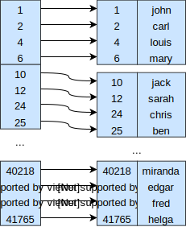

name: inverse
layout: true
class: center, middle, inverse
.indexlink[[<i class="fa fa-arrow-circle-o-up"></i>](#) [<i class="fa fa-list-ul"></i>](#index) [<i class="fa fa-tint"></i>](../change-color.php)[<i class="fa fa-file-pdf-o"></i>](download)]

---

name: normal
layout: true
class: left, middle
.indexlink[[<i class="fa fa-arrow-circle-o-up"></i>](#) [<i class="fa fa-list-ul"></i>](#index) [<i class="fa fa-tint"></i>](../change-color.php)[<i class="fa fa-file-pdf-o"></i>](download)]

---

template:inverse
# Indexes
<a href="http://www.fe.up.pt/~arestivo">André Restivo</a>

---

template:inverse
name:index
# Index

.indexlist[
1. [Introduction](#intro)
1. [Indexes](#indexes)
]

---

template:inverse
name:intro
# Introduction

---

# Blocks

* Data is read or written from the hard disk a whole block at a time.
* Each block can contain several tuples.

---

# Indicators

Some important values that we will use throughout this presentation:

* Number of tuples: **t**
* Block size: **B** bytes
* Tuple size: **T** bytes

Typically B >= T

Some important indicators:

* Blocking Factor: **bfr** = B / T
* Block Number: **b** = t / bfr

---

# Performance

* Biggest obstacle to database performance is **hard disk access**.

* Hard disk is accessed **block by block**.

* Block fetch requires about 5 to 10 milliseconds (10-3), versus about 100 nanoseconds (10-9) for memory access.

* It is important to **minimize** the number of blocks accessed.

* On many different operations: search, insert, delete, update, sort, ranges, ...

---

# Example

.pull-right[

]

* **t** = 30000 tuples
* **B** = 1024 bytes
* **T** = 100 bytes
* **bfr** = 1024 / 100 = 10 tuples/block
* **b** = 30000 / 10 = 3000 blocks

---

# Unordered Sequential File

.pull-right[

]

* File has no special order between tuples.
* Inserting and updating is very fast.
* Searching and ordering very slow.

--

* Searching:
  * Keys: b / 2 = **500** blocks
  * Non-keys: b = **1000** blocks

---

# Ordered Sequential File

.pull-right[

]

* File **ordered** by **primary key**.
* Inserting and updating is slow. Unless sequentially or some space wasted.
* Searching and ordering very slow except on primary key.

--

* Searching:
  * Primary Keys: log2b  = **12** blocks
  * Other Keys: b / 2 = **500** blocks
  * Non-keys: b = **1000** blocks

---

template:inverse
name:indexes
# Indexes

---

# Indexes

* Mechanisms used to speed up data access.
* An index file typically consists of entries having a **search-key** and a **pointer**.
* Index files are typically much smaller than the original file.* 
* Two basic kinds: **ordered** and **hashed**.
* Index evaluation: genericity, performance and overhead.

---

template:inverse
name:ordered
# Ordered Indexes

---

# Ordered Indexes

In a ordered index, entries are sorted by their **search-key**.

* Primary indexes: In a ordered file, an index having a **search-key** in the same order as the file. Only one per file. Also called **clustering index**.

* Secondary indexes: An index having a **search-key** in a different order as the file. Many per file are possible.

---

# Dense or Sparse

**Dense** indexes have **one index entry** for each **search-key value** in the indexed file.

.pull-left[
Dense index: file ordered by key

]

.pull-right[
Dense index: file ordered by non-key

]

---

# Dense or Sparse

**Sparse** indexes contain entries for **only some** search-key
values. Only applicable when entries are ordered on search-key.

* Advantages: Less space and less maintenance.
* Disadvantages: Slower than dense indexes.

**Trade-off**: One entry per block.

---

# Dense or Sparse

* **Search-key**: 9 bytes
* **Pointer**: 6 bytes (2.8 * 1014 tuples)

.pull-left[
**Dense** Index

* **ti**: 30000 (same as t)
* **Ti**: 15 bytes (9 + 6)
* **bfri**: 68 tuples/block (1024 / 15)
* **bi**: 442 blocks (30000 / 68)
]

.pull-left[
**Sparse** Index

* **ti**: 3000 (same as b)
* **Ti**: 15 bytes (9 + 6)
* **bfri**: 68 tuples/block (1024 / 15)
* **bi**: 45 blocks (3000 / 68)
]

--

Search on **dense**: log2442 + 1 = 10 blocks

Search on **sparse**: log245 + 1 = 7 blocks

But search isn't everything...

---

# Secondary Indexes

* Always have to be dense.
* Entries point to a bucket of pointers to the actual tuples.

