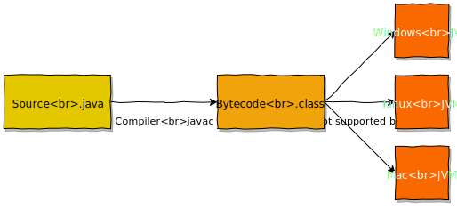
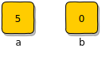
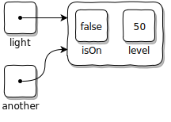
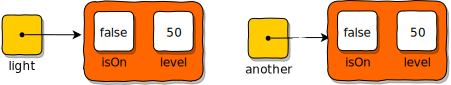
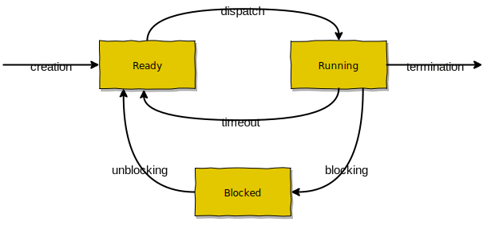
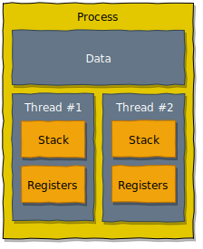

name: inverse
layout: true
class: center, middle, inverse
.indexlink[[<i class="fa fa-arrow-circle-o-up"></i>](#) [<i class="fa fa-list-ul"></i>](#index) [<i class="fa fa-tint"></i>](../change-color.php)[<i class="fa fa-file-pdf-o"></i>](download)]

---

name: normal
layout: true
class: left, middle
.indexlink[[<i class="fa fa-arrow-circle-o-up"></i>](#) [<i class="fa fa-list-ul"></i>](#index) [<i class="fa fa-tint"></i>](../change-color.php)[<i class="fa fa-file-pdf-o"></i>](download)]

---

template:inverse
# Java
<a href="http://www.fe.up.pt/~arestivo">André Restivo</a>

---

template: inverse
name:index
# Index

.indexlist[
1. [Introduction](#intro)
1. [Basics](#basics)
1. [Arrays](#arrays)
1. [OOP](#oop)
1. [Classes](#classes)
1. [Objects](#objects)
1. [Inheritance](#inheritance)
1. [Methods to Override](#override)
1. [Garbage Collection](#garbage)
1. [Packages](#packages)
1. [Exceptions](#exceptions)
1. [Collections](#collections)
1. [Threads](#threads)
2. [Input/Output](#io)
]

---

template: inverse
name:intro
# Introduction

---

# What is Java?

* Designed by: James **Gosling** (1995)

* Created by Sun Microsystems now owned by **Oracle**.

* Java is **open source** (under the GPL).

* Key **characteristics**:
  
  * General-purpose 
  * Object-oriented (class-based)
  * Automatic memory management
  * Write-once Run-everywhere

---

# Java Editions

* **Java Card** - Smart **cards** and similar small memory footprint devices. 
* **Java ME** - Micro Edition for **embedded** and **mobile** devices (IoT).
* **Java SE** - Standard Edition for regular Java applications. Mainly **desktop** and command-line apps.
* **Java EE** - Enterprise Edition for enterprise-oriented applications and servlets. Mainly large-scale **web**-oriented applications.

---

# Compiling and Running

* Compiled into **bytecode** using the command **javac**.
* Bytecode can be run, using the command **java**, in any OS, as long as there is a Java Virtual Machine (**JVM**).
* Compiling and executing can be done using the Java Development Kit (**JDK**).
* The Java Runtime Environment (**JRE**) can be used instead for executing only.
  


---

# Resources

* [Book: Thinking in Java, 4th edition](https://ia800103.us.archive.org/20/items/TIJ4CcR1/TIJ4-cc-R1.pdf)
* [Book: Java Programming](https://en.wikibooks.org/wiki/Java_Programming)
* [JDK 11 Documentation](https://docs.oracle.com/en/java/javase/11/)

---

template: inverse
name:basics
# Basics

---

# Types

* Java is **strongly typed** so every variable must have a type.

* Java is **not a pure OOP language** so variables can have a **primitive** type or be a reference to an **object**.

* In Java, **arrays** are objects.

* There are no pointers but:

  *  Primitive variables are stored as **values**.
  *  Objects are stored as **references**.

---

# Primitive Types

Primitive type are the most basic data types in Java.

.small.simple[
|Types|Size (bits)|Minimum Value|Maximum Value|Precision|
|--- |:---:|:---:|:---:|---:|
|byte|8|-128|127|From +127 to -128|
|char|16|0|2<sup>16</sup>-1|All Unicode characters|
|short|16|-2<sup>15</sup>|2<sup>15</sup>-1|From +32,767 to -32,768|
|int|32|-2<sup>31</sup>|2<sup>31</sup>-1|From +2,147,483,647 to -2,147,483,648|
|long|64|-2<sup>63</sup>|2<sup>63</sup>-1|From +9,223,372,036,854,775,807 to -9,223,372,036,854,775,808|
|float|32|2<sup>-149</sup>|(2-2-23)·2<sup>127</sup>|From 3.402,823,5 E+38 to 1.4 E-45|
|double|64|2<sup>-1074</sup>|(2-2<sup>-52</sup>)·2<sup>1023</sup>|From 1.797,693,134,862,315,7 E+308 to 4.9 E-324|
|boolean|&mdash;|&mdash;|&mdash;|false, true|
|void|&mdash;|&mdash;|&mdash;|&mdash;|
]

---

# Literals

Java Literals are syntactic representations of boolean, character, numeric, or string data. 

* **Boolean**: true or false.
* **Character**: 16-bit characters inside single quotes ('a'). Can be cast to int or long.
* **String**: Inside double quotes ("Java").
* **Integer**: Decimal (1234), Octal with a leading zero (02322), hexadecimal starting with 0x (0x4D2) or binary starting with 0B (0B10011010010). Ending with L if we want a long type integer (1234L).
* **Floating Point**: Ending with F or D for single and double precision (double is the default). Can be a decimal fraction or an exponential notation (0.1234 or 1234E-4). 

---

# Variables

Local variables are created by: 

* giving it a **unique name**; and

* assigning it a **data type**.

```java
int i;
```

Local variables must be given a value explicitly before being used:

```java
int i; i = 10;
```

This can be done in a single statement:

```java
int i = 10; 
```

---

# Conditional Blocks

Java has all the conditional blocks you would expect from a [C-family](https://en.wikipedia.org/wiki/List_of_C-family_programming_languages) programming language:

```java
if (condition) {      // Curly brackets when more than one statement
  doSomething();      
  doSomethingElse();
} else 
  doAnotherThing();
```

And also:

```java
switch (variable) {                 // variable must be of the correct type 
  case 1: doSomething();
    break;                          // don't forget the break
  case 2: doSomethingElse();
    break;
  default: doSomethingDefault();
    break;
}
```

---

# Loop Blocks

Loop blocks are also the expected ones. The **while-loop**:

```java
while (condition) {
  doSomething();
}
```

Also a **do-while** variant:
```java
do {
  doSomething();          // executed at leat once
} while (condition);
```

And, of course, the **for-loop**:
```java
for (int i = 0; i < 10; i++) {
  doSomething(i);         // i from 0 to 9
}
```

---

# Operators

Arithmetic and boolean operators are also very similar to other C-family languages:

* Assignment: <code>= += -= *=  /=</code>
* Numerical: <code> + - * / % ++ -- </code>
* Relational: <code>== != < > <=  >=</code>
* Boolean: <code>&& || !</code>
* Bitwise: <code>& | ^ ~ << >> >>></code>
* Tertiary: <code>?:</code>
* Type casting: <code>(type) </code>

Be careful with the <code>==</code> operator. It compares primitive types by value; but **compares objects by reference**.

---

# Standard Input and Output

Writing to the screen can be accomplished using one of two methods: 

```java
System.out.print("Hello world");
System.out.println("Hello world");  // also changes line
```

Reading from the keyboard can be done using the **Scanner** class from *java.util* package:

```java
Scanner scanner = new Scanner(System.in); // Instantiating a new Scanner object
String line = scanner.nextLine();         // Reading a line
System.out.println(line);                 // Printing out the line
int number = scanner.nextInt();           // We can also read primitive types
```

---

# Naming Convention

Names should follow the standard naming convention:

.simple[
| Type | Form | Capitalization | Example |
|------|------|----------------|---------|
| Class or Interface | Noun | First word letter capitalized | PoliceCar |
| Methods | Verb | First word letter capitalized (except first one) | turnSirenOn() |
| Variables | &mdash; | First word letter capitalized (except first one) | carPlate |
| Constants | &mdash; | Uppercase with underscores separating words | MAX_SPEED |
| Packages | &mdash; | Starting with top-level domain, lowercase separated by periods | com.lpoo.util |
]

---

# Strings

* In Java Strings are **immutable**, so they cannot be modified once created.
* String are a class defined in the *java.lang* **package** (more on that later):

The <code>+</code> operator **concatenates** strings:

```java
String hello = "Hello";
String world = "World";
String sentence = hello + " " + world;
```

String are objects, so to compare them we **must** use the **equals** method:

```java
if (hello.equals(world)) {  // hello == world would compare the references
  doSomething(i); 
}
```

---

# Hello World

In Java, **everything** must **belong** to a **class**.

That means our customary **Hello World** example looks like this:

```java
public class HelloWorld {
  public static void main(String[] args) { // when we run a class this method
    System.out.println("Hello, World");    // runs first
  }
}
```

Don't worry too much about the syntax for now.

---

template: inverse
name:arrays
# Arrays

---

# Arrays

In Java, an **array** is an **object**. This object has a given type for the contained primitive types or objects (int, char, String, ...). 

An array can be declared in several ways: 

```java
int[] array;  // recommended
int array[];  // identical but less used
```

These arrays have been declared but haven't been instantiated yet. We can do it in a few different ways:

```java
array = new int[10];                              // 10 default elements 
array = new int[]{1, 2, 3, 4, 5, 6, 7, 8, 9, 10}; // works anywhere
int[] other = {1, 2, 3, 4, 5, 6, 7, 8, 9, 10};    // only works in the declaration
```

The default value depends on the data type. For objects it's **null**, for numeric types it's **0**, for booleans is **false** and for chars it's **'\u0000'** (whose decimal equivalent is 0).

---

# Using Arrays

The size of an array can be obtained by using the **length** attribute:

```java
for (int i = 0; i < array.length; i++)
  System.out.println(array[i]);  // getting the value at index i
```

A simpler way of **looping** over an array is:

```java
for (int element : array)       // element must be the same type
{                               // as the array internal values
  System.out.println(element);
}
```

---

# Multidimensional Arrays

Arrays can have more than one **dimension**:

```java
int[][] array = {{  0,  1,  2,  3,  4 },
                 {  5,  6,  7,  8,  9 },
                 { 10, 11, 12, 13, 14 }};
System.out.println(array[0][3]); // 3
System.out.println(array[1][4]); // 9
```

Sub-arrays can even have **different** lengths:

```java
int[][] array = {{       0       },
                 {    1, 2, 3    },
                 { 4, 5, 6, 7, 8 }};
System.out.println(array[0].length); // 1
System.out.println(array[1].length); // 3
```

---

template: inverse
name:oop
# OOP

---

# Abstractions

All programming languages provide **abstractions**:
  
* **Assembly** is an abstraction of **machine-code**.
* **Imperative** programming is an abstraction of **assembly**.

But they force us to think about the structure of the **machine** and not the structure of the **problem**.

<hr>

**OOP** provides an abstraction where **elements** of the problem are **objects** in the solution space.

**OOP** allows you to describe the problem in terms of the **problem**, rather than in terms of the **computer** where the solution will run.

---

# Objects

**Alan Kay**<sup>1</sup> on the five pillars of *Smalltalk*:

1. **Everything** is an object.
2. A program is a bunch of objects telling each other
what to do by sending **messages**.
3. Each object has its own **memory** made up of **other
objects**.
4. Every object has a **type**.
5. All objects of a particular type can receive the **same
messages**.

"An object has state, behavior and identity" &mdash; **Grady Booch**<sup>2</sup>, 1994.

"An object is characterized by a number of operations and a state which remembers the effect of these operations" &mdash; **Ivar Jacobson**<sup>2</sup>, 1996.

.footnote[1&#46; Inventor of the Smalltalk language. <br>2. Two of the developers of UML (together with James Rumbaugh).]

---

# Object Oriented Pillars (A PIE)

Data **A**bstraction: 
> Clear separation between the **public interface** of a data type, and its concrete implementation.

**P**olymorphism:
> A **single symbol** can **represent** a **multitude** of **different types**.

**I**nheritance:
> Objects can **inherit** **properties** and **behaviors** from **other** objects.

**E**ncapsulation (2 different concepts):
> A mechanism that: (1) allows **restricting access** to some of the **object's components** (2) facilitates the **bundling** of **data** with the **operations** on that data.

---

template: inverse
name:classes
# Classes

---

# Classes

* All **objects**, while being **unique**, are also part of a **class** of objects that have **characteristics** and **behaviors** in common.
* Objects that are identical &mdash; **except** for their **state** &mdash; are grouped together into **classes of objects**.
* Classes **extend** the programming language by adding new **data types**.

<hr>

* Each class is defined by its **interface**.
* The **interface** determines the **requests** that you can make for a particular
object.
* An object **provides services** and can use **other objects'** services to accomplish it.

---

# Classes in Java

* In Java, public classes must be declared in a file with the **same name** but with a **.java** extension. 
* This means that a Java file can have, at most, **one** public class.
* For example, inside a file called **Light.java** you could have:

```java
public class Light {
  // ...
}
```

* As this is a **public** class, it can be accessed from anywhere.

---

# Fields

* Objects store data inside **fields** (also called *member variables*)
* Each object keeps its **own** storage for its fields.
* **Ordinary** fields are **not shared** among objects.

```java
public class Light {
  private boolean isOn = false;
  private int level = 100;
}
```

* Usually, fields should be made **private** so they can be accessed only from inside the object they belong to.
* Objects from other classes can access them using the class *public interface* (methods).

---

# Methods

* Methods are how we **communicate** with objects. 
* When we **invoke** or **call** a method we are asking the object to carry out a **task**.
* Each method has a **name**, input **parameters**, a **return** type and a **visibility**.

```java
public class Light {
  public void turnOn() {
    this.isOn = true;
  }

  public void turnOff() {
    this.isOn = false;
  }

  public void setLevel(int level) {
    this.level = level;
  }
}
```

---

# Visibility

For a **class**:

.small[
* **public**: can be referenced anywhere in the **application**.
* **protected**: can be referenced only in the **package**.
* **private**: only in **nested** classes, can be accessed only in the **outer** class.
]

For a **variable**:

.small[
* **public**: can be referenced anywhere in the **application**.
* **protected**: can be referenced only in **sub-classes** and in the same **package**.
* **package** (no modifier): can be referenced only in the same **package**.
* **private**: can be accessed only in the **class** it is defined in.
]

For a **method**:

.small[
* **public**: can be called anywhere in the **application**.
* **protected**: can be called only in **sub-classes** and in the same package.
* **package** (no modifier): can be called only in the same **package**.
* **private**: can be called only in the **class** it is defined in.
]

---

# Keyword *this*

* **this** is a reference to the current object &mdash; the object whose method or constructor is being called. 
* You can treat the reference just like any other **object reference**. 

<hr>

* If you are calling a method from **within** another method of the **same**
class, you **do not** need to use *this*.
* If you are referring to a field from **within** a method of the **same**
class, you **do not** need to use *this*. But you should, for **readability** purposes (and sometimes to avoid **ambiguity**).

---

# Constructor

* Constructors are special methods that are used to create **new objects**.
* Constructors have the **same name** as the class.
* Constructors **do not** have a explicit return type &mdash; they **implicitly** return the type they are constructing.
* Constructors can be **overloaded**.

```java
public class Light {
  public Light() {
    this.isOn = false;
    this.level = 50;
  }

  public Light(int level) {
    this.isOn = false;
    this.level = level;
  }
}
```

---

# Constructor Chaining

* Within a constructor, you can use the **this** keyword to invoke **another** constructor in the **same** class.
* This has to be the **first statement** of the constructor.

```java
public class Light {
  public Light() {
    this(50);
  }

  public Light(int level) {
    this.isOn = false;
    this.level = level;
  }
}
```

---

# Setters and Getters

* Object fields are usually kept **private** to improve **encapsulation**.

* It is common to provide public **setter** and **getter** methods to access and modify the value of a private field.

```java
public class Light {
    private boolean isOn;
    private int level;

    // ...

    public void setLevel(int level) {
        this.level = level;
    }

    public int getLevel() {
        return level;
    }
}
```

---

# Static 

* **Static fields** belong to the class instead of a specific object.
* **Static methods** can only access the static context of the class.

```java
public class Light {
  private static int MAX_LEVEL = 100; 

  public static int getMaximumLevel() {
    return Light.MAX_LEVEL;
  }
}
```

```java
System.out.println(Light.getMaximumLevel()); // no need for an object
```


---

template: inverse
name:objects
# Objects

---

# Objects

When a **primitive type** variable is declared, its value is **stored** directly in its **memory** location.

```java
int a = 5, b; // if a field, b is initialized with a default value of 0.
```



When an **object** is declared, it only contains a reference to the actual object.

```java
Light light; // if a field, light is initialized with a default value of null. 
```


---

# Instantiation

To create a new object, we just have to call its constructor using the **new** keyword:

```java
Light light = new Light();
Light another = light;      // this only copies the reference
```




---

# Cloning

If we need to have two instances of the same object, we must use the **clone()** method. To use clone, our class must implement the **Cloneable** interface and override the **clone()** method making it **public**.



```java
public class Light implements Cloneable{
  @Override
  public Object clone() throws CloneNotSupportedException {
    return super.clone();
  }
}

Light light = new Light();
Light another = light.clone();
```


---

# Final

* The **final** keyword, allows us to declare **fields** and **variables** that **cannot be changed**.
* This only applies to the variable itself, so in the case of objects we can modify the **object** but not its **reference**.
* Can be used together with **static** to create **global constants**.

```java
final Light light = new Light();
light.setLevel(50);
light = new Light(); // error
```

```java
final int level = 50;
level = level + 10; // error
```

```java
public class Light {
  private final static int MAX_LEVEL = 100; 
}
```

---

# Parameters

**Objects** are passed to methods by **reference**; while **primitive** variables are passed by **value**.

```java
private void change(int a, Light light) {
  a = a + 10;
  light.setLevel(80);
}

public void doSomething() {
  int a = 10;
  Light light = new Light(); // level = 50

  change (a, light);

  System.out.println(a); // 10
  System.out.println(light.getLevel()); // 80
}
```

---

template: inverse
name:inheritance
# Inheritance

---

# Inheritance

* The mechanism of **basing** a class (or object) upon another class (or object), retaining a **similar** implementation.
* Inheritance should be used to establish a **is-a** relationship between classes.

<hr>

* In Java, inheritance is **class-based**.
* In Java, there is **no multiple-inheritance**.
* In Java, if unspecified, all classes are based on the root **Object** class.

---

# Extends

* The **extends** keywords allows a class to define a **different** superclass, inheriting all methods and fields from it.
* The **super** keyword allows calling a **constructor** from the superclass.
* You can **only** extend **one** class.

.small[
**Tip:** You don't have to provide any constructors for your class, but you must be careful when doing this. The compiler automatically provides a no-argument, default constructor for any class without constructors. This default constructor will call the no-argument constructor of the superclass. In this situation, the compiler will complain if the superclass doesn't have a no-argument constructor so you must verify that it does.
]

---

# Extends

```java
public class Shape {
    private String color;

    public Shape(String color) {
        this.color = color;
    }
}

public class Rectangle extends Shape {
    private int x1, x2, y1, y2;

    public Rectangle(int x1, int x2, int y1, int y2, String color) {
        super(color);

        this.x1 = x1;
        this.x2 = x2;
        this.y1 = y1;
        this.y2 = y2;
    }
}
```

---

# Overriding

Java allows classes to **override** superclass methods, providing that:
* The access modifier (visibility) for an overriding method can allow **more**, but **not less**, access than the overridden method.
* **Final** methods can not be overridden.
* **Static** methods can not be overridden.
* **Private** methods can not be overridden.
* The overriding method must have **same return type** (or **subtype**).

We can call a parent class method using the **super** keyword.

```java
public class Animal {
  public void talk() { System.out.println("Animal says:"); }
  public final void eat() { /* ... */ }
}
public class Dog extends Animal {
  public void talk() { 
    super.talk();
    System.out.println("Woof!"); 
  }
}
```

---

# Abstract Classes

* **Abstract** classes cannot be instantiated but can be **extended**:

* They are used to:
 
  * Define **methods** which can be **used** by the inheriting subclass.
  * Define abstract methods which the inheriting subclass **must implement**.
  * Provide a **common interface** for their subclasses.

```java
public abstract class Animal {
    public abstract void talk();
}
public class Dog extends Animal {
    // This method must be implemented or the 
    // class must be declared abstract.
    public void talk() {
        System.out.println("Woof!");
    }
}
```

---

# Interfaces

* Java does not allow multiple-inheritance but it has **interfaces**.
* An interface is like a **fully abstract** class (only abstract methods).
* A class can implement **several interfaces**.
* Interfaces can be used in order to achieve **polymorphism**.

```java
public interface Runner { public void run();  }
public interface Walker { public void walk(); }
public interface Eater  { public void eat();  }

public abstract class Animal implements Eater, Walker{
    public abstract void talk();
}

public class Dog extends Animal implements Runner {
    public void talk() {  } // all these
    public void eat()  {  } // methods
    public void run()  {  } // be
    public void walk() {  } // implemented
}
```

---

# Polymorphism

In Java, a variable of a given type may be **assigned** a value of **any subtype**, and a method with a parameter of a given type may be **invoked** with an argument of **any subtype** of that type.

```java
public void race(Runner r1, Runner r2) { /* ... */ }

public void main() {
  Dog d1 = new Dog();
  Runner d2 = new Dog();

  race (d1, d2);
}
```

---

# Polymorphism

In Java, the method to be called is decided at **runtime**, based on the runtime type of the object.

```java
public class Animal{
    public void talk() { System.out.println("Hello!"); };
}

public class Dog extends Animal {
    public void talk() { System.out.println("Woof!");  }
}

public class Cat extends Animal {
    public void talk() { System.out.println("Meow!");  }
}

public void main() {
    Animal a1 = new Animal(); a1.talk(); // Hello
    Animal a2 = new Dog(); a2.talk();    // Dog
    Animal a3 = new Cat(); a3.talk();    // Cat
}

```

---

template: inverse
name:override
# Methods to Override

---

# Equals

As we have seen with **Strings**, when we want to compare objects we shouldn't use the **==** operator as it will only return true if the two objects are the same (have the same reference).

We should instead **override** the **equals(Object)** methods from the **Object** class.

The **correct** way to do so looks something like:

```java
@Override
public boolean equals(Object o) {
  if (this == o) return true;                   // are the references equal
  if (o == null) return false;                  // is the other object null
  if (getClass() != o.getClass()) return false; // both objects the same class

  Point p = (Point) o;                          // cast the other object
  return x == p.getX() && y == p.getY();        // actual comparison
}
```

---

# Hash Code

Another important method is the **hashCode()** method. This method should return the **same value** for **two objects** that are **equal**. So normally, when overriding the **equals(Object)** method you should also override the **hashCode()** method.

You can see the **hash code** at work in the **HashSet** data structure (which we will see in detail later on):

*  When an element is **added**, the **hash code** is used to decide in which **bucket** it should be **stored**.
  
*  When **searching** for an object, we only need to compare it (using **equals(Object)**) with objects in the same bucket.

---

# Hash Code Implementation

To implement the **hashCode()** method, we should use a **subset** of the fields that are used in **equals(Object)**.

A possible implementation would be:

```java
@Override
public int hashCode() {
  return Objects.hash(x, y);
}
```

---

## To String


Another useful method from the **Object** class is the **toString()** method. This method returns a representation of any **Object** as a **String**. The default implementation is not very useful:

```java
System.out.println(new Point(1, 2)); // Point@3e2
```

But we can **override** it and make it **better**:

```java
@Override
public String toString() {
    return "Point (" + x + ", " + y + ")";
}
```

So that we get:

```java
System.out.println(new Point(1, 2)); // Point (1, 2)
```

---

template: inverse
name:garbage
# Garbage Collection

---

# Garbage Collection

* Automatic **garbage collection** is the process of looking at **heap** memory, identifying which objects are in use and which are not, and deleting the unused objects.
* An **in use** object, or a referenced object, means that some part of your program still maintains a pointer to that object.
* In Java, this process is done automatically so developers do not have to worry about **memory leaks**. [Or do they](https://stackify.com/memory-leaks-java/)?

---

template: inverse
name:packages
# Packages

---

# Packages

* A **package** contains a **group** of classes, **organized** together under a single **namespace**.
* Classes in the **same package** can access each other's **package-private** and **protected** members.
* The package that a class belongs to is specified with the **package** keyword (first statement):

```java
package com.example;
```

Packages are **stored** in the form of structured **directories**. For example: package "*com.example*" would be stored in directory "*com/example*".

---

# Importing

To use a class from another package we must first import it:

```java
import com.example.HelloWorld;
import com.example.*; // imports all classes from the package

// ...
  HelloWorld hw = new HelloWorld();
```

It is important to understand that **import** is simply used by the compiler to let you name your classes by their **unqualified** name.

**Without** the import statement this would still be valid:

```java
com.example.HelloWorld hw = new com.example.HelloWorld();
```

---

template: inverse
name:exceptions
# Exceptions

---

# Exceptions

* When an error occurs within a method, the flow of execution of the program stops immediately, the method creates an **Exception** object and hands it off to the **runtime system**.
* The **runtime system** attempts to find something to **handle** it by following the **ordered list of methods** that have been called to get to the method where the error occurred.

```java
public void someCode() {
  HelloWorld hw = null;
  hw.hello();              // Not a good idea!
}

public void moreCode() {
  someCode();
}

public void code() {
  try {
    moreCode();
  } catch (NullPointerException e) {
    // do something about the error
  }
}
```

---

# Throw

The **throw** keyword is used to **explicitly** throw an exception (any sub-class of **Throwable**) from a method or any block of code. User defined exceptions typically extend **Exception** class.

```java
public void someCode() throws VeryBadThingHappenedException {
  throw new VeryBadThingHappenedException("Boom!");
}

public void moreCode() throws VeryBadThingHappenedException {
  someCode();
}

public void code() {
  try {
    moreCode();
  } catch (VeryBadThingHappenedException e) {
    // do something about the error
  }
}
```

---

# Throws

If the **compiler** thinks there is **a chance** of rising an exception inside a method, then it will force us to either: 1) **catch** that exception, or 2) **declare** that we will **throw** that exception. 

```java
public void someCode() throws VeryBadThingHappenedException {
  throw new VeryBadThingHappenedException("Boom!");
}

public void moreCode() throws VeryBadThingHappenedException {
  someCode();
}
```

In this example, the **moreCode()** method is calling a method that **throws** an Exception, so it has to **throw** it also or **catch** it.

---

# Finally

* The **finally** block always executes when the a try block exits. 

* This ensures that the **finally** block is executed even if an **unexpected** exception occurs or an accidental return statement is added.
  
* Putting **cleanup code** in a **finally** block is always a **good practice**, even when no exceptions are anticipated.

```java
public void code() {
  try {
    moreCode();
  } catch (VeryBadThingHappenedException e) {
    // do something about the error
  } finally {
    // clean up code
  }
}
```

---

# Throw or Catch

The decision between **throwing** an exception and **catching** it might be an hard one:

* Methods should **catch** an exception if they can **handle** it locally.
* Methods should **throw** an exception if there is **nothing** they can do about it.

Catching an exception and **doing nothing** about it, besides printing the stack trace, is **always a bad idea**.

---

template: inverse
name:collections
# Collections

---

# Collections

* A **Collection** is a **group** of individual objects represented as a **single unit**. 

* Java provides the **Collection Framework** which defines several classes and interfaces to represent a group of objects as a single unit.

* The Collection interface (**java.util.Collection**) and Map interface (**java.util.Map**) are the two main interfaces of Java Collection classes.

---

# Collection Classes

* **Set** : Doesn't allow duplicates: HashSet (Hashing based), TreeSet (balanced
BST based; implements SortedSet)...

* **List** : Can contain duplicates and elements are ordered: LinkedList (linked list based), ArrayList (dynamic array based), Stack, Vector, ...

* **Queue** : Typically order elements in FIFO order: LinkedList, PriorityQueue (not in FIFO order)...

* **Deque** : Elements can be inserted and removed at both ends: ArrayDeque, LinkedList...

* **Map** : Contains Key value pairs. Doesn't allow duplicates: HashMap and TreeMap (implements SortedMap).

---

# Parameterized Collections

Java Collections are **parameterized** (using **Generics** &mdash; more about this later). 

This means that we can define the **type of data** that the collection will **store**.

```java
  List<Animal> animals = new ArrayList<>();
  animals.add(new Dog());
  animals.add(new Cat());
```

```java
  for (Animal animal : animals) {
    animal.talk();
  }
```

Notice that we used **List** instead of **ArrayList** to declare the variable. **List** is the **interface** that all lists **implement** and **ArrayList** is a **concrete instantiation** of that interface.

This is the "*Return the most specific type, accept the most generic type*" **principle**.


---

# List

Some examples on how to use **lists**:

```java
Dog dog = new Dog();
Cat cat = new Cat();

List<Animal> animals = new ArrayList<>();

animals.add(dog); animals.add(cat); // Adding some animals

for (Animal animal : animals)       // Looping over the collection
  animal.talk();

animals.get(0).talk();              // Element at position 0 (dog)

animals.remove(0);                  // Removing element at position 0
animals.remove(cat);                // Removing the cat

animals.clear();                    // Removing all elements
```

---

# Set

Some examples on how to use **sets**:

```java
Set<Point> points = new HashSet<Point>();

points.add(new Point(1, 2));       // returns true
points.add(new Point(1, 2));       // returns false

System.out.println(points.size()); // prints 1

points.contains(new Point(2, 3));  // returns false
points.contains(new Point(1, 2));  // returns true
```

---

# Map

Some examples on how to use **maps**:

```java
Map<String, Point> locations = new HashMap<String, Point>();

locations.put("John", new Point(1, 2));
locations.put("Mary", new Point(2, 4));

locations.get("John");                   // returns Point (1, 2)
locations.get("Carl");                   // returns null

locations.remove("Mary");

locations.containsKey("John");           // returns true;
locations.containsKey("Mary");           // returns false;
```

---

template: inverse
name:threads
# Threads

---

# Processes

Multitasking is a method to allow **multiple processes** to share processors and other system resources.




---

# Threads

A process may be made up of **multiple threads** of execution that execute instructions concurrently.



Threads are **lightweight processes** that have their own **stack** but have access to **shared data**.

---

# Why threads?

Until now, all our code has been running in a **single main thread**.

But what happens if we need to block to read data from some source but still want our state and view to be updated?

~~~java
public void run() {
  while (true) {
    draw();                         // Draws the current game state
    processKey(screen.readInput()); // "Read input" blocks waiting for a key
                                    // to be pressed.
    doStep();                       // Makes our game move forward
                                    // e.g. enemies move
  }
}
~~~

---

# Threads in Java (1)

There are two different ways to create a new thread in Java.

**1)** Extend the **Thread** class and override the **run()** method:

~~~java
public class GameUpdater extends Thread {
  @Override
  public void run() {
    // Do something
  }
}

new GameUpdater().start();
~~~

Or just:

~~~java
new Thread() {
  @Override
  public void run() {
    // Do something
  }
}.start();
~~~

---

# Threads in Java (2)

There are two different ways to create a new thread in Java.

**2)** Implement the **Runnable** interface and start a **Thread** with it:

~~~java
class GameUpdater implements Runnable {
  @Override
  public void run() {
    // do something
  }
}

new Thread(new GameUpdater()).start();
~~~

Or just:

~~~java
new Thread(new Runnable() {
  @Override
  public void run() {
    // do something
  }
}).start();
~~~

---

# Thread Class

The thread class has a series of useful methods:

* **void start()** - Causes this thread to **begin** execution; the Java Virtual Machine calls the **run** method of this thread.
* **static Thread currentThread()** - Returns a **reference** to the **currently** executing **thread** object.
* **long getId()** - Returns the **identifier** of this Thread.
* **void join()** - **Waits** for this thread to **die**.
* **boolean isAlive() and isInterrupted()** - Tests whether this thread is **alive** or has been **interrupted**.
* **static Thread interrupted()** - Checks if current thread has been interrupted and **resets flag**.

---

# Interrupt

A thread **cannot order** another thread to stop. It has to **ask nicely**:

~~~java
  Thread t = new Thread() {
    @Override
    public void run() {
      while (true) {
        System.out.println("I'm alive!");
        if (isInterrupted()) break;
      }
    }
  };

  t.start();
  // Sometime later
  t.interrupt();
~~~

---

# Sleep

The **Thread.sleep()** method can be used to pause the execution of current thread for specified time in milliseconds.

If the thread is interrupted during that time, an Exception is raised:

~~~java
Thread t = new Thread() {
  @Override
  public void run() {
    while (true) {
      System.out.println("I'm alive!");
      try {
        Thread.sleep(100);
      } catch (InterruptedException e) {
        System.out.println("Interrupted");
        break;
      }
      if (isInterrupted()) break;
    }
  }
};
~~~

---

# Multi-Threading

Multi-threading programming can be **tricky**!

~~~java
class Model {
  int a = 0, b = 0;
  public void increment() { a++; b++; }
}

class View {
  public void draw(Model model) {
    System.out.println(model.a + " - " + model.b);
  }
}
~~~

~~~java
Model m = new Model(); View v = new View();

new Thread() {
  public void run() { while (true) { m.increment(); } }
}.start();

new Thread() {
  // This will not always print two equal values
  public void run() { while (true) v.draw(m); }    
}.start();
~~~

---

# Synchronized Blocks

* To make threads play nice with each other, we can use **synchronized** blocks.

* Synchronized blocks use a mechanism known as **monitor locks** (or intrinsic locks). 

* A **synchronized block** uses an object as a **lock**. 
  
* **No** two threads can **enter** a **synchronized** block if using the **same** **object** as a lock.

---

# Synchronized Block Example

Each loop is synchronized on the **same object** (the Model **m**). 

So, **v.draw()** will never be called while **m.increment()** is being executed.

~~~java
Model m = new Model(); View v = new View();

new Thread() {
  public void run() { 
    while (true)
      synchronized (m) { m.increment(); } 
  }
}.start();

new Thread() {
  public void run() { 
    while (true) 
      synchronized (m) { v.draw(m); }
  }
}.start();
~~~

---

# Synchronized Methods

When a **synchronized method** is called, it **automatically** acquires the **intrinsic lock** for that **method's object** and **releases** it when the method **returns**. 

~~~java
  class Model {
    int a = 0, b = 0;
    public synchronized void increment() { a++; b++; }
    public synchronized void draw() { System.out.println(a + " - " + b); }
  }

  Model m = new Model();

  new Thread() {
    public void run() {
      while (true) { m.increment(); }
    }
  }.start();


  new Thread() {
    public void run() {
      while (true) { m.draw(); }
    }
  }.start();
~~~

---

# Wait and Notify

Sometimes we need a thread to wait until something happens.

The **Object.wait()** method, pauses a thread until another thread calls **Object.notify()** on the same object.

Calls to wait and notify must be **synchronized**.

~~~java
Thread thread = new Thread() {
  @Override
  public synchronized void run() {
    try {
      wait();
      // Do something
    } catch (InterruptedException e) {
      e.printStackTrace();
    }
  }
};

thread.start();
// Sometime later
synchronized (thread) {
  thread.notify();
}
~~~

---

template: inverse
name:io
# Input and Output

---

# Streams

All fundamental I/O in Java is based on **streams**. 

A stream represents a **flow** of **data** with a **writer** at one end and a **reader** at the other. 

---

# Abstract Streams

* **InputStream** and **OutputStream** are the basic **abstract** input and output stream for **unstructured bytes**.
* All other byte streams are built on top of these two classes.

<hr>

* **Reader** and **Writer** are the basic **abstract** input and output stream for **unicode chars**.
* All other character stream are built on top of these two classes.

---

# File Streams

**FileInputStream**, **FileOutputStream**, **FileReader** and **FileWriter** are
implementations of **InputStream**, **OutputStream**, **Reader**, and **Writer** that read from and write to files on the local filesystem.

The **File** class represents a file in the local filesystem.

**Examples**:

~~~java
FileInputStream fos = new FileInputStream(new File("level10.lvl"));
int b = fos.read();
~~~

~~~java
FileReader fr = new FileReader(new File("level10.lvl"))
char c = (char) fos.read();
~~~

---

# Bridge Streams

* **InputStreamReader** and **OutputStreamWriter** are classes that convert bytes to characters and vice versa.
* **DataInputStream** and **DataOutputStream** are specialized stream filters that add the ability to read and write primitive types.
* **ObjectInputStream** and **ObjectOutputStream** are stream filters that are capable of writing serialized Java objects and reconstructing them.

**Example**:

~~~java
DataOutputStream dos = new DataOutputStream(
  new FileOutputStream( new File( "highscore.txt" ) )
);
dos.writeChars("HighScore");
dos.writeInt(1000);
dos.flush();
dos.close();
~~~

---

# Buffered Streams

**BufferedInputStream**, **BufferedOutputStream**, **BufferedReader** and **BufferedWriter** add buffering capabilities to other streams. This increases efficiency.

**Example**:

~~~java
DataOutputStream dos = new DataOutputStream(
  new BufferedOutputStream(
    new FileOutputStream( new File( "highscore.txt" ) )
  )
);
dos.writeChars("HighScore");
dos.writeInt(1000);
dos.flush();
dos.close();
~~~

---

# Resources

Resources are pieces of data that **are part**, and can be **accessed**, from within a Java application.

When you create a **Java Gradle** project in **IntelliJ**, a folder for *resources* will be created inside both the **main** and **test** *src* folders.

To access them you can do something like this:

~~~java
private static List<String> readLines(int levelNumber) throws IOException {
  URL resource = RoomLoader.class.getResource("/rooms/" + levelNumber + ".lvl");
  BufferedReader br = new BufferedReader(new FileReader(resource.getFile()));

  List<String> lines = new ArrayList<>();
  for (String line; (line = br.readLine()) != null; )
      lines.add(line);

  return lines;
}
~~~

---

template: inverse
name:annotations
# Annotations

---

template: inverse
name:strings
# Strings

---

template: inverse
name:reflection
# Reflection

---

template: inverse
name:javafx
# Java FX

