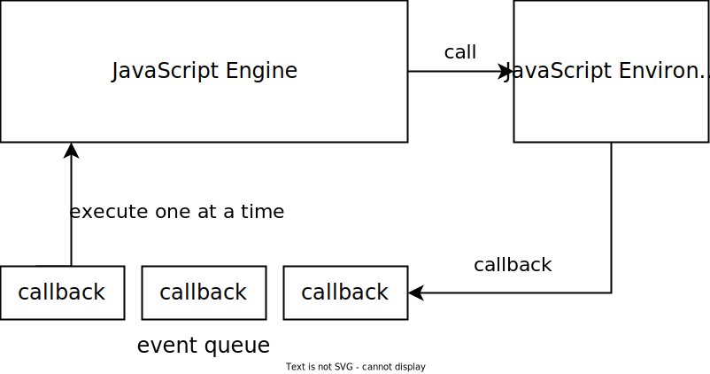

name: inverse
layout: true
class: center, middle, inverse
.indexlink[[<i class="fa fa-arrow-circle-o-up"></i>](#) [<i class="fa fa-list-ul"></i>](#index) [<i class="fa fa-tint"></i>](../change-color.php)]


---

name: normal
layout: true
class: left, middle
.indexlink[[<i class="fa fa-arrow-circle-o-up"></i>](#) [<i class="fa fa-list-ul"></i>](#index) [<i class="fa fa-tint"></i>](../change-color.php)]


---

template:inverse
# JavaScript / DOM
<a href="http://www.fe.up.pt/~arestivo">André Restivo</a>

---

template: inverse
name:index
# Index

.indexlist[
1. [Introduction](#intro)
1. [Variables](#variables)
1. [Control Structures](#control)
1. [Functions](#functions)
1. [Objects](#objects)
1. [Arrays](#arrays)
1. [Exceptions](#exceptions)
1. [DOM](#dom)
1. [Ajax](#ajax)
1. [Advanced Functions](#advanced-functions)
1. [Advanced Arrays](#advanced-arrays)
1. [Timers](#timers)
1. [Promises](#promises)
1. [Data Attributes](#data)
1. [jQuery](#jQuery)
]

---

template: inverse
name:intro
# Introduction

---

# DOM

* The **Document Object Model** (DOM) is a **programming interface** for HTML and XML documents.
* It provides a structured representation of the document and it defines a way that the structure can be accessed from programs so that they can change the document **structure**, **style** and **content**.
* The DOM is a fully object-oriented representation of the web page, and it can be modified with a scripting language such as **JavaScript**.

---

template: inverse
# Resources


* Reference:
  * [MDN JavaScript Reference](https://developer.mozilla.org/en-US/docs/Web/JavaScript/Reference)
  * [ECMAScript Reference](http://ecma-international.org/ecma-262/5.1/)
  * [MDN DOM Reference](https://developer.mozilla.org/en-US/docs/Web/API/Document_Object_Model)

* Resources:
  * [MDN JavaScript Resources](https://developer.mozilla.org/en-US/docs/Web/JavaScript)
  * [JS Fiddle](http://jsfiddle.net/)

* Tutorials:
  * [The Modern JavaScript Tutorial](http://javascript.info)
  * [JavaScript Style Guide](https://github.com/airbnb/javascript)

---

# JavaScript on HTML Documents

*JavaScript* can be embedded directly into an HTML document:

```html
<script>
  // javascript code goes here
</script>
```

Or as an external resource:

```html
<script src="script.js"></script>
```

The closing *tag* is mandatory.

---

# Script tag position

As *JavaScript* is capable of changing the HTML structure of a document, whenever the browser finds a **script** tag, it first fetches and runs that script and only then resumes loading the page.

Most *JavaScript* scripts don't change the document until it is fully loaded but the browser does not know this. For that reason, it was recommended that **script** tags were placed at the bottom of the **body**.

Modern browsers support the async and defer attributes, so scripts can safely be placed in the **head** of the document:

```html
<head>
  <script src="script.js" async></script>
  <script src="script.js" defer></script>
</head>
```

* A asynchronous (**async**) script is run as soon as it is downloaded but without blocking the browser.
* Deferred (**defer**) scripts are executed only when the page is loaded and in order.

---

# Document

The [Document](https://developer.mozilla.org/en/docs/Web/API/Document) object represents an HTML document.

You can access the current document in *JavaScript* using the **global** variable **document**.

Some Document **properties**:

  *  **URL** - read-only location of the document
  * **title** - contains the document title
  * **location** - a *location* object that can be assigned in order to change to another document

```javascript
document.location = 'http://www.google.com/'
```

There is also another **global** variable that represents the browser called **window**.

---

# Accessing Elements

The following *document* **methods** can be used to access specific HTML elements:

|||
|-:|-|
| Element **getElementById**(id)             | returns the element with the specified id
| NodeList **getElementsByClassName**(class) | returns all elements with the specified class
| NodeList **getElementsByTagName**(name)    | returns all elements with the specified tag name
| Element **querySelector**(selector)        | returns the first element selected by the specified CSS selector
| NodeList **querySelectorAll**(selector)    | returns all elements selected by the specified CSS selector

```javascript
let menu = document.getElementById('menu')
let paragraphs = document.getElementsByTagName('p')  
let intros = document.querySelectorAll('article p:first-child')  
```

---

# Element

An [Element](https://developer.mozilla.org/en-US/docs/Web/API/Element) object represents an HTML element.

Some common Element **properties**:

|||
|-:|-|
| **id**        | The id attribute |
| **innerHTML** | The HTML code inside the element |
| **outerHTML** | The HTML code including this element |
| **style**    | The CSS style of the element |

---

# Element

Some common Element **methods**:

|||
|-:|-|
| String **getAttribute**(name) | get the attribute with the given name (or null).
| **setAttribute**(name, value) | modifies the attribute with the given name to value.
| **remove**()                  | removes the element from its parent.

We can also use the same methods we used with the *document* object to access element children:

```javascript
  let article = document.getElementById('top-article')
  let intro = article.getElementsByTagName('p')[0]
```

Other **methods**: **removeAttribute**, **hasAttribute**

---

# Creating Elements

The **createElement** method of the *document* object can be used to create new elements:

```javascript
let title = 'Some Title'
let intro = 'This is a long introduction'

let article = document.createElement('article')
article.setAttribute('class', 'post')
article.innerHTML = '<h1>' + title + '</h1><p>' + intro + '</p>'

console.log(article.outerHTML)
```

The returned **article** variable is a subclass of the [HTMLElement](https://developer.mozilla.org/en-US/docs/Web/API/HTMLElement) class.

```html
<article class="post">
  <h1>Some Title</h1>
  <p>This is a long introduction</p>
</article>
```

The variable still **has not been inserted** anywhere in the *document*.

---

# HTML Element

The HTMLElement inherits from the Element object. There are [different](https://developer.mozilla.org/en-US/docs/Web/API/Document_Object_Model#HTML_interfaces)
HTMLElement objects for each HTML element.

|||
|-:|-|
| [HTMLElement](https://developer.mozilla.org/en-US/docs/Web/API/HTMLElement)       | style, title, blur(), click(), focus()
| [HTMLInputElement](https://developer.mozilla.org/en-US/docs/Web/API/HTMLInputElement)  | name, type, value, checked, autocomplete, autofocus, defaultChecked, defaultValue, disabled, min, max, readOnly, required
| [HTMLSelectElement](https://developer.mozilla.org/en-US/docs/Web/API/HTMLSelectElement) | name, multiple, required, size, length
| [HTMLOptionElement](https://developer.mozilla.org/en-US/docs/Web/API/HTMLOptionElement) | disabled, selected, defaultSelected, text, value
| [HTMLAnchorElement](https://developer.mozilla.org/en-US/docs/Web/API/HTMLAnchorElement) | href, host, hostname, port, hash, pathname, protocol, text, username, password
| [HTMLImageElement](https://developer.mozilla.org/en-US/docs/Web/API/HTMLImageElement)  | alt, src, width, height

---

# Node

The [Node](https://developer.mozilla.org/en-US/docs/Web/API/Node) object represents a node in the document tree. The *Element* object inherits from the *Node* object.

Some common Node **methods**:

|||
|-:|-|
| **appendChild**(node)             | appends a node to this node.
| **replaceChild**(new, old)        | replaces a child of this node.
| **removeChild**(child)            | removes a child from this node.
| **insertBefore**(new, reference)  | inserts a new child before the reference child.

---

# Element and Node

Some examples:

```javascript
let element = document.getElementById("menu") // gets the element with id menu

element.style.color = "blue"                  // changes the text color to blue
element.style.padding = "2em"                 // and the padding to 2em

let paragraph = document.createElement("p")   // creates a new paragraph
paragraph.innerHTML = "Some text"             // inserts text in the paragraph

element.appendChild(paragraph)                // adds the paragraph to the menu
element.remove()                              // removes the menu
```

---

# Traversing the DOM tree

The *Node* object has the following properties that can be used to traverse the DOM tree:

|||
|-:|-|
| **firstChild** and **lastChild**           | first and last node children of this node.
| **childNodes**                             | all children nodes as a NodeList.
| **previousSibling** and **nextSibling**    | previous and next siblings to this node.
| **parentNode**                             | parent of this node.
| **nodeType**                               | the type of the node.

We have to be careful as not all nodes are elements (see [node type list](https://developer.mozilla.org/en-US/docs/Web/API/Node.nodeType))

---

# Traversing the DOM tree

Consider the following HTML:

```html
<article id="article">
  <h1>Title</h1>
  <p>Some text</p>
</article>
```

And the following *JavaScript*:

```javascript
let article = document.getElementById('article')
console.log(article.firstChild)                         // #text
console.log(article.firstChild.textContent)             // '\n '
console.log(article.firstChild.nextSibling)             // <h1>
console.log(article.firstChild.nextSibling.textContent) // 'Title'
```

---

# Traversing the DOM tree

To solve this problem, the following properties have been added since *ECMAScript 6*:

|||
|-:|-|
| **firstElementChild** and **lastElementChild**        | first and last element children of this node.
| **children**                                          | all children elements as a NodeList.
| **previousElementSibling** and **nextElementSibling** | previous and next element siblings to this node.

```html
<article id="article">
  <h1>Title</h1>
  <p>Some text</p>
</article>
```

```javascript
let article = document.getElementById('article')
console.log(article.firstElementChild)                         // <h1>
console.log(article.firstElementChild.textContent)             // 'Title'
```

---

# NodeList

* A *NodeList* is an object that behaves like an array of elements.
* Functions like **document.getElementsByTagName()** return a *NodeList*.
* Items in a Node List can be accessed by index like in an array:

```javascript
let paragraphs = document.getElementsByTagName("p")
for (let i = 0; i < paragraphs.length; i++) {
  let paragraph = paragraphs[i]
  // do something with the paragraph
}
```

Or using a **for..of** loop:

```javascript
let paragraphs = document.getElementsByTagName("p")
for (const paragraph of paragraphs) {
  // do something with the element
}
```


---

# Events

* Events are sent to notify code of interesting things that have taken place.

* Each event is represented by an object which is based on the Event interface, and may have additional custom fields and/or functions used to get additional information about what happened.

Some possible events:

|||
|-:|-|
| Mouse | click, dblclick, mousedown, mouseup, mouseenter, mouseleave, mouseover, mousewheel
| Keys | keypress, keydown, keyup
| Text | cut, copy, paste, select
| Form | reset, submit
| Input | focus, blur, change

---

# Events in HTML

A possible way to get notified of Events of a particular type (such as click) for a given object is to specify an event handler using:

An HTML attribute named on{eventtype} on an element, for example:

```html
<button onclick="return handleClick(event)">
```

or by setting the corresponding property from JavaScript, for example:

```javascript
document.getElementById("mybutton").onclick = function(event) { ... }
```

---

# Add Event Handler

On modern browsers, the *JavaScript* function **addEventListener** should be used to handle events.

```javascript
element.addEventListener(type, listener[, useCapture = false])
```

Example:

```javascript
function handleEvent() {
  ...
}

let menu = document.getElementById("menu")
menu.addEventListener("click", handleEvent)
menu.addEventListener("click", function(){...})
```

---

# Event Handler Functions

A function that handles an event can receive a parameter representing the event that caused the function to be called.

```javascript
function handleEvent(event) {
  console.log('You shall not pass!')
  event.preventDefault()
}

let link = document.querySelector("a")
link.addEventListener('click', handleEvent)
```

Depending on its type, the event can have different properties and methods: [Reference](https://developer.mozilla.org/en/docs/Web/API/Event#DOM_Event_interface)

To make sure that the original behavior is prevented, we can use the event.[preventDefault](https://developer.mozilla.org/en-US/docs/Web/API/Event/preventDefault) method.

---


# Bubbling

* When an event happens on an element, it first runs the handlers on it, then on its parent, then all the way up on other ancestors.
* In each step, the handler can know the current target (*event.currentTarget* or *this*) and also the initial target (*event.target*).

.small[

Example where we add some events on all elements and print **this** and **event.target** tag names:

```html
<section> <article> <p>Text</p> </article> </section>
```

```javascript
document.querySelector('section').addEventListener('click', function(event){
  console.log('Bubble: ' + this.tagName + " - " + event.target.tagName)})
document.querySelector('article').addEventListener('click', function(event){
  console.log('Bubble: ' + this.tagName + " - " + event.target.tagName)})
document.querySelector('p').addEventListener('click', function(event){
  console.log('Bubble: ' + this.tagName + " - " + event.target.tagName)})
```
]

.small[
Clicking on the paragraph:
```html
Bubble: P - P
Bubble: ARTICLE - P
Bubble: SECTION - P
```
]

To stop bubbling we use the event.[stopPropagation](https://developer.mozilla.org/en-US/docs/Web/API/Event/stopPropagation) method.

---

# Capturing

Event processing has two phases:
  * Capturing: goes down to the element.
  * Bubbling: the event bubbles up from the element.

Although rarely used, the **useCapture** parameter of the *addEventListener* method, allows us to set the event handler on the capturing phase.

The previous example with some more capture events:

.small[
```javascript
document.querySelector('section').addEventListener('click', function(event){
  console.log('Capture: ' + this.tagName + " - " + event.target.tagName)}, true) // notice the true in the end
document.querySelector('article').addEventListener('click', function(event){
  console.log('Capture: ' + this.tagName + " - " + event.target.tagName)}, true)
document.querySelector('p').addEventListener('click', function(event){
  console.log('Capture: ' + this.tagName + " - " + event.target.tagName)}, true)
```

```html
Capture: SECTION - P
Capture: ARTICLE - P
Capture: P - P
Bubble: P - P
Bubble: ARTICLE - P
Bubble: SECTION - P
```
]

---

# On Load Event

As we want to be sure the DOM is completely loaded before adding events to any elements,
we normally add any initialization code to the *load* event of the *window* element.

```javascript
window.addEventListener('load', function() {
  // initialization code goes here.
})
```

With *ECMAScript 6* and the *defer* attribute, this is no longer necessary.

---

name:ajax
template: inverse
#Ajax

---

# Ajax

* Asynchronous JavaScript + XML.
* Not a technology in itself, but a term coined in 2005 by **Jesse James Garrett**, that describes an
  approach to using a number of existing technologies: namely the **XMLHttpRequest** object.

---

# XMLHttpRequest

XMLHttpRequest makes sending HTTP requests very easy.

```javascript
void open(method, url, async)
```

  * Method: **get** or **post**.
  * Url: The URL to fetch.
  * Async: if false, execution will stop while waiting for response.

Example:

```javascript
function requestListener () {
  console.log(this.responseText)
}

let request = new XMLHttpRequest()
request.onload = requestListener
request.open("get", "getdata.php", true)
request.send()
```

---

# Monitoring Progress

.small[
```javascript
let request = new XMLHttpRequest()

request.addEventListener("progress", updateProgress)
request.addEventListener("load", transferComplete)
request.addEventListener("error", transferFailed)
request.addEventListener("abort", transferCanceled)

request.open("get", "getdata.php", true)
request.send()

function updateProgress (event) {
  if (event.lengthComputable)
    let percentComplete = event.loaded / event.total
}

function transferComplete(event) {
  console.log("The transfer is complete.")
}

function transferFailed(event) {
  console.log("An error occurred while transferring the file.")
}

function transferCanceled(event) {
  console.log("The transfer has been canceled by the user.")
}
```
]

---

# Sending data

To send data to the server, we first must encode it properly:

```javascript
function encodeForAjax(data) {
  return Object.keys(data).map(function(k){
    return encodeURIComponent(k) + '=' + encodeURIComponent(data[k])
  }).join('&')
}
```

Sending it using **get**:

```javascript
request.open("get", "getdata.php?" + encodeForAjax({id: 1, name: 'John'}), true)
request.send()
```

Sending it using **post**:

```javascript
request.open("post", "getdata.php", true)
request.setRequestHeader('Content-Type', 'application/x-www-form-urlencoded')
request.send(encodeForAjax({id: 1, name: 'John'}))
```

---

# Analyzing a XMLRequest Response

If you use XMLHttpRequest to get the content of a remote **XML** document, the responseXML property will be a DOM Object containing a parsed XML document, which can be hard to manipulate and analyze.

If you use **JSON**, it is very easy to parse the response as JSON is already in *JavaScript Object Notation*.

```javascript
JSON.parse('{}')              // {}
JSON.parse('true')            // true
JSON.parse('"foo"')           // "foo"
JSON.parse('[1, 5, "false"]') // [1, 5, "false"]
JSON.parse('null')            // null
JSON.parse('{"1": 1, "2": 2}') // Object {1: 1, 2: 2}
JSON.parse(this.responseText)  // The server response
```

---

name:advanced-functions
template: inverse
#Advanced Functions

---

# Apply and Call

* The **apply()** method calls a function with a given *this* value, and arguments provided as an array.
* The **call()** method calls a function with a given *this* value and arguments provided individually.

```javascript
function foo(bar1, bar2) {
  console.log(this)
  console.log(bar1)
  console.log(bar2)
}

foo.apply('hello', ['john', 123] ) //hello john 123
foo.call('hello', 'john', 123)     //hello john 123
```

---

# Bind

The *bind()* method is similar to *call()* but returns a new function where *this* and any of the initial parameters are set to the provided values.

```javascript
function foo(bar1, bar2) {
  console.log(this)
  console.log(bar1)
  console.log(bar2)
}

let foo2 = foo.bind('hello', 'john')
foo2(123) //hello john 123
```

---

# Closures

A closure is the combination of a function and the lexical environment within which that function was declared.

```javascript
function foo() {
  let number = 123
  return function bar() {
    console.log(number)
  }
}

bar = foo()
bar() // 123
```

---

# Closures and Events

Closures are the reason code like this works in *JavaScript*:

```JavaScript
let paragraphs = document.querySelectorAll('p')
for (let i = 0; i < paragraphs.length; i++)
  paragraphs[i].addEventListener('click', function() {
      console.log('I am paragraph #' + i)
  })
```

Several functions were created in this code, and for each one of them, the variable **i** has a different value.

---

# Bind and Events

Sometimes we lose our *this*:

```javascript
class Foo {
    setup() {
      document.querySelector('h1').addEventListener('click', this.bar)
    }

    bar(event) {
      console.log(this)         // the h1 element (we wanted the object)
      console.log(event.target) // the h1 element
    }
}

let foo = new Foo()
foo.setup()
```

We can fix it using *bind*:

```javascript
setup() {
  document.querySelector('h1').addEventListener('click', this.bar.bind(this))
}
```

---

# Partial Functions

Sometimes we might want to do this:

```javascript
document.querySelector('p.blue').addEventListener('click', changeColor('blue'))
document.querySelector('p.red').addEventListener('click', changeColor('red'))

function changeColor(color) {
  this.style.color = color
}
```

But it obviously doesn't work. A solution would be to create anonymous functions to create a closure:

```javascript
document.querySelector('p.blue').addEventListener('click', function(event) {
  changeColor('blue', event)}
)
document.querySelector('p.red').addEventListener('click', function(event) {
  changeColor('red', event)}
)

function changeColor(color, event) {
  event.target.style.color = color
}
```

---

# Partial Functions

Instead we can create partial functions using bind:

```javascript
let blue = document.querySelector('p.blue')
blue.addEventListener('click', changeColor.bind(blue, 'blue'))

let red = document.querySelector('p.red')
red.addEventListener('click', changeColor.bind(red, 'red'))

function changeColor(color) {
  this.style.color = color
}
```

---

name:advanced-arrays
template: inverse
#Advanced Arrays


---

# forEach

The *forEach()* method executes a provided function once for each array element.

```javascript
let numbers = [4, 8, 15, 16, 23, 42]
numbers.forEach(function(value, index){
    console.log('Element #' + index + ' is ' + value)
})
```

The result would be:

```html
Element #0 is 4
Element #1 is 8
Element #2 is 15
Element #3 is 16
Element #4 is 23
Element #5 is 42
```

---

# Filter

The *filter()* method creates a new array with all elements that pass the test implemented by the provided function.

```javascript
let numbers = [4, 8, 15, 16, 23, 42]
let even = numbers.filter(function(n) {return n % 2 == 0})
console.log(even) // [ 4, 8, 16, 42 ]
```

Or using arrow functions:

```javascript
let numbers = [4, 8, 15, 16, 23, 42]
let even = numbers.filter(n => n % 2 == 0)
console.log(even) // [ 4, 8, 16, 42 ]
```

The alternative would be:

```javascript
let numbers = [4, 8, 15, 16, 23, 42]
let even = []
for (let i = 0; i < numbers.length; i++)
  if (numbers[i] % 2 == 0) even.push(numbers[i])
console.log(even) // [ 4, 8, 16, 42 ]
```

---

# Map

The *map()* method creates a new array with the results of calling a provided function on every element in the calling array.

```javascript
let numbers = [4, 8, 15, 16, 23, 42]
let doubled = numbers.map(function(n) {return n * 2})
console.log(doubled) // 8, 16, 30, 32, 46, 84
```

Or using arrow functions:

```javascript
let numbers = [4, 8, 15, 16, 23, 42]
let doubled = numbers.map(n => n * 2)
console.log(doubled) // 8, 16, 30, 32, 46, 84
```

---

# Generic use of map

The *map()* method can be used on other types of *array like* objects:

```javascript
let ascii = Array.prototype.map.call('John', letter => letter.charCodeAt(0))
console.log(ascii) // [74, 111, 104, 110]
```

Simpler:

```javascript
let ascii = [].map.call('John', letter => letter.charCodeAt(0))
console.log(ascii) // [74, 111, 104, 110]
```

A more useful example:

```javascript
let inputs = document.querySelectorAll('input[type=number]')
let values = [].map.call(inputs, input => input.value)
console.log(values) // an array with all the number input values
```

---

# Reduce

The *reduce()* method applies a function against an accumulator (starting at 0 by default) and each element in the array (from left to right) to reduce it to a single value.

```javascript
let numbers = [4, 8, 15, 16, 23, 42]
let total = numbers.reduce(function(current, number) {
  return current + number
})
console.log(total) // 108
```

Or with arrow functions:

```javascript
[4, 8, 15, 16, 23, 42].reduce( (c, n) => c + n ) // 108
```

We can initialize the accumulator adding a second parameter:

```javascript
[4, 8, 15, 16, 23, 42].reduce( (c, n) => c + n, 10 ) // 118
```

---

# Objects to Arrays

Sometimes we need to convert an *array like* object (like *NodeList*) to a true array so that we can use these awesome new array functions.

```javascript
let paragraphs = document.querySelectorAll('p')
```

There are several ways to achieve this:

```javascript
let array1 = Array.apply(null, paragraphs)
let array2 = Array.prototype.slice.call(paragraphs)
let array3 = [].slice.call(paragraphs)
let array4 = [...paragraphs] // the ECMAScript 2015 spread operator
```

---

# Spread Operator

The spread operator allows an iterable, such as an array or string, to be expanded in places where zero or more arguments are expected.

```javascript
function sum(x, y, z) {
  return x + y + z
}

const numbers = [1, 2, 3]

console.log(sum(...numbers))
```

Other examples:

```javascript
[...document.querySelectorAll('input')] // all inputs as an array

function sum(...args) { // sum any number of args
  let sum = 0
  for (let i = 0; i < args.length; i++)
    sum += args[i]
  return sum
}
sum (1,2,3) // 6
```

---

name:timers
template: inverse
#Timers

---

# Set Timeout

The *window* object has a function (*setTimeout*) that sets a timer which executes a function, or specified piece of code, once it expires:

```javascript
  let id = window.setTimeout(function() {console.log('Yay!')}, 5000)
```

The return value is an *id* that can be used to cancel the timer:

```javascript
  window.clearTimeout(id)
```

---

# Set Interval

Another function (*setInterval*) executes executes a function, or specified piece of code, with a fixed time delay between each call.

```javascript
  let counter = 1
  let id = window.setInterval(function() {
    console.log('Yay! ' + counter++)
  }, 1000)
```

The return value is an *id* that can be used to cancel the timer:

```javascript
  window.clearInterval(id)
```

---

name:promises
template: inverse
#Promises
## Async, Await and the Event Loop

---

# Event Loop

JavaScript is **single-threaded**!

That means there is always only one thread running, which has a **call stack**.

But there can be a multitude of event callbacks waiting to be executed in the **event queue**.



```javascript
button.addEventListener('click', function() {
  foo()
})
```

---

# Asynchronous 

So how do asynchronous calls (e.g., Ajax) work?

Asynchronous calls are **delegated** to the **browser** (web apis) and run in a separate thread.

When the call **returns**, the browser **injects** a call into the **event queue**.


---

# Promises

A *promise* represents the eventual result of an asynchronous operation. 

A *promise* may be in one of 3 possible states: **fulfilled**, **rejected**, or **pending**.

A *promise* can be used to return asynchronously from an synchronous function. This can save us from [Callback Hell](http://callbackhell.com/).

```javascript
let promise = new Promise(function(resolve, reject) {
  /* Very long operation */
  if (ok)
    resolve(result)
  else
    reject(error)
})
```

---

# Consuming

When the *promise* *resolves*, or is *rejected*, we can use *then* and *catch* to consume it:

```javascript
promise.then(function(result){
  console.log('Ok')
}).catch(function(error)){
  console.log('Error')
}
```

---

# Example

Transforming a **synchronous** *XMLHttpRequest* into a *promise*:

```javascript
function getSomeData() {
  return new Promise(function(resolve, reject) {
    let request = new XMLHttpRequest()
    request.open("get", "getdata.php", false) // synchronous
    request.send()
    if (request.status === 200) resolve(request.response)
    else reject(request.statusText)
  })
}
```

```javascript
getSomeData().then(console.log).catch(alert)
```

---

# Chaining

*Promises* can be chained, making successive calls to asynchronous functions much easier:

```javascript
getSomeData()
  .then(function(result){
    return getMoreDataBasedOn(result) // also returns a promise
  })
  .then(function(result){
    return getEvenMoreDataBasedOn(result)
  })
  .then(function(result){
    console.log(result)
  })
  .catch(console.log) // catches any error in the chain
```

---

# Async Functions

An **async** function is a function which operates asynchronously (via the event loop), using an **implicit** *Promise* to return its result.

An **async** function always returns a *promise*. If the code returns a *non-promise*, then JavaScript automatically wraps it into a resolved *promise* with that value.

```javascript
async function getSomeData() {
  let request = new XMLHttpRequest()
  request.open("get", "getdata.php", false) // synchronous
  request.send()
  if (request.status === 200) 
    return request.response
  else
    throw(new Error('Error getting data'))
}
```

**Note:** using promises and async does **not** make JavaScript multi-thread.

---

# Await

The keyword *await* makes JavaScript wait until a *promise* settles and returns its result.

```javascript
async function doSomething() {
  let result = await getSomeData() // returns a promise
  console.log(result)
}
```

The keyword *await* can only be used inside *async* functions.

---

# Promise.all

The *Promise.all(&lt;promises&gt;)* method returns a single *Promise* that resolves when all of the *promises* in the argument have resolved. It rejects with the reason of the first *promise* that rejects.

```javascript
async function doSomething() {
  let promise1 = getSomeData()
  let promise2 = getEvenMoreData()
  Promise.all([promise1, promise2]).then(function(values) {
    console.log(values)
  })
}
```

The result is an array with the results of each one of the *promises*

---

# Ajax with Promises

The commands fetch() and json() return promises:

```javascript

const request = async () => {
    const response = await fetch('https://example.com/');
    const json = await response.json();
    console.log(json);
}

request();
```

---

name:data
template: inverse
#Data Attributes (not really JS)

---

# HTML5 Data Attributes

HTML5 data-* attributes allow us to store extra information on standard, semantic HTML elements without using hacks.

This can be useful, for example, to store the id of a certain database tuple to be used in an Ajax call.

```html
  <ul>
    <li data-id="1">Apple</li>
    <li data-id="2">Banana</li>
    <li data-id="3">Pear</li>
  </ul>
```

---

name:jquery
template: inverse
#jQuery

---

# jQuery

**jQuery** is a *JavaScript* library that solves several different problems:

  * Inadequacy of the *Javscript* DOM.
  * Browser compatibility issues.
  * Verbosity of some *JavaScript* commands.

Most of these have been mitigated by recent advances in the *JavaScript* standard.

---

# How it works

* *jQuery* defines a function/object called *$* (yes, the dollar sign).
* This function is responsible for selecting and filtering elements, traversing and modifying the DOM, ...
* Elements selected are returned nested inside a *$* object making it harder to mix *jQuery* with plain *JavaScript* code.

Example:

```javascript
$('p').click(function() {
  console.log($(this).text())
})
```

In plain JavaScript this would be:

```javascript
let paragraphs = document.querySelectorAll('p')
for (let i = 0; i < paragraphs.length; i++)
  paragraphs[i].addEventListener('click', function(){
    console.log(this.textContent)    
  })
```

---

# Drawbacks

  * *jQuery* is big (85Kb minified).
  * *jQuery* is slow (mainly due to having to maintain compatibility with older browsers).
  * You end up being trapped into the *jQuery* ecosystem.

---

# Alternatives

Roll your own:

```javascript
function $(selector) {
  return document.querySelectorAll(selector)
}

NodeList.prototype.css = function(property, value) {
  [].forEach.call(this, function(element) {
    element.style[property] = value
  })
  return this
}

$('p').css('color', 'red').css('background-color', 'blue')
```

Smaller and simpler alternatives like: http://zeptojs.com/ (25Kb)

Just use plain JavaScript: https://plainjs.com/
