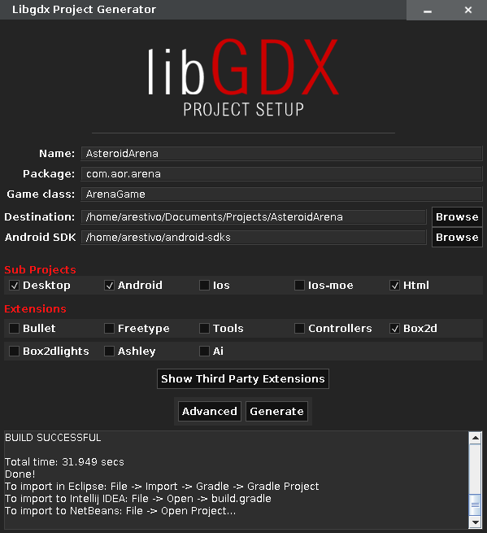
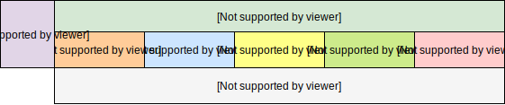
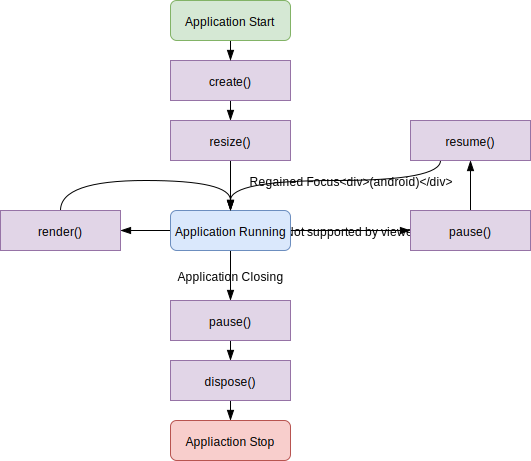
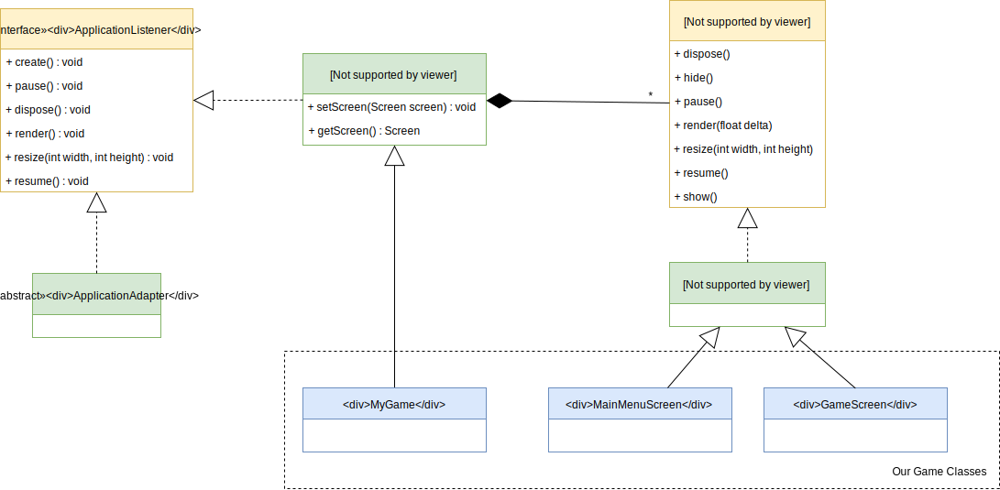
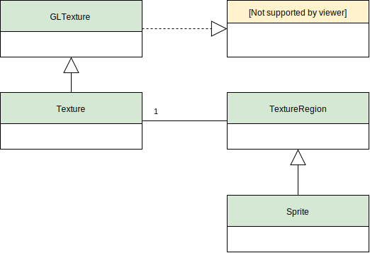
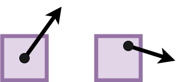
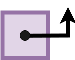

name: inverse
layout: true
class: center, middle, inverse
.indexlink[[<i class="fa fa-arrow-circle-o-up"></i>](#) [<i class="fa fa-list-ul"></i>](#index) [<i class="fa fa-tint"></i>](../change-color.php)[<i class="fa fa-file-pdf-o"></i>](download)]

---

name: normal
layout: true
class: left, middle
.indexlink[[<i class="fa fa-arrow-circle-o-up"></i>](#) [<i class="fa fa-list-ul"></i>](#index) [<i class="fa fa-tint"></i>](../change-color.php)[<i class="fa fa-file-pdf-o"></i>](download)]

---

template:inverse
# LibGDX
<a href="http://www.fe.up.pt/~arestivo">André Restivo</a>

---

template:inverse
name:index
# Index

.indexlist[
1. [Introduction](#intro)
1. [Core Modules](#modules)
1. [Life-Cycle](#life-cycle)
1. [2D Graphics](#2dgraphics)
1. [Camera](#camera)
1. [Physics](#physics)
1. [Input Handling](#input)
]

---

template:inverse
name:intro
# Introduction

---

# LibGDX

A Java game development framework providing a unified API that works across several different platforms:

* Desktop: Windows, Linux, Mac OS X
* Mobile: Android, BlackBerry, iOS
* Web: Java Applet, Javascript/WebGL

Can be used in many different ways as it does not force a specific design on you.

---

# Environment Setup

* Start by downloading the [LibGDX Setup App](https://libgdx.badlogicgames.com/download.html).
* To open it, double-click the downloaded *.jar* file or use .code[java -jar gdx-setup.jar] from the command line.
* If you want to have Android support, you must also have the Android SDK installed. The easiest way is to install [Android Studio](https://developer.android.com/studio/index.html).

---

# Setup App

.smaller[

]

---

# Assets

* The setup app creates a different project for each selected platform plus a *Core* project where you will write the bulk of your code.

* In order to share assets between the different projects, only one assets folder is created. 

* If you select *Android* as a supported platform, this folder will be located in the *Android* project.

* If not, it will be located in the *Core* project.

* You might have to change the working directory of each project to the assets folder in your IDE of choice.

---

template:inverse
name:modules
# Core Modules

---

# Core Modules

The Gdx class provides a unified interface to all the supported platforms:

* **Input** - Provides an input model and handler for all platforms (keyboard, touchscreen, accelerometer, mouse, ...). .code[Gdx.input.getAccelerometerX()]
* **Graphics** - Enables the drawing of images to the screen using the hardware provided OpenGL ES implementation. .code[Gdx.graphics.isFullscreen()] .code[Gdx.gl.glClearColor();
]
* **Files** - Abstracts file access on all platforms by providing convenient methods for read/write operations. .code[Gdx.files.internal()]
* **Audio** - Facilitates sound recording and playback on all platforms. .code[Gdx.audio.newSound()]
* **Networking** - Provides methods to perform networking operations, such as simple HTTP get and post requests, and TCP server/client socket communication. .code[Gdx.net.newServerSocket()]

---

# Core Modules

Core modules are not only used by the app being developed, but also by the internal LibGDX code. 

---

template:inverse
name:life-cycle
# Application Life-Cycle

---

# Starter Classes

For each target platform, a starter class is automatically generated by the setup application.

Normally we don't have to modify these classes unless we want to change some configuration items.

Example **desktop** starter class:

~~~java
public class Main {
   public static void main(String[] args) {
      LwjglApplicationConfiguration cfg = new LwjglApplicationConfiguration();
      cfg.title = "My Game";
      cfg.useGL30 = false;
      cfg.width = 480;
      cfg.height = 320;
		
      new LwjglApplication(new MyGame(), cfg);
   }
}
~~~

---

# ApplicationListener

An *ApplicationListener* allows you to handle application events. This allows you to execute code during certain events within the game life-cycle.

~~~java
public interface ApplicationListener {

  public void create ();  // When the game is created
  public void render ();  // When the game should render a frame
  public void resize (int width, int height); // When the game is resized
  public void pause ();   // When the game loses focus (android only)
  public void resume ();  // When the game regains focus (android only)
  public void dispose (); // When the games is closed

}
~~~

---

# Life Cycle

---

# ApplicationAdapter

An abstract class that implements the *ApplicationListener* interface. Allows the developer to implement the *ApplicationListener* interface without overriding every method.

~~~java
public abstract class ApplicationAdapter implements ApplicationListener {

  /* ... */

}
~~~

---

# Game

A *Game* is an *ApplicationListener* that supports multiple screens. You can create multiple screens and switch between em using *setScreen*. Game events are delegated to the current screen.

~~~java
public abstract class Game implements ApplicationListener {

  public void setScreen(Screen screen);
  public Screen getScreen();
  /* ... */

}
~~~

---

# Screen

Represents one of many application screens, such as a main menu, a settings menu, the game screen and so on.

~~~java
public interface Screen {

  public void	dispose();
  public void	hide();
  public void	pause();
  public void	render(float delta); // delta in seconds since the last render.
  public void	resize(int width, int height);
  public void	resume();
  public void	show();

}
~~~

---

# ScreenAdapter

An abstract class that implements the *Screen* interface. Allows the developer to implement the *Screen* interface without overriding every method.

~~~java
public abstract class ScreenAdapter implements Screen {

  /* ... */

}
~~~

---

# Proposed Usage

.large[

]

---

template:inverse
name:2dgraphics
# 2D Graphics

---

# SpriteBatch

* It is very common to draw a texture mapped to rectangular geometry. 
* It is also very common to draw the same texture or various regions of that texture **many times**. 
* It would be **inefficient** to send each rectangle one at a time to the GPU to be drawn. 
* Instead, many rectangles for the same texture can be described and sent to the GPU **all at once**. 

This is what the SpriteBatch class does.

~~~java
public class SpriteBatch implements Batch {
  public void begin ();
  public void draw(Texture texture, float x, float y); // and many other like this
  public void end();
  public void dispose();
}
~~~

---

# Texture

The Texture class decodes an image file and loads it into GPU memory. 

~~~java
public class Texture extends GLTexture {

}
~~~

Loading a texture into memory:

~~~java
Texture heroTexture = new Texture (Gdx.files.internal("hero.png"));
~~~

Textures should be disposed once they are not needed:

~~~java
heroTexture.dispose();
~~~

---

# TextureRegion

The *TextureRegion* class describes a rectangle inside a texture and is useful for drawing only a portion of the texture.

~~~java
public class TextureRegion {
  public TextureRegion (TextureRegion region, 
    int x, int y, 
    int width, int height);
	
  public void setRegion (int x, int y, int width, int height);

  public static TextureRegion[][] split (Texture texture, 
      int tileWidth, int tileHeight);
}
~~~

The *split* method is an helper method that splits a *Texture* into *TextureRegion*s according to a tile width and height. 

---

# Sprite

The *Sprite* class describes both a *texture region* and the *geometry* where it will be drawn.

~~~java
public class Sprite extends TextureRegion {
  public Sprite (TextureRegion region);

  public void setPosition (float x, float y);
  public void setCenter(float x, float y);
  public void setRotation (float degrees);
  public void setScale (float scaleXY);

  public void draw (Batch batch);
}
~~~

---

# Texture Classes

---

# AssetManager

* *Texture*s take a lot of precious memory.
* The same texture is typically used more than once.
* The AssetManager can manage our textures keeping only one copy of each in memory.
* It also handles asynchronous loading.

~~~java
public class AssetManager implements Disposable {
	public <T> void load (String fileName, Class<T> type);
	public <T> T get (String fileName);

	public boolean update(); // true if finished loading
	public void finishLoading (); // waits for all assets to load
}
~~~

---

# Render

To render our *Screen* we can do something like:

~~~java
public void render(float delta) {
    super.render(delta);

    // Clear the screen
    Gdx.gl.glClearColor( 103/255f, 69/255f, 117/255f, 1 );
    Gdx.gl.glClear( GL20.GL_COLOR_BUFFER_BIT | GL20.GL_DEPTH_BUFFER_BIT );

    // Draw the texture
    game.getBatch().begin();
    game.getBatch().draw(texture, 100, 100);
    game.getBatch().end();
}
~~~

---

# Example

As an example lets checkout the *texture* branch on this example project:

https://github.com/arestivo/BouncingBalls/tree/texture

In particular the [BouncingScreen](https://github.com/arestivo/BouncingBalls/blob/texture/core/src/com/aor/bouncing/BouncingScreen.java) class.

---

template:inverse
name:camera
# Camera

---

# Units

* Every device has a different screen size and ratio.
* This means that we cannot think in terms of pixels to define the size of our objects.

~~~java
public static int WORLD_WIDTH = 100; // Arbitrary world size (e.g. meters)
public static int WORLD_HEIGHT = 50;

// The ammount of world we want to show in our screen
public static int VIEWPORT_WIDTH = 50; 
public static int VIEWPORT_HEIGHT = 25; // Can be calculated from screen ratio 

// How to transform from pixels to our unit
public static int PIXEL_TO_METER = .05f;

float ratio = ((float) Gdx.graphics.getHeight() / (float) Gdx.graphics.getWidth());

~~~

---

# Example

For example:
* A world of 100x50(m).
* On a 1280x720(px) screen.
* With a viewport 50m wide.
* And showing a 50x50(px) texture.
* Where a pixel is equal to .05m.

We would get:

* The world would have 2560x2048 pixels.
* The screen ratio would be 1.78.
* The viewport would be 1280x720(px) or 50x28.1(m).
* The texture would represent 2.5x2.5(m).
* The texture would be drawn as 64x64(px) (2.5/50*1280).

---

# Orthographic Camera

* The viewport into our game.
* Implements a parallel (orthographic) projection.

~~~java
public class OrthographicCamera extends Camera {
  public OrthographicCamera (float viewportWidth, float viewportHeight);
  public void update (); // Updates the transformation matrix
}
~~~

Setting the camera position:

~~~java
camera.position.set(new Vector3(x, y, 0));
~~~

---

# Example

As an example lets checkout the *camera* branch on this example project:

https://github.com/arestivo/BouncingBalls/tree/camera

In particular the [BouncingScreen](https://github.com/arestivo/BouncingBalls/blob/camera/core/src/com/aor/bouncing/BouncingScreen.java) class.

---

template:inverse
name:physics
# Physics

---

# World

The *World* class manages all physics entities using [Box2D](http://box2d.org/).

~~~java
public final class World implements Disposable {
  public World (Vector2 gravity, boolean doSleep);
	public Body createBody (BodyDef def);
	public void destroyBody (Body body);
}
~~~

The world uses SI units (meters, Newtons, seconds, radians, ...)

---

# Body

In *Box2D* the physical objects are called bodies.

Bodies can be of three types:

* **Dynamic**: move around and are affected by forces and other dynamic, kinematic and static objects.
* **Static**: do not move and are not affected by forces.
* **Kinematic**: do not react to forces, but have the ability to move.

---

# Body Definition

* To create a body we first must create a body definition.

* A body definition holds all the data needed to construct a rigid body. You can safely re-use body definitions.

~~~java
BodyDef bodyDef = new BodyDef();
bodyDef.type = BodyDef.BodyType.DynamicBody;

bodyDef.angle = (float) (Math.PI / 4); // radians 
bodyDef.position.set(10f, 5f);         // meters
bodyDef.linearVelocity.set(5f, 0f);    // meters/s
bodyDef.angularVelocity.set(Math.PI);  // PI radians/s

Body body = world.createBody(bodyDef);
~~~

---

# Fixtures

* Each body is made up of one or more *fixtures*, which have a fixed position and orientation within the body.
* Fixtures give bodies their shape, mass and properties.

~~~java
// Create shape
CircleShape circle = new CircleShape();
circle.setRadius(0.22f);       //22cm

// Create fixture
FixtureDef fixtureDef = new FixtureDef();
fixtureDef.shape = circle;
fixtureDef.density = .5f;      // how heavy is the fixture kg/m^2
fixtureDef.friction = .5f;     // how slippery is the fixture [0,1]
fixtureDef.restitution = .5f;  // how bouncy is the fixture [0,1]

// Attach ficture to body
body.createFixture(fixtureDef);
~~~

---

# Shapes

There are 4 types of shapes that can be used to create fixtures:

* Circle: A circle with a radius.
* Edge: A line segment.
* Chain: A chain of line segments.
* Polygon: A convex polygon.

---

# Circle Shape

Circles have a radius:

~~~java
CircleShape circle = new CircleShape();
circle.setRadius(0.11f);
~~~

---

# Polygon Shape

 * Polygon shapes must be convex and can have 8 vertexes at most.
 * They can be combined to create more complex shapes.

~~~java
public class PolygonShape extends Shape {
  public void set (Vector2[] vertices);
}
~~~

Creating a rectangular shape is easy with the *setAsBox* method.

~~~java
PolygonShape rectangle = new PolygonShape();
rectangle.setAsBox(1f, 0.5f);
~~~

---

# Updating the world

* To update our simulation we need to tell our world to step. 
* Stepping updates the world objects through time. 
* The best place to call our step function is at the end of our *render* loop. 

~~~java
public final class World implements Disposable {
  public void step (
    float timeStep,          // time since last update
    int velocityIterations,  // accuracy for velocity constraints (6)
    int positionIterations); // accuracy for position constraints (2)
}

~~~

---

# Example

As an example lets checkout the *physics* and *ground* branches on this example project:

https://github.com/arestivo/BouncingBalls/tree/physics
https://github.com/arestivo/BouncingBalls/tree/ground

In particular the [BouncingScreen](https://github.com/arestivo/BouncingBalls/blob/physics/core/src/com/aor/bouncing/BouncingScreen.java) (physics) and [BouncingScreen](https://github.com/arestivo/BouncingBalls/blob/ground/core/src/com/aor/bouncing/BouncingScreen.java) (ground) classes.

---

# Direct Movement

We can change the position, angle and speed of a body directly:

~~~java
  public void setTransform (Vector2 position, float angle); // meters, radians
  public void setLinearVelocity (Vector2 velocity);         // meters/second
  public void setAngularVelocity (float omega);             // radians/second
~~~

---

# Forces and Impulses

But normally, to move things around, we will apply forces or impulses to a body.

* Forces act gradually over time to change the velocity of a body.
* Impulses change a body's velocity immediately.

~~~java
public class Body {
  public void applyForce (Vector2 force, Vector2 point, boolean wake); // Newtons
  public void applyForceToCenter (Vector2 force, boolean wake);        // Newtons
  public void applyLinearImpulse (Vector2 impulse, Vector2 point, boolean wake); 
  //Newtons*second
}
~~~

---

# Torque

Angular movement can also be controlled:

* Torques act gradually over time to change the angular velocity of a body.
* Impulses change a body's angular velocity immediately.

~~~java
public class Body {
	public void applyTorque (float torque, boolean wake);          //Newton*meter
	public void applyAngularImpulse (float impulse, boolean wake); //kg*m²/second
}
~~~

[More on Box2D](https://github.com/libgdx/libgdx/wiki/box2d)

---

template:inverse
name:input
# Input Handling

---

# Keyboard

In each step of our simulation we can check if some key of the keyboard has been pressed using the *Input* interface.

~~~java
public interface Input {
	public boolean isKeyPressed (int key);
	public boolean isKeyJustPressed (int key);
}
~~~

The Input interface also has keycodes for every key:

~~~java
  Input.isKeyPressed( Input.Key.NUM_0 );
  Input.isKeyPressed( Input.Key.A );
  Input.isKeyPressed( Input.Key.LEFT );
  /* ... */
~~~

---

# Touch

We can also checked if the screen has been touched or clicked:

~~~java
public interface Input {
	public boolean isTouched ();
	public boolean justTouched ();
}
~~~

And get the touch coordinates:

~~~java
public interface Input {
	public int getX ();
	public int getY ();
	public int getDeltaX ();
	public int getDeltaY ();
}
~~~

---

# Example

As an example lets checkout the *input* branch on this example project:

https://github.com/arestivo/BouncingBalls/tree/input

In particular the [BouncingScreen](https://github.com/arestivo/BouncingBalls/blob/input/core/src/com/aor/bouncing/BouncingScreen.java) class.

