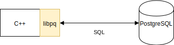

name: inverse
layout: true
class: center, middle, inverse
.indexlink[[<i class="fa fa-arrow-circle-o-up"></i>](#) [<i class="fa fa-list-ul"></i>](#index) [<i class="fa fa-tint"></i>](../change-color.php)[<i class="fa fa-file-pdf-o"></i>](download)]

---

name: normal
layout: true
class: left, middle
.indexlink[[<i class="fa fa-arrow-circle-o-up"></i>](#) [<i class="fa fa-list-ul"></i>](#index) [<i class="fa fa-tint"></i>](../change-color.php)[<i class="fa fa-file-pdf-o"></i>](download)]

---

template:inverse
# libpq
<a href="http://www.fe.up.pt/~arestivo">André Restivo</a>

---

template:inverse
name:index
# Index

.indexlist[
1. [Introduction](#intro)
1. [Connection](#connection)
1. [Manipulation](#manipulation)
1. [Queries](#queries)
1. [SQL Injection](#injection)
]

---

template:inverse
name:intro
# Introduction

---

# libpq

*Libpq* is the C application programmer's interface to PostgreSQL. 

*Libpq* is a set of library functions that allow client programs to pass queries to the PostgreSQL backend server and to receive the results of these queries.

---

# Usage

Documentation:
  https://www.postgresql.org/docs/9.5/static/libpq.html

To compile a program using libpq we must first include the following file:

~~~cpp
#include <postgresql/libpq-fe.h>
~~~

And link the library when compiling:

~~~bash
g++ libpq.cpp -o libpq -lpq
~~~

---

template:inverse
name:connection
# Connection

---

# Connection

To connect to a PostgreSQL database we use the *PQconnectdb* command.

This command receives a *connection string* as its only parameter. 

The *connection string* will contain all the necessary information about the database: host, username and password.

The result will be a pointer to a PGconn variable representing the connection to the database.

~~~cpp
PGconn *PQconnectdb(const char *connection);
~~~

~~~cpp
PGconn *conn = PQconnectdb("host='dbm.fe.up.pt' user='USERNAME' password='PASSWORD'");
~~~

---

# Connection

To verify if the connection was succesful, we start by verifying if the connection returned *null*.

After that, we should verify the status of the connection using the function *PQStatus*.

~~~cpp
if(!conn) {
  cout << "Failed to connect to Database" << endl;
  exit(-1);
}

if (PQstatus (conn) != CONNECTION_OK) {
  cout << "Failed to connect to Database" << endl;
  cout << PQerrorMessage(conn) << endl;
  exit(-1);
}
~~~

---

# Connection

When the connection is no longer necessary, we should close it.

~~~cpp
PQfinish(conn);
~~~

---

template:inverse
name:manipulation
# Manipulation

---

# Manipulation

To execute a query we use the PQexec function. 

This command receives a pointer to the connection being used and a string representing the query to be executed.

~~~cpp
PGresult *PQexec(PGconn *conn, const char *command);
~~~

~~~cpp
void deleteEmployee(int id) {
  string query = "DELETE * FROM employee WHERE id = " + intToStr(id);
  PGresult *res = PQexec(conn, query.c_str());
}

~~~

---

# Manipulation

We should verify if the query was successful using the *PQresultStatus* function.

~~~cpp
boolean deleteEmployee(int id) {
  string query = "DELETE * FROM employee WHERE id = " + intToStr(id);
  PGresult *res = PQexec(conn, query.c_str());
  return PQresultStatus(res) == PGRES_COMMAND_OK;
}
~~~

---

# Manipulation

If we want to know the error message we can use the *PQresultErrorMessage* function.

~~~cpp
boolean deleteEmployee(int id) {
  string query = "DELETE * FROM employee WHERE id = " + intToStr(id);
  PGresult *res = PQexec(conn, query.c_str());
  if (PQresultStatus(res) != PGRES_COMMAND_OK) {
    cout << PQresultErrorMessage(res) << endl;
    return false:
  }
  return true;
}
~~~

---

template:inverse
name:queries
# Queries

---

# Queries

For queries that return a result (i.e. SELECT), we also use the *PQexec* function.

The main differences are in the way we verify if the query succeeded and that it
returns some results.

~~~cpp
PGresult* getEmployees(int dep_id) {
  string query = "SELECT id, name FROM employee WHERE dep_id = " + intToStr(dep_id);
  PGresult *res = PQexec(conn, query.c_str());
  if (PQresultStatus(res) != PGRES_TUPLES_OK) {
    cout << PQresultErrorMessage(res) << endl;
    return null;
  }
  return res;
}
~~~

---

# Queries

To know how many lines were returned by the query, we use the *PQntuples* function.

~~~cpp
int PQntuples(const PGresult *res);
~~~

To obtain a value from the results, we use the *PQgetvalue* using the line and column number to identify the desired result.

~~~cpp
char *PQgetvalue(const PGresult *res,
                 int row_number,
                 int column_number);
~~~

~~~cpp
PGresult* employees = getEmployees(5);

if (employees != 0) {
  for (int row = 0; row < PQntuples(employees); row++) {
    cout << PQgetvalue(employees, row , 0) 
         << " - " 
         << PQgetvalue (employees, row, 1) 
         << endl;
  }
}
~~~

---

# Queries

Because *PQgetvalue* returns an empty string if a certain field contains a null value, we must use the *PQgetisnull* function to test if a value is null. 

This function returns 1 if the value is null and 0 if it isn't.

~~~cpp
int PQgetisnull(const PGresult *res,
                int row_number,
                int column_number);
~~~

---

template:inverse
name:injection
# SQL Injection

---

# SQL Injection

SQL injection is a code injection technique, used to attack data-driven applications, in which nefarious SQL statements are inserted into an entry field for execution

Consider the following code:

~~~cpp
strin query = "SELECT emp_id, emp_name FROM employee WHERE emp_name= '" + name + "'";
PQexec (conn , query.c_str());
~~~

What happens if the user inputs:

~~~bash
';DELETE FROM empregado;--
~~~

---

# SQL Injection

---

# SQL Injection

One way to prevent these kind of attacks is to use the *PQexecParams* function:

~~~cpp
PGresult *PQexecParams(
  PGconn *conn,
  const char *command,
  int nParams,
  const Oid *paramTypes,
  const char * const *paramValues,
  const int *paramLengths,
  const int *paramFormats,
  int resultFormat);
~~~

---

# SQL Injection

Example usage of the *PQexecParams* function:

~~~cpp
const char *paramValues[1];
paramValues[0] = "John";

res = PQexecParams(conn,
       "SELECT emp_id, emp_name FROM employee WHERE emp_name= $1",
       1,       /* one param */
       NULL,    /* let the backend deduce param type */
       paramValues,
       NULL,    /* don't need param lengths since text */
       NULL,    /* default to all text params */
       0);      /* ask for text results */
~~~
