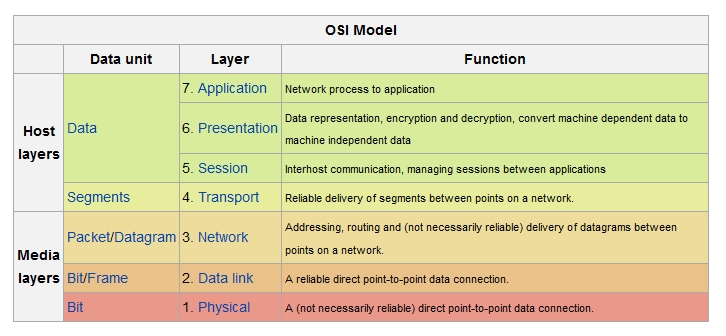
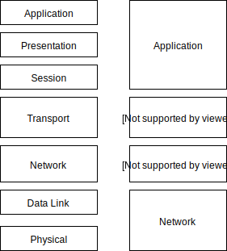
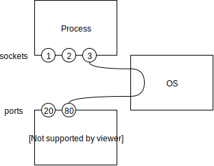
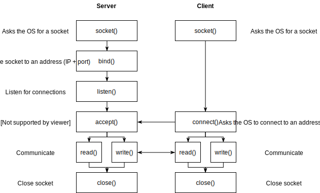
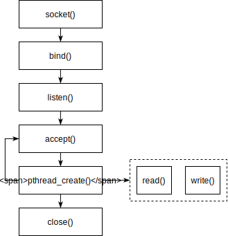

name: inverse
layout: true
class: center, middle, inverse
.indexlink[[<i class="fa fa-arrow-circle-o-up"></i>](#) [<i class="fa fa-list-ul"></i>](#index) [<i class="fa fa-tint"></i>](../change-color.php)[<i class="fa fa-file-pdf-o"></i>](download)]

---

name: normal
layout: true
class: left, middle
.indexlink[[<i class="fa fa-arrow-circle-o-up"></i>](#) [<i class="fa fa-list-ul"></i>](#index) [<i class="fa fa-tint"></i>](../change-color.php)[<i class="fa fa-file-pdf-o"></i>](download)]

---

template:inverse
# Sockets
<a href="http://www.fe.up.pt/~arestivo">André Restivo</a>

---

template:inverse
name:index
# Index

.indexlist[
1. [Introduction](#intro)
2. [Socket Types](#sockets)
3. [Socket in C++](#cpp)
]

---

template:inverse
name:intro
# Introduction

---

# Sockets

A network socket is an abstract representation for the local **endpoint** of a network communication path.

They are used for receiving and sending data associated with a **single** node on a computer network.

* A socket is a system resource and normally identified by a **number** (socket descriptor).
* A socket is local (cannot be referenced by other nodes).
* Sockets are not necessarily associated with a persistent connection.

---

# Protocol Stack

A protocol stack is an implementation of a computer networking protocol suite.

The **OSI Model** is a conceptual model that characterizes the communication functions without regard to their technology.

.right.small[
[1] [IBM Knowledge Center](https://www.ibm.com/support/knowledgecenter/SSCVHB_1.1.0/glossary/npi_osi_model.html)
]

---

# The TCP/IP Stack

A concrete implementation of the OSI model.

---

# Berkeley Sockets

* A *de facto* standard used by most modern operating systems.
* Represented as a file descriptor (file handle) that provides a common interface for input and output.
* Used for both TCP and UDP communication over IP.

---

# Ports

A port is an **endpoint** of communication in an operating system as defined by the Internet Protocol (IP) suite.

All TCP/IP stacks have 65,536 ports for both TCP and UDP:
  * These are two set of ports with the same numbering.
  * They do not overlap so communication over both TCP and UDP can take place on the same port number at the same time.

A port is defined by an **IP address** and a port **number** (e.g. 192.168.1.100:80)

The first 1024 ports are reserved by convention to identify specific services.

---

# Ports and Sockets
Socket Types
* Processes ask the operating system for sockets and ask to bind them to specific ports.

* When data arrives at a certain port, the operating knows the socket (and process) to send it to.

* When a process sends data trough a socket, the operating knows from which port to send it from.

---

# Server/Client sockets

---

template:inverse
name:sockets
# Socket Types

---

# Socket Characteristics

A socket is characterized by its domain, type and protocol.

* Domain: UNIX (path), Internet (ip address + port)
* Type: Raw, Datagram, Stream
* Protocol: TCP, UDP

---

# Datagram Sockets

* Used by the UDP protocol.
* Connectionless. Each packet is individually addressed.
* Order is not guaranteed.
* Reliabability is not guaranteed.

Multiple packets sent from one process to another may arrive in any order or might not arrive at all.

---

# Stream Sockets

* Used by the TCP protocol.
* Connection-oriented. A connection must be estabilished before sending data. 
* Order is guaranteed.
* Reliabability is guaranteed.

Slower to recover from errors.

---

template:inverse
name:cpp
# Sockets in C++

Reference: http://beej.us/guide/bgnet/output/html/singlepage/bgnet.html
---

# Important includes

Includes needed to implement sockets in C/C++:

~~~cpp
#include <sys/types.h> 
#include <sys/socket.h>
#include <netinet/in.h>
#include <unistd.h>
~~~

---

# Creating a Socket

~~~cpp
int socket(int domain, int type, int protocol);
~~~

* Domain: AF_UNIX, AF_INET
* Type: SOCK_STREAM, SOCK_DGRAM
* Protocol: Normally 0 (only one protocol per type)

Example:

~~~cpp
int sockfd = socket(AF_INET, SOCK_STREAM, 0);
if (sockfd < 0) cout << "Error creating socket" << endl;
~~~

---

# Binding to Port

~~~cpp
int bind(int sockfd,                  // the socket to bind
         const struct sockaddr *addr, // the address to bind to
         socklen_t addrlen);          // address length
~~~

Example:

~~~cpp
bzero((char *) &serv_addr, sizeof(serv_addr));// clean address
serv_addr.sin_family = AF_INET;               // IP address
serv_addr.sin_addr.s_addr = INADDR_ANY;     // Accept from any
serv_addr.sin_port = htons(port);           // host byte order to net byte order

int res = bind(sockfd, (struct sockaddr *) &serv_addr, sizeof(serv_addr));
if (res < 0) cout << "Error binding socket" << endl;
~~~

---

# Listen to Connections

~~~cpp
int listen(int sockfd, int backlog);
~~~

The backlog argument defines the maximum length to which the queue of pending connections for sockfd may grow.

Example:

~~~cpp
listen(sockfd, 5);
~~~

---

# Accepting Connections

~~~cpp
int accept(int sockfd,               // socket to accept connections
           struct sockaddr *addr,    // client address
           socklen_t *addrlen);      // client address size
~~~

Example:

~~~cpp
cli_addr_length = sizeof(cli_addr);
int clientsockfd = accept(sockfd, 
  (struct sockaddr *) &cli_addr, 
  &cli_addr_length
);
~~~

Program waits for client. After client connects, *clientsockfd* becomes the socket descriptor to be used for this client.

---

# Read and Write

~~~cpp
ssize_t recv(int sockfd, void *buf, size_t len, int flags);
ssize_t read(int fd, void *buf, size_t count);
~~~

Returns the length of the message. 

Some bytes may be discarded if they do not fit the buffer size.

~~~cpp
ssize_t send(int sockfd, const void *buf, size_t len, int flags);
ssize_t write(int fd, const void *buf, size_t count); //flags 0
~~~

Returns the number of characters sent.

---

# Connect to Server

Clients use the connect function to connect to a server:

~~~cpp
int connect(int sockfd, 
            const struct sockaddr *addr,
            socklen_t addrlen);
~~~

Example: 

~~~cpp
int sockfd = socket(AF_INET , SOCK_STREAM , 0);

struct sockaddr_in server;
server.sin_addr.s_addr = inet_addr("127.0.0.1"); //include <arpa/inet.h>
server.sin_family = AF_INET;
server.sin_port = htons(2345);
int res = connect(sockfd , (struct sockaddr *)&server , sizeof(server));
~~~

---

# Close a Socket

Sockets must be closed so they can be reused:

~~~cpp
int close(int fd);
~~~

Example:

~~~cpp
close(sockfd);
~~~

---

# Multiple Connection Server

Server that can handle several connections at the same type must use multiple processes or threads.

[Example](https://web.fe.up.pt/~arestivo/page/solutions/os/sockets/step10/)
