name: inverse
layout: true
class: center, middle, inverse
.indexlink[[<i class="fa fa-arrow-circle-o-up"></i>](#) [<i class="fa fa-list-ul"></i>](#index) [<i class="fa fa-tint"></i>](../change-color.php)[<i class="fa fa-file-pdf-o"></i>](download)]

---

name: normal
layout: true
class: left, middle
.indexlink[[<i class="fa fa-arrow-circle-o-up"></i>](#) [<i class="fa fa-list-ul"></i>](#index) [<i class="fa fa-tint"></i>](../change-color.php)[<i class="fa fa-file-pdf-o"></i>](download)]

---

template:inverse
# Design Patterns
<a href="http://www.fe.up.pt/~arestivo">André Restivo</a>

---

template: inverse
name:index
# Index

.indexlist[
1. [Introduction](#introduction)
1. [Factory Method](#factory-method)
1. [Composite](#composite)
1. [Command](#command)
1. [Observer](#observer)
1. [Strategy](#strategy)
1. [State](#state)
1. [Adapter](#adapter)
1. [Decorator](#decorator)
1. [Singleton](#singleton)
1. [Abstract Factory](#abstract-factory)
1. [Architectural Patterns](#architectural-patterns)
]

---

# Reference

* Gamma, Erich, et al. "Design Patterns: Elements of Reusable Object-Oriented Software." (1994).
* [Source Making](https://sourcemaking.com/design_patterns/)
* [Refactoring Guru](https://refactoring.guru)

---

template: inverse
name:introduction
# Introduction

---

# Patterns

Patterns originated as an **architectural** concept by Christopher **Alexander** (1977/78).</li>

---

# (Software) Design Patterns

Design patterns gained popularity in computer science after the book **"Design Patterns: Elements of Reusable Object-Oriented Software"** was published in **1994** by the so-called **"Gang of Four"**.

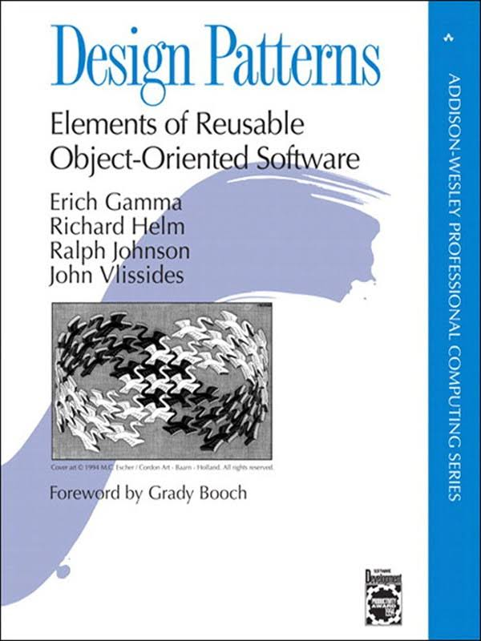

---

# Design Pattern

A **general**, **reusable** solution to a **commonly** occurring problem within a given **context** in software design.

It is **not** a **finished design** that can be transformed directly into source code.

It is a **description** or **template** for **how** to **solve** a problem that can be **used** in **many** different situations.

---

# GoF Patterns

The twenty-three design patterns described by the Gang of Four:

.simple[
| Creational 	         | Structural 	 | Behavioral 	           |
|----------------------|---------------|-------------------------|
| **Abstract Factory** | **Adapter**   | Chain of Responsibility |
| Builder              | Bridge        | **Command**             |
| **Factory Method**   | **Composite** | Interpreter             |
| Prototype            | **Decorator** | Iterator                |
| Singleton            | Facade        | Mediator                |
|                      | Flyweight     | Memento                 |
|                      | Proxy         | **Observer**            |
|                      |               | **State**               |
|                      |               | **Strategy**            |
|                      |               | Template Method         |
|                      |               | Visitor                 |
]

---

# Documentation

The documentation for a design pattern describes the context in which the pattern is used, the forces within the context that the pattern seeks to resolve, and the suggested solution.

.simple[
|                                 | |
|---------------------------------|-|
| Pattern Name | Classification |
| **Intent** | Collaboration
| Also Known As| **Consequences**
| **Motivation**| **Implementation**
| **Applicability**| Sample Code
| **Structure**| Known Uses
| Participants| Related Patterns
]

---

template: inverse
name:factory-method
# Factory Method

---

# Factory Method

> "Define an interface for creating an object, but let sub-classes decide which class to instantiate."

## Motivation

A framework for applications that can present multiple documents to the user.

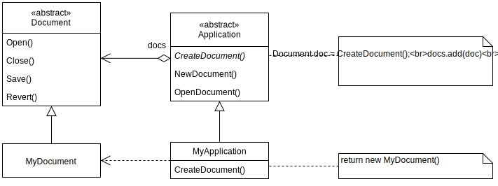

---

# Applicability

Use the **factory method** pattern when:

* a class can't anticipate the class of objects it must create.
* a class wants the subclasses to specify the objects it creates.
* classes delegate responsibility to one of several helper classes, and you want to localize the knowledge of which helper subclass is the delegate.

# Consequences

Factory methods eliminate the need to bind application-specific classes into your code. The code only needs to deal with the Product *interface*; therefore it can work with any user-defined ConcreteProduct classes.

---

# Structure

---

# Variations

* **Creator** might **not be abstract** and provide a **default implementation** for the **FactoryMethod**.
* **Factory Method** might take a **parameter** specifying the **type of product** to create.
* Using **Generics/Templates** to avoid *subclassing* the **Creator**.

---

template: inverse
name:composite
# Composite

---

# Composite

> "Compose objects into tree structures to represent part-whole hierarchies. Composite lets clients treat individual objects and compositions uniformly."

# Motivation

A graphics application where shapes can be composed into groups.

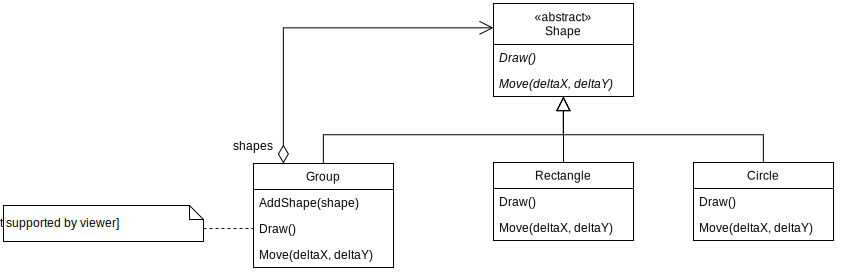

---

# Applicability

Use the **composite** pattern when:

* you want to represent part-whole hierarchies of objects.
* you want clients to be able to ignore the difference between compositions of objects and individual objects.

# Consequences

* Primitive objects can be composed into more complex objects.
* Clients can be kept simple.
* Easier to add new types of components.

---

# Structure

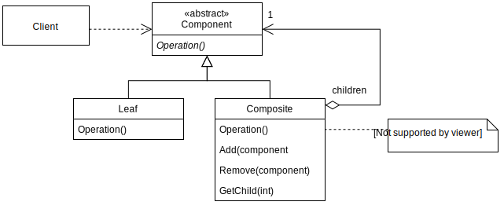

---

# Variations

* Maintaining **references** from **child** components to their **parents**.
* **Sharing** components.
* Child **ordering**.
* **Caching** to improve performance.

---

template: inverse
name:command
# Command

---

# Command

> "Encapsulate a request as an object thereby letting you parameterize clients with different requests, queue or log requests, and support undoable operations."

# Motivation

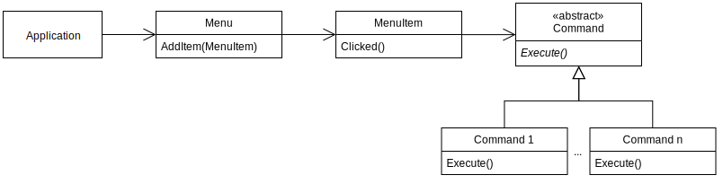

---

# Applicability

Use the **command** pattern when:

* **parameterize** objects by an action to perform.
* **specify**, **queue**, and **execute** requests at different times.
* support **undo/redo** operations.
* support **logging** changes so they can be reapplied.
* **structure** a system around **high-level** operations built on **primitive** operations.

# Consequences

* Decouples the object that invokes the operation from the one that knows how to perform it.
* Commands can be extended and manipulated like any other object.
* You can create **Composite** commands.
* It's easy to add new commands.
  
---

# Structure

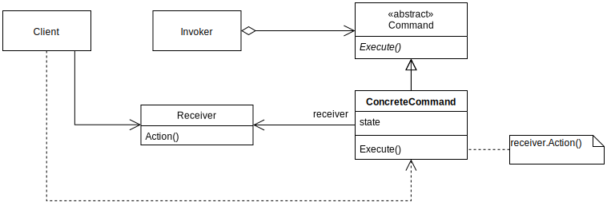

---

# Variations

* Commands only **delegating** to Receiver actions or doing **all the work** by themselves.
* Support **undo/redo** instead of only action.
* Avoiding **error accumulation** in undo operations.

---

template: inverse
name:observer
# Observer

---

# Observer

> "Define a one-to-many dependency between objects so that when one object changes status all its dependents are notified and updated automatically."

# Motivation

---

# Applicability

Use the **observer** pattern when:

* When an abstraction has two aspects one dependent on the other.
* When a change to one object requires changing others.
* When an object should be able to notify other objects without making assumptions about who those objects are.

# Consequences

* Abstract coupling between subject and observer.
* Support for broadcast communication.
* Unexpected updates.

---

# Structure

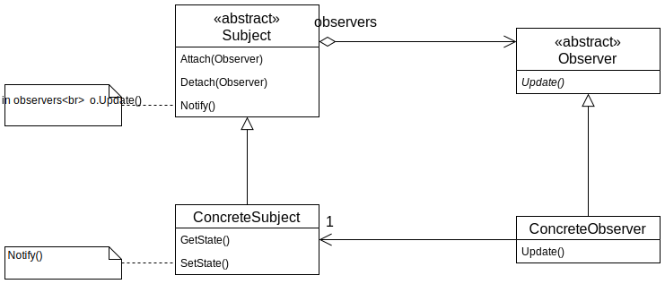

---

# Variations

* Observing more than one subject.
* Who triggers the update (client or subject)?
* Push and pull models.
* Specifying "events of interest" explicitly.

---

template: inverse
name:strategy
# Strategy

---

# Strategy

> "Define a family of algorithms, encapsulate each one, and make them interchangeable. Strategy lets the algorithm vary depending from clients that use it."

# Motivation

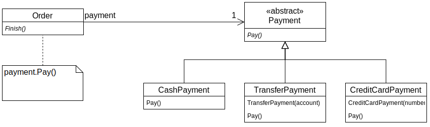

---

# Applicability

Use the **strategy** pattern when:

* many related classes differ only in their behavior.
* you need different variants of an algorithm.
* an algorithm uses data that clients should not know about.
* a class defines many behaviors that appear in multiple conditional statements.

# Consequences

* An alternative to subclassing.
* Eliminates conditional statements.
* Provides different implementations.
* Clients must be aware of different strategies.

---

# Structure

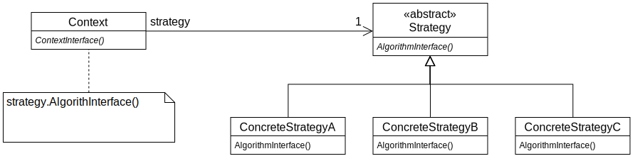

---

# Variations

* Strategy and Context must have well defined interfaces for exchanging any needed data.
* Strategy can be optional if context has default behavior. 

---

template: inverse
name:state
# State

---

#State

> "Allow an object to alter its behavior when its internal state changes. The object will appear to change its class."

# Motivation

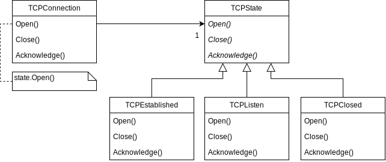

---

# Applicability

Use the **state** pattern when:

* an object behavior depends on its state, and it must change that state in run-time.
* operations have large, multipart conditional statements that depend on one or more enumerated constants.

# Consequences

* Localizes and partitions behavior for different states.
* Makes state transitions explicit.

---

# Structure

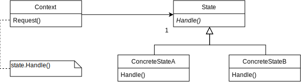

---

# Variations

* Who defines the criteria for state transitions? More flexible solution is to let the states define the transitions.
* When are state objects created and destroyed? Easier to create and destroy when state changes. Better to only create them once and never destroy them. 

---

template: inverse
name:adapter
# Adapter

---

# Adapter

> "Convert the interface of a class into another interface clients expect. Adapter lets classes work together that couldn't otherwise because of incompatible interfaces."

# Motivation

---

# Applicability

Use the **adapter** pattern when:

* you want to use an existing class, and the interface does not match the one you need.
* you want to create a reusable class that work with unforseen classes.

---

# Structure

Two different alternatives:
* **Class adapter**: Using multiple inheritance (if available).
* **Object adapter**: Using composition.

---

template: inverse
name:decorator
# Decorator

---

# Decorator

> "Attach additional responsibilities to an object dynamically. Decorators provide a flexible alternative to subclassing for extending functionality."

# Motivation

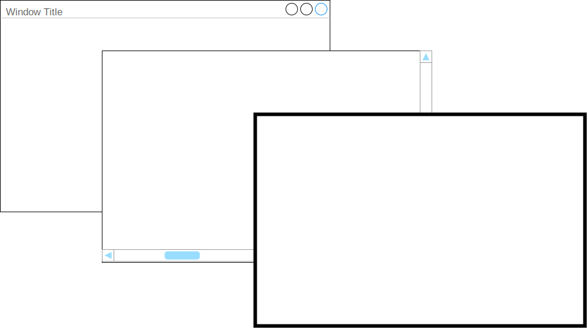

---

# Applicability

Use the **decorator** pattern when:

* to add responsibilities for **individual** objects dynamically and transparently.
* for responsibilities that can be withdrawn.
* when extension by subclassing is impractical (many different combinations 🠒 explosion of subclasses).

# Consequences

* More flexible than static inheritance.
* Avoids classes with too many features and responsibilities.
* Lots of little objects.

---

# Structure

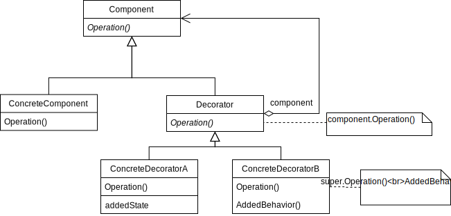

> "Changing the object guts (Strategy) versus changing the object skin (Decorator)".

---

template: inverse
name:singleton
# Singleton

---

# Singleton

> "Ensure a class only has one instance and provide a global point to acess it."

# Applicability

Use the **singleton** pattern when:

* there must be exactly one instance of a class.
* when the sole instance must be extensible by subclassing.

---

# Consequences

The **singleton** pattern is considered an [anti-pattern](https://www.michaelsafyan.com/tech/design/patterns/singleton):
* The assumption that there will ever be only one instance is often broken during a project's lifetime.
* Makes it very difficult to test code.
* Difficult to implement correctly when taking multi-threading into account.

# What to use instead

* Instantiate a single instance and propagate it to places that use the object as a parameter.

---

# Structure

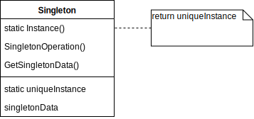

# Variations

When to create the unique instance?
  * At application start.
  * When instance() is called for the first time.

---

template: inverse
name:abstract-factory
# Abstract-Factory

---

# Abstract-Factory

> "Provide an interface for creating families of related or dependent objects without specifying the concrete classes."

# Motivation

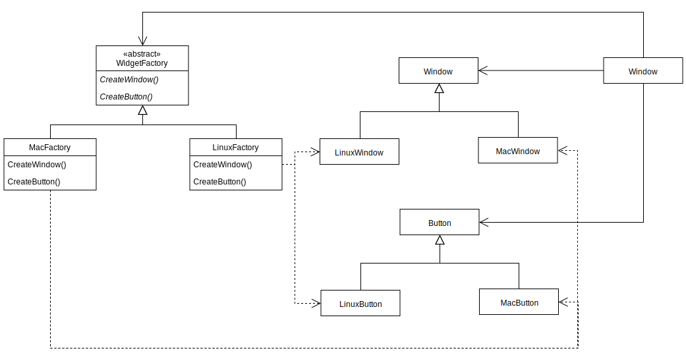

---

# Applicability

Use the **asbtract factory** pattern when:

* a system should be independent from how its products are created, composed and represented.
* a system should be configurable with one or more families of products.
* a family of products is designed to work together and you need to reinforce this constraint.

# Consequences

* It isolates concrete classes.
* It makes exchanging product families easy.
* It promotes consistency among products.
* Supporting new types of products is difficult.

---

# Structure

---

template: inverse
name:architectural-patterns
# Architectural Patterns

---

# Architectural Patterns

An **Architectural style** is responsible for how we should organize our code (monolithic, pipes and filters, plugins, microservices, ...).

**Architectural patterns** are patterns that deal with the architectural style of software.

Some examples:

* Model-View-Controller (commonly used in GUIs)
* Pipe-Filter (pipes guide data from filter to filter)
* Broker (message queues e.g. RabbitMQ)
* ...

---

# Model-View-Controller (MVC)

An architectural pattern commonly used for developing user interfaces that divides an application into **three** parts.

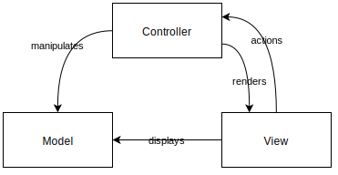

* The **model** only represents the **data**.
* The **view** **displays** the **model** data, and sends user **actions** to the **controller**.
* The **controller** provides **model** data to the **view**, and **interprets** user **actions**.

---

# MVC Variants

There are several variants to the MVC pattern and even the MVC hasn't got a single interpretation:

* **HMVC** - Hierarchical Model-View-Controller: Each visual component has its own MVC model.

* **MVVM** - Model-View-ViewModel: Uses a ViewModel as a binder between the model and the view.

* **MVP** - Model-View-Presenter: The Presenter sits in the middle of the View and the Model mediating the actions between them.