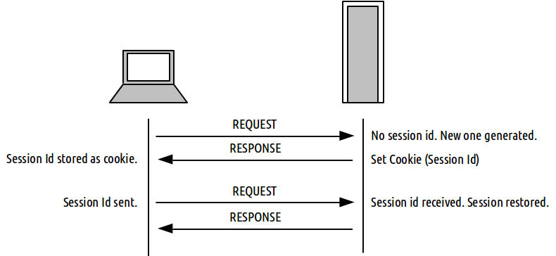
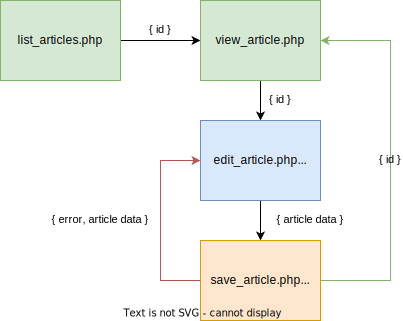

name: inverse
layout: true
class: center, middle, inverse
.indexlink[[<i class="fa fa-arrow-circle-o-up"></i>](#) [<i class="fa fa-list-ul"></i>](#index) [<i class="fa fa-tint"></i>](../change-color.php)[<i class="fa fa-file-pdf-o"></i>](download)]

---

name: normal
layout: true
class: left, middle
.indexlink[[<i class="fa fa-arrow-circle-o-up"></i>](#) [<i class="fa fa-list-ul"></i>](#index) [<i class="fa fa-tint"></i>](../change-color.php)[<i class="fa fa-file-pdf-o"></i>](download)]

---

template:inverse
# PHP 5
<a href="http://www.fe.up.pt/~arestivo">André Restivo</a>

---

template: inverse
name:index
# Index

.indexlist[
1. [Introduction](#intro)
1. [Variables](#data)
1. [Control Structures](#control)
1. [Strings](#strings)
1. [Arrays](#arrays)
1. [Functions](#functions)
1. [Classes](#classes)
1. [Exceptions](#exceptions)
1. [Databases](#databases)
1. [HTTP Parameters](#parameters)
1. [Sessions](#sessions)
1. [Passwords](#passwords)
1. [Headers](#headers)
1. [Includes](#includes)
1. [JSON](#json)
1. [Best Practices](#best)
]

---

template: inverse
name:intro
# Introduction

---

# PHP

* Originally called **P**ersonal **H**ome **P**age, it now stands for **P**HP: **H**ypertext **P**reprocessor, which is a recursive acronym
* Created by Rasmus Lerdorf in 1994.
* It is a **dynamically typed** programming language.
* Usually used to create dynamic web pages but can also be used to create standalone programs.

---

# Hello World

The infamous hello world example in PHP:

```php
<?php echo 'Hello World'; ?>
```

or even shorter

```php
<?='Hello World;
```

---

# PHP Delimiters

* The PHP interpreter only executes PHP code within its delimiters. Anything outside its delimiters is not processed by PHP.
* PHP code can be delimited using ```<?php``` and ```?>```, ```<?``` and ```?>``` or ```<script language="php">``` and ```</script>```.
* The purpose of all these delimiters is to separate PHP code from non-PHP code, including HTML.
* After processing, the PHP code blocks are replaced by their output.

```php
<div>
  <p><?php echo 'Hello World'?></p>
</div>
```

becomes

```html
<div>
  <p>Hello World</p>
</div>
```

---

# Echo

* The **echo** function outputs one or more strings.
* It is not actually a function (it is a language construct), so you are not required to use parentheses with it.
* It also has a shortcut syntax, where you can immediately follow the opening tag with an equals sign.

```php
echo 'Hello World';
```

```php
<?='Hello World'?>
```

---

# Comments

There are two ways of creating single line comments:

```php
echo 'Hello World'; // This line prints Hello World
echo 'Hello World'; # This line prints Hello World
```

Multiple line comments can also be used:

```php
/**
 * The following line
 * prints Hello World
 */
echo 'Hello World'; 
```


---

template:inverse
# Resources

* References:
  * http://php.net/manual/en/
* Benchmarks:
  * http://www.phpbench.com/
* Books:
  * http://www.phptherightway.com/

---

template:inverse
name:data
#Variables

---

# Variables

* Variables in PHP are represented by a dollar sign followed by the name of the variable. 
* The variable name is **case-sensitive**.
* PHP does not require (or support) explicit type definition in variable declaration
* A variable's type is determined by the context in which the variable is used.

```php
$name = 'John';
$age = 25;
```

---

# Data Types

PHP supports the following scalar types:

* boolean
* integer
* float
* string

---

# Assignment

* The type of a variable is defined when a value is assigned to it.
* Variables can change type when values of another type are assigned to them.
* Assignment is done by value unless the **&** sign is used.

```php
$foo = 5;
$foo = 'John';

$bar = &$foo;
$foo = 'Mary';

echo $bar; // Mary
``` 

---

# Type Juggling

* PHP does automatic type conversion whenever it is needed.
* For example, the **+** (sum) operator expects two numerical values.

```php
echo 5 + '10 potatoes'; // 15
```

* PHP automatically converts the string into an integer.

> If the string does not contain any of the characters '.', 'e', or 'E' and the numeric value fits into integer type limits (as defined by PHP_INT_MAX), the string will be evaluated as an integer. In all other cases it will be evaluated as a float.
<br><br>
> The value is given by the initial portion of the string. If the string starts with valid numeric data, this will be the value used. Otherwise, the value will be 0 (zero). Valid numeric data is an optional sign, followed by one or more digits (optionally containing a decimal point), followed by an optional exponent. The exponent is an 'e' or 'E' followed by one or more digits.

---

# Null Value

The special **null** value represents a variable with no value.

A variable is considered to be null if:

* it has been assigned the constant NULL.
* it has not been set to any value yet.
* it has been unset().

```php
// $a starts as null
$a = 5;    // 5
$a = null; // null
$a = 10;   // 10;
unset($a); // null;
```

The constant **null** is case-insensitive.

---

# Var Dump

The **var_dump** function displays structured information about one or more expressions that includes its type and value. 
Arrays and objects are explored recursively with values indented to show structure.

```php
$a = 10.5;
$b = true;
var_dump($a, $b);
```

```html
float(10.5)
bool(true)
```

Very useful for simple and dirty debugging. 

An alternative is **print_r**, a simplified form of **var_dump**.

---

template:inverse
name:control
# Control Structures
Not so different from other languages

---

# While

Executes the nested statement(s) repeatedly, as long as the while expression evaluates to *true*.

```php
while($expr) 
  do_something();
```

```php
while($expr) {
  do_something();
  do_something_more();
}
```

```php
while($expr):
  do_something();
  do_something_more();
endwhile;
```

---

# Do While

Similar to while loops, except the truth expression is checked at the end of each iteration instead of in the beginning. 

```php
do {
  do_something();
} while($expr);
```

---

# For

The first expression is executed once unconditionally at the beginning of the loop.

In the beginning of each iteration, the second expression is evaluated. If it evaluates to *false*, the execution of the loop ends.

At the end of each iteration, the third expression is executed.

```php
for ($i = 0; $i < 10; $i++) 
  do_something($i);
```

```php
for ($i = 0; $i < 10; $i++) {
  do_something($i);
  do_something_more($i);
}
```

---

# If

If the expression evaluates to *true*, executes the statement(s), and if it evaluates to *false*, ignores it(them).

```php
if ($expr) 
  do_something();
```

```php
if ($expr) {
  do_something();
  do_something_more();
}
```

---

# Else 

The **else** statement extends an **if** statement to execute a statement in case the expression in the if statement evaluates to *false*.

```php
if ($expr) 
  do_something();
else
  do_something_else();
```

```php
if ($expr)
  do_something();
else {
  do_something_else();
  do_something_more();
}
```

---

# Break and Continue

Break ends execution of the current **for**, **foreach**, **while**, **do-while** or **switch** structure.

Continue skips the rest of the current loop iteration and continue execution at the condition evaluation.

```php
while ($expr) {
  do_something();
  if ($foo) break;
  if ($bar) continue;
  do_something_more();
}
```

---

# Switch

The switch statement is similar to a series of *if* statements on the same expression.

After finding a true condition, PHP continues to execute the statements until the end of the switch block, or the first time it sees a break statement. 

```php
switch($name) {
  case "John":
    do_something():
    do_something_more():
    break;
  case "Mary":
    do_something():
    break;
  default:
    do_something_else();    
}
```

---

# Die and Exit

Both **die** and **exit** stop the execution of the current PHP script. 

They can receive a status as a string, that will be printed before stopping, or an integer, that will be as the exit status and not printed.

```php
  if ($something == "wrong") die ("Something is Wrong");
```

```php
  if ($everything == "ok") exit(0);
```

---

# Loose and Strict Comparisons

Comparisons can be tricky in PHP. There are two type of equality operators:

**Loose comparison**

```php
if ($a == $b) {   // != gives the opposite result
  do_something();
}
```  

**Strict comparison**

```php
if ($a === $b) {   // !== gives the opposite result
  do_something();
}
```  

---

# Loose and Strict Comparisons

Some Examples:

```php
if (1 == true)  // true - true is casted into the integer 1
if (1 === true) // false;
```

```php
if (1 == "1")  // true - "1" is casted into the integer 1
if (1 === "1") // false;
```

```php
if (null == false)  // true
if (null === false) // false;
```

```php
if ("Car" == true)  // true
if ("Car" === true) // false;
```

Learn more: http://php.net/manual/en/types.comparisons.php

---

template:inverse
name:strings
# Strings

---

# Strings

A string is a series of characters.

The simplest way to specify a string is to enclose it in *single quotes*.

```php
$name = 'John';
```

A *single quote* inside a string defined using *single quotes* must be escaped using a **backslash**. To specify a literal backslash, double it.

```php
$title = 'Ender\'s Game';
```

Single quoted strings don't recognize any other escape sequences.

---

# Double Quote

If the string is enclosed in *double quotes*, more escape sequences for special characters are allowed (e.g. \r, \n, \t, \\\\, \"):

```php
$title = "The quick brown fox\njumps over the lazy dog";
// The quick brown fox
// jumps over the lazy dog
```
Double quoted strings also expand any variables inside them.

```php
$name = 'John';

echo 'This car belong to $name'; // This car belongs to $name
echo "This car belong to $name"; // This car belongs to John
```

Some developers consider it a best practice to use single quotes when assigning string literals as they denote that there are no variables inside them.

---

# Concatenation

As we have seen before, the *sum* operator expects two numeric values. If used with strings it will try to cast the string into numbers and them sum them.

A different operator is used to concatenate strings together.

```php
$name = 'John';
echo 'Hello World!' . " This is $name.";
```

---

# Some String Functions

```php
int strlen ( string $string )
```
Returns the length of the given string.

```php
echo strlen('John')   // 4
```

***

```php
mixed strpos ( string $haystack , mixed $needle [, int $offset = 0 ] )
```

Find the numeric position of the first occurrence of *needle* in the *haystack* string starting at *offset*. Returns false if not found.

```php
echo strpos ('abccba', 'bc');    // 1
echo strpos ('abccba', 'a');     // 0
echo strpos ('abccba', 'a', 2);  // 5
echo strpos ('abccba', 'bc', 2); // false
```

---

# Some String Functions

```php
string substr ( string $string , int $start [, int $length ] )
```
Returns the portion of string specified by the start and length parameters.

```php
echo substr('abcdefgh', 2, 4); // cdef
```

***

```php
mixed str_replace ( mixed $search , mixed $replace , mixed $subject [, int &$count ] )
```
Returns a string or an array with all occurrences of search in subject replaced with the given replace value.

```php
$text = str_replace("cd", "--", "abcdabcd", $count);
echo $text;  // ab--ab--
echo $count; //2
```

---

# Some String Functions

```php 
array explode ( string $delimiter , string $string [, int $limit ] )
```
Returns an array of strings, each of which is a substring of string formed by splitting it on boundaries formed by the string *delimiter*.


***

```php
string implode ( string $glue , array $pieces )
```
Join array elements with a *glue* string.

***

```php
$pieces = explode(' ', 'a b c'); // $pieces = array('a', 'b', 'c')
$text = implode('-', $pieces);   //$text = 'a-b-c'
```

---

template:inverse
name:arrays
# Arrays

---

# Arrays

At first glance, PHP arrays might seem similar to arrays in other classical languages.

```php
$values[0] = 5;  // although they don't need to be defined
$values[1] = 10; // and they don't have a fixed size
$values[2] = 20;

for ($i = 0; $i < count($values); $i++) // count returns the size of the array
  $sum = $sum + $values[$i];
  
echo $sum / count($values); // calculates average: 11.666666666667
```

---

# Arrays

An array is a **ordered map** organized as an ordered collection of **key-value** pairs.

Keys can be either **integers** or **strings** and values can hold any type of data. They can even hold different kinds of data in the same array.

```php
$values['name'] = 'John';
$values['age'] = 45;
$values[3] = 'Car';
```

---

# Creating Arrays

Arrays can be created just by using a variable as an array. Or they can be explicitly created using the **array()** function.

```php
$values = array(); // this creates an empty array
```

They can also be initialized with some values.

```php
$values = array(1, 2, 3, 'John'); // 0 => 1, 1 => 2, 2=>3, 3 => 'John'
```

```php
$values = array('name' => 'John', 'age' => 45, 3 => 'Car');
```

---

# Using Arrays

When a key is not provided, PHP will use the increment of the largest previously used integer key.

```php
$values = array('name' => 'John', 'age' => 45, 2 => 'Car', 'Bicycle');
$values[] = 'Boat'; 
// 'name' => John, 'age' => 45, 2 => 'Car', 3 => 'Bicycle', 4 => 'Boat'
```

> Note that the maximum integer key used for this need not currently exist in the array. It need only have existed in the array at some time since the last time the array was re-indexed.

We can even use arrays as an array value.

```php
$people = array(
  array('name' => 'John', 'age' => 45), 
  array('name' => 'Mary', 'age' => 35);
);
echo $people[0]['name']; // John
```

---

# Cycling Arrays

As arrays might not have sequential keys, like in other languages, in PHP we use the following construct to cycle through them:

```php
$values = array('name' => 'John', 'age' => 45, 2 => 'Car', 'Bicycle');
foreach ($values as $value) 
  echo "$value\n";
```

A similiar construct can be used to cycle through the keys and values simultaneously:
```php
$values = array('name' => 'John', 'age' => 45, 2 => 'Car', 'Bicycle');
foreach ($values as $key => $value) 
  echo "$key = $value\n";
```

---

# Some Array Functions

Searching for data:

```php
bool in_array ( mixed $needle , array $haystack [, bool $strict = FALSE ] )
```
Searches haystack for needle using loose comparison unless strict is set. Returns true if found, false otherwise.

***

```php
mixed array_search ( mixed $needle , array $haystack [, bool $strict = false ] )
```
Returns the key for needle if it is found in the array, *false* otherwise.

***

```php
bool array_key_exists ( mixed $key , array $array )
```
Returns *true* if the given key is set in the array, *false* otherwise.

---

# Some Array Functions

Sorting data:

```php
bool asort ( array &$array [, int $sort_flags = SORT_REGULAR ] )
```
Sorts an array such that array indexes maintain their correlation with the array elements they are associated with. **arsort** does the same but in reverse.

***

```php
bool ksort ( array &$array [, int $sort_flags = SORT_REGULAR ] )
```
Sorts an array by key, maintaining key to data correlations. **krsort** does the same but in reverse.

***

Sort Flags: **SORT_REGULAR**, **SORT_NUMERIC**, **SORT_STRING**, **SORT_LOCALE_STRING**, **SORT_NATURAL** and **SORT_FLAG_CASE**.

Learn more: http://php.net/manual/en/array.sorting.php

---

# Some Array Functions

Random arrays:

```php
bool shuffle ( array &$array )
```
This function randomizes the order of the elements in an array. Returns *true* on success or *false* on failure.

***

```php
mixed array_rand ( array $array [, int $num = 1 ] )
```
Picks one or more random entries out of an array, and returns the key (or keys) of the random entries. When picking only one entry, returns the key, otherwise returns an array of keys.

---

# Some Array Functions

```php
array list ( mixed $var1 [, mixed $... ] )
```
Used to assign a list of variables in one operation. This is not really a function, but a language construct.

```php
$values = array('John', 45, 'Bicycle');
list($name, $age, $vehicle) = $values;
echo $name;     // John
echo $age;      // 45
echo $vehicle;  // Bicycle
```

```php
$values = array('John', 45, 'Bicycle');
list($name, , $vehicle) = $values; // skipping some values
```

Many more functions: http://php.net/manual/en/ref.array.php

---

template:inverse
name:functions
# Functions

---

# Functions

Any valid PHP code may appear inside a function, even other functions and class definitions.

Functions need not be defined before they are referenced, except when a function is conditionally defined.

Function names are **case-insensitive**.

To create a function, we use the *function* keyword:

```php
function do_something() {
  echo "done";
}

do_something(); // prints done
```

---

# Arguments

Information may be passed to functions via the argument list.

Arguments have no type specified.

By default, function arguments are passed by value. To have an argument to a function always passed by reference, prepend an ampersand (&) to the argument name in the function definition.

```php
function sum($a, &$b) {
  echo $a + $b;
  $a++; 
  $b++;
}

$a = 1; $b = 2;
sum($a, $b); // prints 3
echo $a;     // prints 1
echo $b;     // prints 3
```

---

# Default Values

Arguments can have a default value.

When using default arguments, any defaults should be on the right side of any non-default arguments

```php
function sum($a, $b = 0, $c = 0) {
  echo $a + $b + $c;
}

sum(1);     // prints 1
sum(1,2);   // prints 3
sum(1,2,3); // prints 6
```

---

# Returning Values

PHP functions can return values.

The type of the returned value does not need to be specified. In fact, a function can return different types of values depending on some condition. 

There is no distinction between a procedure (a function that doesn't return a value) and a function.

```php
function sum($a, $b = 0, $c = 0) {
  return $a + $b + $c;
}

echo sum(1);     // prints 1
echo sum(1,2);   // prints 3
echo sum(1,2,3); // prints 6
```

---

# Returning Multiple Values

There is no way for a function to return multiple values.

But we can achieve a similar result using *arrays* and the *list* construct.

```php
function sort2($a, $b) {
  if ($a > $b) return array($b, $a);
  else return array($a, $b);
}

list($smaller, $larger) = sort2(10, 5);
echo $smaller; \\ 5
echo $larger;  \\ 10
```

---

# Global

As PHP variables do not need to be defined before usage, to use a global variable inside a function we need to declare it as global.

```php
function foo() {
  echo $var;
}

function bar() {
  global $var;
  echo $var;
}

$var = 10;
foo(); // prints nothing
bar(); // prints 10
```

---

template:inverse
name:classes
# Classes

---

# Classes

PHP 5 marks the introduction of a brand new object model for PHP.

Every class starts with the word class followed by its name and the class definition (inside curly brackets):

```php
class Car {

  // class definition goes here

}
```

---

# Properties

Properties are defined by using one of the visibility keywords **public**, **protected**, or **private**, followed by a normal variable declaration.

This declaration may include an initialization, but this initialization must be a constant value.

```php
class Car {
  private plate = '12-34-AB';
  private driver = 'John Doe';
}
```

---

# Methods

Methods are like functions that have access to the private properties of the class. They also have the same visibility keywords as properties.

However, due to the dynamic typed nature of PHP, to access these properties the pseudo-variable **$this** must be used:

```php
class Car {
  private plate;
  private driver = 'John Doe';
  
  public function getDriver() {
    return $this->driver; // return $driver would have returned null
  }
}
```

---

# Creating

To create an instance of a class, the **new** keyword must be used. 

An object will always be created unless the object has a constructor defined that throws an exception on error.

```php

  $my_car = new Car();

```

---

# Constructors

PHP 5 allows developers to declare constructor methods for classes.

Classes which have a constructor method call this method on each newly-created object.

The constructor method is always called **__construct** and can receive any number of parameters. The destructor method is, as expected, called **__destruct**.

```php
class Car {
  private plate;
  private driver;
  
  public function __construct($driver, $plate) {
    $this->driver = $driver;
    $this->plate = $plate;
  }

}

$car = new Car('John Doe', '12-34-AB');
```

---

# Extends

A class can inherit the methods and properties of another class by using the keyword extends in the class declaration. It is not possible to extend multiple classes; a class can only inherit from one base class.

```php
class RaceCar extends Car {

  // Specific race car definitions

}
```

---

# Static

The static keyword allows us to define static properties and methods that are shared between all instances of the class.

```php
class Car {
  static public mile = 1.609344; //km
  // ...
}

echo Car::mile;
```

Static members can be accessed using the name of the class and the **::** operator.

Obviously, **$this** cannot be used inside a static method.

---
# Scope

There are three special keywords that are used to access properties or methods from inside the class definition

* **self::** - accesses the current class (different from **$this**)
* **parent::** - accesses the parent class
* **static::** - accesses a static member of property
  
```php
class Car {
  static private mile = 1.609344; //km

  public function __construct($driver, $plate) {
    parent::__construct($driver, $plate);
  }
  
  public static function milesToKm($miles) {
    return $miles * static::mile;
  }
}

echo Car::milesToKm(10);
```

---

# Self vs Static

```php
<?php

  class Foo
  {
    protected static $bar = 1234;

    public function print() {
      echo "static " . static::$bar . "<br>";
      echo "self " . self::$bar . "<br>";
    }
  }

  class Bar extends Foo
  {
    protected static $bar = 4321;
  }

  $foo = new Foo();
  $bar = new Bar();

  $foo->print();  // 1234 and 1234 
  $bar->print();  // 4321 and 1234

?>
```

---

# Abstract

Classes defined as abstract may not be instantiated.
Classes that contain at least one abstract method must also be abstract.
Methods defined as abstract cannot define the implementation.
When inheriting from an abstract class, all methods marked abstract in the parent's class declaration must:
  * be defined by the child; 
  * be defined with the same (or a less restricted) visibility;

```php
abstract class Car {
  private plate;
  private driver = 'John Doe';
  
  public function getDriver() {
    return $this->driver;
  }

  abstract public function getPlate();
}
```

---

# Interfaces

Interfaces are defined using the **interface** keyword, in the same way as a standard class, but without any of the methods having their contents defined.

The **implements** specifies that a specific class implements the interface.

```php
interface Car {
  public function getDriver();
  public function getPlate();
}

class RaceCar implements Car {
  private plate;
  private driver;
  
  public function getDriver() {
    return $this->driver;
  }

  public function getPlate() {
    return $this->plate;
  }
}
```

---

# Final

The final keyword, prevents child classes from overriding a method by prefixing the definition with final. 

If the class itself is being defined final then it cannot be extended.

```php
final class RaceCar implements Car {
  private plate;
  private driver;
  
  public function getDriver() {
    return $this->driver;
  }

  final public function getPlate() {
    return $this->plate;
  }
}
```

---

template:inverse
name:exceptions
# Exceptions

---

# Exceptions

Exceptions are events that occur during the execution of a script that disrupt the normal flow of instructions.

Like in other programming languages, exceptions can be thrown, and caught within PHP.

To throw an exception we use the throw keyword:

```php
if ($db == null)
  throw new Exception('Database not initialized');
```

---

# Exceptions

Exception is a class with the following public methods:

```php
final public string getMessage ();
final public Exception getPrevious ();
final public mixed getCode ();
final public string getFile ();
final public int getLine ();
final public array getTrace ();
final public string getTraceAsString ();
```

A user defined Exception class can be defined by extending the built-in Exception class.

---

# Try and Catch

The **try-catch** statement consists of a try block followed by one or more catch clauses, which specify handlers for different exceptions.

```php
try {
  $car = getCar($id);
} catch (DatabaseException $e) {
  echo 'Database error: ' . $e->getMessage();
} catch (Exception $e) {
  echo 'Unknown error: ' . $e->getMessage();
}
```

---

template:inverse
name:databases
# Databases

---

# PDO

The PHP Data Objects (PDO) extension defines a lightweight, consistent interface for accessing databases in PHP.

---

# Connecting

To connect to a database we use a PDO object.

The connection string is database dependent.

```php
$dbh = new PDO('mysql:host=localhost;dbname=test', $user, $pass);
```

```php
$dbh = new PDO('pgsql:host=localhost;port=5432;dbname=anydb', $user, $pass);
```

```php
$dbh = new PDO('sqlite:database.db');
```

---

# Prepared Statements

Prepared statements are the recommended way of executing queries as they prevent SQL injection attacks.

```php
$stmt = $dbh->prepare('INSERT INTO person (name, address) 
                       VALUES (:name, :address)');
$stmt->bindParam(':name', $name);
$stmt->bindParam(':address', $address);

$stmt->execute();
```

---

# Prepared Statements

Another form of prepared statements.

```php
$stmt = $dbh->prepare('INSERT INTO person (name, address) VALUES (?, ?)');
$stmt->execute(array($name, $address));
```

Values are bound to each question mark in order.

---

# Getting Results

To get the results of a SELECT query the function **fetch** can be used.

This function fetchs one row at a time and returns false if there are no more rows.

```php
$stmt = $dbh->prepare('SELECT * FROM person WHERE name = ?');
$stmt->execute(array($name));

while ($row = $stmt->fetch()) {
  echo $row['address'];
}
```

---

# Getting Results

The **fetch_all** function returns the complete result as an array of rows.

```php
$stmt = $dbh->prepare('SELECT * FROM person WHERE name = ?');
$stmt->execute(array($name));

$result = $stmt->fetchAll()

foreach ($result as $row) {
  echo $row['address'];
}
```

If the query result is large, using **fetch_all** might waste a lot of memory.

---

# Fetch Mode

Query results can return results in several different modes. Some of them:

* PDO::FETCH_ASSOC: returns an array indexed by column name
* PDO::FETCH_NUM: returns an array indexed by column number
* PDO::FETCH_BOTH (default): returns an array indexed by both column name and 0-indexed column number

Changing the default fetch mode (has to be done every time a connection is created):

```php
$dbh->setAttribute(PDO::ATTR_DEFAULT_FETCH_MODE, PDO::FETCH_ASSOC);
```

---

# Transactions

Unfortunately, not every database supports transactions, so PDO needs to run in what is known as "auto-commit" mode when you first open the connection.

If you need a transaction, you must use the **beginTransaction()** method to initiate one.
 
```php
$dbh->beginTransaction();

// queries go here

$dbh->commit; // or $dbh->rollBack();
```

---

# Error Handling

PDO offers you a choice of 3 different error handling strategies:

* **PDO::ERRMODE_SILENT** The default mode. No error is shown. You can use the errorCode() 
  and errorInfo() on both database and statement objects to inspect the error.

* **PDO::ERRMODE_WARNING** Similar to previous one but a warning is shown.

* **PDO::ERRMODE_EXCEPTION** In addition to setting the error code, PDO will throw a PDOException and set its properties to reflect the error code and error information. 

---

# Error Handling

Setting the default error handling strategy:

```php
$dbh->setAttribute(PDO::ATTR_ERRMODE, PDO::ERRMODE_EXCEPTION);
```

Using PDO exceptions:

```php
try {
  $stmt = $dbh->prepare("SELECT * FROM person WHERE name = ?");
  $stmt->execute(array($name));

  $result = $stmt->fetchAll()
} catch (PDOException $e) {
  // Do something about it...
  echo $e->getMessage();
}
```

---

template:inverse
name:parameters
# HTTP Parameters

---

# $\_GET and &dollar;\_POST$

The special **$_GET** variable is an associative array of variables passed to the current script via the **URL** parameters.
The special **$_POST** variable is an associative array of variables passed to the current script via the **HTTP Header**.

```php
$name = $_GET['name'];
$email = $_GET['email'];
```

These are **superglobal**, or automatic global, variables. There is no need to do **global $variable;** to access them within functions or methods.

---

template:inverse
name:sessions
# Sessions

---

# Cookies

Cookies are a mechanism for storing data in the remote browser.


---

# Cookies

You can set a cookie using the **setcookie** function:

```php
bool setcookie ( string $name [, string $value [, int $expire = 0 
                 [, string $path [, string $domain [, bool $secure = false 
                 [, bool $httponly = false ]]]]]] )
```

Like other header functions, cookies must be sent before any output from your script (this is a protocol restriction). 
This requires that you place calls to this function prior to any output, including **<html>** and **<head>** tags as well as any **whitespace**.

You can access the cookies sent by the browser using the special **$_COOKIE** array.

If you set a cookie, it won't be sent back until the next request and so the data won't be present in $_COOKIE.

---

# Sessions

As cookies are stored in the browser, they cannot be used as a secure mechanism for storing sensitive information (e.g. the current user).

Sessions are a mechanism, using cookies, that can be used to persist state information between page requests in the server:

1. When a session is started, PHP will either:
 * **retrieve** an existing session using the ID passed (usually from a session cookie) or 
 * if no session is passed it will **create** a new session.
2. PHP will populate the **$_SESSION** superglobal with any session data after the session has started. 
3. When the script ends, it will automatically take the contents of the $_SESSION superglobal, serialize it, and send it for storage.

---

# Sessions



---

# Session Start

Sessions can be started using the **session_start** function:

```php
bool session_start ( void )
```

Like other header functions, sessions must be started before any output from your script (this is a protocol restriction). 
This requires that you place calls to this function prior to any output, including **<html>** and **<head>** tags as well as any **whitespace**.

Normally called in every page to ensure session variables are always accessible.

---

# $_SESSION

The special **$_SESSION** variable is an associative array containing session variables available to the current script.

```php
session_start();
echo $_SESSION['name'];
$_SESSION['name'] = 'John';
```

The correct way of verifying if a session variable exists is:

```php 
if (isset($_SESSION['name']))
```

But do not forget that it can exist and still be empty.

---

# Session Destroy

The function **session_destroy** destroys all of the data associated with the current session. 

It does not unset any of the global variables associated with the session, or unset the session cookie.

In order to kill the session altogether, like to log the user out, the session id must also be unset.

```php
bool session_destroy ( void )
```

---

# Session Parameters

The parameters of the cookie used for the session cookie can be changed using the **session_set_cookie_params** function.

```php
void session_set_cookie_params ( int $lifetime [, string $path [, string $domain 
                                 [, bool $secure = false 
                                 [, bool $httponly = false ]]]] )
```

* **lifetime** of the session cookie, defined in seconds. The value 0 means "until the browser is closed
* **path** on the domain where the cookie will work. Use a single slash ('/') for all paths on the domain.
* Cookie **domain**, for example 'www.fe.up.pt'. To make cookies visible on all subdomains then the domain must be prefixed with a dot like '.fe.up.pt'.

---
template:inverse
name:passwords
# Storing Passwords

---

# Hash Functions

Password should never be stored in plain text. Instead you should use a one-way hashing function. 

```php
echo md5('apple');  
// 1f3870be274f6c49b3e31a0c6728957f
echo sha1('apple'); 
// d0be2dc421be4fcd0172e5afceea3970e2f3d940
echo hash('sha256', 'apple'); 
// 3a7bd3e2360a3d29eea436fcfb7e44c735d117c42d1c1835420b6b9942dd4f1b
```

---
template:inverse
name:headers
# HTTP Headers

---

# Header

The header function sends a raw HTTP header to the browser.

This can be used, for example, to redirect the browser to another page:

```php
header('Location: another_page.php');
```

Like other header functions, headers must be sent before any output from your script (this is a protocol restriction). 
This requires that you place calls to this function prior to any output, including **<html>** and **<head>** tags as well as any **whitespace**.

Do not forget that this does not stop the execution of the script. If you want to stop execution you must follow this instruction with **die()** or **exit()**.

---
template:inverse
name:includes
# Includes

---

# Includes

The **include** statement includes and evaluates the specified file.

The **require** statement is identical to include except upon failure it will also produce a fatal **E_COMPILE_ERROR** level error.

The **include_once** statement is identical to include except PHP will check if the file has already been included.

The **require_once** statement is identical to require except PHP will check if the file has already been included.

---
template:inverse
name:json
# JSON

---

# JSON

* JSON (**J**ava**S**cript **O**bject **N**otation) is a lightweight data-interchange format. 
* It is easy for **humans** to read and write. 
* It is easy for **machines** to parse and generate.

```json
[
  {
   "id":"1",
   "title":"Mauris...",
   "introduction":"Sed eu...",
   "fulltext":"Donec feugiat..."
  }, {
   "id":"2",
   "title":"Etiam efficitur...",
   "introduction":"Cum sociis ...",
   "fulltext":"Donec feugiat..."
  }
]
```

---

#JSON

The PHP **json_encode** and **json_decode** functions can be used to encode from and to JSON easily.

```php
  $encoded = json_encode($posts);
  $decoded = json_decode($encoded); //$decoded === $posts
```


---

template:inverse
name:best
# Best Practices

---

# Validate your input

Never trust the user:

```php
  if (!isset($_GET['username'] || 
             $_GET['username'] === '' || 
             length($_GET['username'] > 20))
    // Do something about it
```

---

# Separate your PHP and HTML code

Always start by calculating/querying all your data and only then start outputting HTML.

```php
<?php
  $stmt = $dbh->prepare('SELECT * FROM car WHERE make = ?');
  $stmt->execute(array($make));

  $cars = $stmt->fetchAll();
?>
<body>
<? foreach ($cars as $car) { ?>
<ul>
  <li><strong>Model:</strong> <?=$car['model']?></li>
  <li><strong>Price:</strong> <?=$car['price']?></li>
</ul>
<? } ?>
</body>
```

You can use the short version of echo to make your code look nicer.

PHP delimiters can break in the middle of a block and pickup later.

---

# DRY

##Don't Repeat Yourself

Use include and/or functions to avoid code repetions:

```php
function getAllCars($dbh) { // inside database/cars.php
  $stmt = $dbh->prepare('SELECT * FROM car WHERE make = ?');
  $stmt->execute(array($make));

  $cars = $stmt->fetchAll();
}
```

```php
include ('database/init.php');
include ('database/cars.php');
$cars = getCars($dbh);
```

---

# DRY

##Don't Repeat Yourself

Use include and/or functions to avoid code repetions:


```html
<html> <!-- inside templates/header.html -->
  <head>
    <title>My Site</title>
    <meta charset="utf-8">
  </head>
  <body>
```

```html
  </body> <!-- inside templates/footer.html -->
</html>
```

---

# DRY

##Don't Repeat Yourself

Use include and/or functions to avoid code repetions:

```php
<?php
include ('database/init.php');
include ('database/cars.php');
$cars = getCars($dbh);

include ('templates/header.html');

foreach ($cars as $car) { ?>
<ul>
  <li><strong>Model:</strong> <?=$car['model']?></li>
  <li><strong>Price:</strong> <?=$car['price']?></li>
</ul>
<? } 
include ('templates/header.html');
?>
```

---

# Separate Actions from Views

Never mix scripts that show data with scripts that change data:

  * **list_news.php** 
    * Shows all news. 
    * Has links to each one of the news items **view_item.php**.
  * **view_item.php** 
    * Shows one news item and its comments. 
    * Receives the id of the item. 
    * Link to **edit_item.php**.
  * **edit_item.php**
    * Shows a form that allows the user to edit a news item. 
    * Submits to **save_item.php**.
  * **save_item.php** 
    * Receives the new data for the news item.
    * Saves it in the database and redirects to **view_item.php**.

---

# Separate Actions from Views



---

# Extra Stuff

* Functions: [Dates](http://php.net/manual/en/ref.datetime.php), [Image Processing](http://php.net/manual/en/book.image.php)
* Charts: [jpGraph](http://jpgraph.net/), [pChart](http://pchart.sourceforge.net/index.php)
* Extensions: [SPL](http://php.net/manual/en/book.spl.php)
* Libraries: [Pear](http://pear.php.net/)
* Template Engines: [Smarty](http://www.smarty.net/)
* Frameworks: [CodeIgniter](https://ellislab.com/codeigniter), [CakePHP](http://cakephp.org/), [Symfony](http://symfony.com/), [Zend](http://framework.zend.com/), [Laravel](http://laravel.com/), ...


