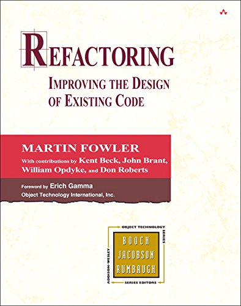

name: inverse
layout: true
class: center, middle, inverse
.indexlink[[<i class="fa fa-arrow-circle-o-up"></i>](#) [<i class="fa fa-list-ul"></i>](#index) [<i class="fa fa-tint"></i>](../change-color.php)[<i class="fa fa-file-pdf-o"></i>](download)]

---

name: normal
layout: true
class: left, middle
.indexlink[[<i class="fa fa-arrow-circle-o-up"></i>](#) [<i class="fa fa-list-ul"></i>](#index) [<i class="fa fa-tint"></i>](../change-color.php)[<i class="fa fa-file-pdf-o"></i>](download)]

---

template:inverse
# Refactoring
<a href="http://www.fe.up.pt/~arestivo">André Restivo</a>

---

template: inverse
name:index
# Index

.indexlist[
1. [Introduction](#introduction)
1. [Code Smells](#smells)
1. [Refactoring](#refactoring)
]

---

# Reference

* Fowler, Martin. [Refactoring: Improving the design of existing code](https://scholar.google.pt/scholar?q=Refactoring%3A+Improving+the+Design+of+Existing+Code). Addison-Wesley Professional, 1999.
* Kerievsky, Joshua. [Refactoring to Patterns](https://scholar.google.pt/scholar?q=Refactoring+to+Patterns). Pearson Deutschland GmbH, 2005.
* [Refactoring Guru](https://refactoring.guru)
  
---

template: inverse
name:introduction
# Introduction

---

# Refactoring

* Refactoring is a **controlled** technique for **improving** the **design** of an **existing** code base. 
* Its essence is applying a series of **small behavior-preserving transformations**, each of which "*too small to be worth doing*". 
* However the **cumulative** effect of each of these transformations is quite **significant**.

---

# Structure

* Motivation - Why?

* Mechanics - How?

* Example - Normally before and after code

---

# Testing

Refactoring is intended to improve **nonfunctional** attributes of the software. 

Having a good **testing suite** is of paramount importance **before** refactoring to ensure the code still behaves as expected.

---

template: inverse
name:smells
# Code Smells

---

# Code Smells

* A code smell is a **surface indication** that usually corresponds to a **deeper problem** in the system.
* A code smell is something that's **quick to spot** (*sniffable*).
* A code smell **doesn't always** indicate a **problem**. Smells aren't inherently bad on their own, they are often an **indicator** of a **problem** rather than the problem themselves. 

---

# Code Smells - Bloaters

**Long Method**

A method contains too many lines of code.

**Large Class**

A class contains many fields/methods/lines of code.

**Primitive Obsession**

Use of primitives instead of small objects for simple tasks

**Long Parameter List**

More than three or four parameters for a method.

**Data Clumps**

Different parts of the code containing identical groups of variables.

---

# Code Smells - OOP Abusers

**Switch Statements**

Complex switch/if operators.

**Temporary Field**

Temporary fields get their values only under certain circumstances. 

**Refused Bequest**

If a subclass uses only some of the methods and properties inherited from its parents.

**Alternative Classes with Different Interfaces**

Two classes perform identical functions but have different method names.

---

# Code Smells - Change Preventers

**Divergent Change**

Changing many unrelated methods when you make changes to a class.

**Shotgun Surgery**

Many small changes to many different classes.

**Parallel Inheritance Hierarchies**

Whenever you create a subclass for a class, you find yourself needing to create a subclass for another class.

---

# Code Smells - Dispensables

.small[
**Comments**

A method is filled with explanatory comments.

**Duplicate Code**

Two code fragments look almost identical.

**Lazy Class**

Classes that don't do much.

**Data Class**

Class that contains only fields and crude methods for accessing them.

**Dead Code**

A variable, parameter, field, method or class that is no longer used.

**Speculative Generality**

There’s an unused class, method, field or parameter that was created to support anticipated future features
]

---

# Code Smells - Couplers

**Feature Envy**

A method accesses the data of another object more than its own data.

**Inappropriate Intimacy**

One class uses the internal fields and methods of another class.

**Message Chains**

In code you see a series of calls resembling: <code>a->b()->c()->d()</code>.

**Middle Man**

If a class only delegates work to another class, why does it exist at all?

---

template: inverse
name:refactorings
# Refactorings
## Just Some Examples

---

# Extract Method

~~~java
void printOwing() {
  printBanner();

  // Print details.
  System.out.println("name: " + name);
  System.out.println("amount: " + getOutstanding());
}
~~~

--

Refactored into:

~~~java
void printOwing() {
  printBanner();
  printDetails(getOutstanding());
}

void printDetails(double outstanding) {
  System.out.println("name: " + name);
  System.out.println("amount: " + outstanding);
}
~~~

Can be used to eliminate: **Duplicate Code**, **Long Method**, **Feature Envy**, **Switch Statements**, **Message Chains**, **Comments** and **Data Class**.

---

# Inline Method

~~~java
class PizzaDelivery {
  // ...
  int getRating() {
    return moreThanFiveLateDeliveries() ? 2 : 1;
  }
  boolean moreThanFiveLateDeliveries() {
    return numberOfLateDeliveries > 5;
  }
}
~~~

--

Refactored into:

~~~java
class PizzaDelivery {
  // ...
  int getRating() {
    return numberOfLateDeliveries > 5 ? 2 : 1;
  }
}
~~~

Can be used to eliminate: **Speculative Generality**.

---

# Extract Variable

~~~java
void renderBanner() {
  if ((platform.toUpperCase().indexOf("MAC") > -1) &&
       (browser.toUpperCase().indexOf("IE") > -1) &&
        wasInitialized() && resize > 0 )
  {
    // do something
  }
}
~~~

--

Refactored into:

~~~java
void renderBanner() {
  final boolean isMacOs = platform.toUpperCase().indexOf("MAC") > -1;
  final boolean isIE = browser.toUpperCase().indexOf("IE") > -1;
  final boolean wasResized = resize > 0;

  if (isMacOs && isIE && wasInitialized() && wasResized) {
    // do something
  }
}
~~~

Can be used to eliminate: **Comment**.

---

# Split Temporary Variable

~~~java
double temp = 2 * (height + width);
System.out.println(temp);
temp = height * width;
System.out.println(temp);
~~~

--

Refactored into:

~~~java
final double perimeter = 2 * (height + width);
System.out.println(perimeter);
final double area = height * width;
System.out.println(area);
~~~

---

# Moving Features between Objects

**Move Method** 

Create a new method in the class that uses the method the most, then move code from the old method to there.

**Move Field**

Create a field in a new class and redirect all users of the old field to it.

**Extract Class**

Create a new class and place the fields and methods responsible for the relevant functionality in it.

**Inline Class**

Move all features from the class to another one.

---

# Decompose Conditional

~~~java
if (date.before(SUMMER_START) || date.after(SUMMER_END)) {
  charge = quantity * winterRate + winterServiceCharge;
}
else {
  charge = quantity * summerRate;
}
~~~

--

Refactored into:

~~~java
if (isSummer(date)) {
  charge = summerCharge(quantity);
}
else {
  charge = winterCharge(quantity);
}
~~~

Can be used to eliminate: **Long Method**.

---

# Consolidate Duplicate Conditional Fragments

~~~java
if (isSpecialDeal()) {
  total = price * 0.95;
  send();
}
else {
  total = price * 0.98;
  send();
}
~~~

--

Refactored into:

~~~java
if (isSpecialDeal()) {
  total = price * 0.95;
}
else {
  total = price * 0.98;
}
send();
~~~

Can be used to eliminate: **Duplicate Code**.

---

# Replace Nested Conditional with Guard Clauses

<table>
<tr>
<td>
<pre><code class="java hljs remark-code">
public double getPayAmount() {
  double result;
  if (isDead){
    result = deadAmount();
  }
  else {
    if (isSeparated){
      result = separatedAmount();
    }
    else {
      if (isRetired){
        result = retiredAmount();
      }
      else{
        result = normalPayAmount();
      }
    }
  }
  return result;
}
</code></pre>
</td><td>
<pre><code class="java hljs remark-code">
public double getPayAmount() {
  if (isDead){
    return deadAmount();
  }
  if (isSeparated){
    return separatedAmount();
  }
  if (isRetired){
    return retiredAmount();
  }
  return normalPayAmount();
}
</code></pre>
</td></tr>

---

# Introduce Null Object

~~~java
if (customer == null) {
  plan = BillingPlan.basic();
}
else {
  plan = customer.getPlan();
}
~~~

--

Refactored into:

~~~java
class NullCustomer extends Customer {
  boolean isNull() {
    return true;
  }
  Plan getPlan() {
    return new NullPlan();
  }
}

customer = (order.customer != null) ?
  order.customer : new NullCustomer();

plan = customer.getPlan();
~~~

Can be used to eliminate: **Switch Statements** and **Temporary Field**.

---

# Simplifying Method Calls

**Rename Method**, **Add Parameter** and **Remove Parameter**

**Separate Query from Modifier**

Split a method into two separate methods. One of them should return the value and the other one modifies the object.

**Parameterize Method**

~~~java
increaseOne();
increaseFive();
~~~

**Introduce Parameter Object**

Replace parameters with an object.

**Replace Error Code with Exception**

A method returns a special value that indicates an error? Throw an exception instead.

---

# Dealing with Generalization

**Pull Up Field**, **Pull Up Method** and **Pull Up Constructor Body**

Pull up to the parent class.

**Push Down Method** and **Push Down Field**

Push down to a subclass.

**Extract Subclass**, **Extract Superclass** and **Extract Interface**

Transform one class into two classes.

**Collapse Hierarchy**

Transform many classes into one class.

**Replace Inheritance with Delegation** and **Replace Delegation with Inheritance**