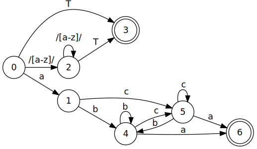

name: inverse
layout: true
class: center, middle, inverse
.indexlink[[<i class="fa fa-home"></i>](#) [<i class="fa fa-list"></i>](#index)]

---

name: normal
layout: true
class: left, middle
.indexlink[[<i class="fa fa-home"></i>](#) [<i class="fa fa-list"></i>](#index)]

---

template:inverse
# Regular Expressions
<a href="http://www.fe.up.pt/~arestivo">André Restivo</a>

---

template: inverse
name:index
# Index

.indexlist[
1. [Introduction](#intro)
1. [Literal Characters](#literal)
1. [Character Classes](#classes)
1. [Zero-Length Matches](#zero-length)
1. [Alternation](#alternation)
1. [Quantifiers](#quantifiers)
1. [Grouping and Capturing](#grouping)
1. [Backreferences](#backreferences)
1. [Backtracking](#backtracking)
1. [Lookaround](#lookaround)
1. [NFA](#nfa)
1. [In HTML](#html)
1. [In PHP](#php)
1. [In Javascript](#javascript)
]

---

template: inverse
name:intro
# Introduction

---

# Regular Expressions

A sequence of characters that forms a **search pattern**.

Used in:

* Data validation.
* Search and Replace.
* Parsing.

---

# Variants

* There are **several** different regular expression **processors**.
* All of them translate regular expressions into a Nondeterministic Finite Automaton (**NFA**).
* But can have slightly **different syntaxes**.

---

# Matching 

* Matching is the process of **applying** a regular expression **pattern** to a text string and finding 
  strings that are represented by that pattern.
* When **validating**, we normally expect the **whole** string to match the pattern.
* When **searching**, we expect a **substring** of that string to match the pattern.

---

# References

* [Online Regular Expression Tester](http://regex101.com/)
* [Regular Expressions Tutorial](http://www.regular-expressions.info/tutorial.html)
* [Regex Golf](https://regex.alf.nu/)
* [Mail RFC822 Regexp](http://ex-parrot.com/~pdw/Mail-RFC822-Address.html)

---

template: inverse
name: literal
# Literal Characters

---

# Literal Characters

A literal character matches the first occurrence of that character in the string.

```text
a
```

.box_regexp[
I **a**te an apple.
]

You can tell the processor to match all occurrences if needed.

.box_regexp[
I **a**te **a**n **a**pple.
]

---

# Literal Characters

A series of literal characters, matches those same characters in the same order.

```text
at
```

.box_regexp[
I **at**e an apple.
]

---

# Special Characters

There are twelve characters that have special meanings in regular expressions: 

```text
\ ^ $ . | ? * + ( ) [ {
```

To match any of these symbols, you need to escape them with a **backslash**.

```text
\+
```

.box_regexp[
1**+**1=2
]

All other characters should **not** be escaped as the backslash also has special meaning.

---

#Non-Printable Characters

* ```\t``` - tab
* ```\r``` - carriage return
* ```\n``` - line feed

---

template: inverse
name: classes
# Character Classes

---

# Character Classes

A character class, or set, matches **only one** out of several characters.

```text
gr[ae]y
```

.box_regexp[
**gray** or **grey**
]

---

# Ranges

You can use an hyphen to specify ranges in a character class.

```text
[0-9a-fA-F]
```

This matches all digits from 0 to 9 and all letters (both in lowercase and uppercase).

.box_regexp[
Th**e** cat is inside the box.
]

---

# Negated

A **caret**(^) after the opening square bracket negates the character class.

```text
[^A-Za-f]
```

This matches all letters except those in uppercase and from *a* to *f*.

.box_regexp[
T**h**e cat is inside the box.
]

---

# Special Characters

Inside a character class, the only special characters are: 

```text
] \ ^ -
```

All others do not need to be escaped.

---

#Shorthand Character Classes

* ```\d``` digit - the same as ```[0-9]```
* ```\w``` word character - the same as ```[A-Za-z0-9_]```
* ```\s``` whitespace character - the same as ```[ \t\r\n\f]```

* ```\D``` not a digit - the same as ```[^0-9]``` or ```[^\d]```
* ```\W``` not a word character - the same as ```[^A-Za-z0-9_]``` or ```[^\w]```
* ```\S``` not a whitespace character - the same as ```[^ \t\r\n\f]``` or ```[^\s]```

---

# Dot

The **dot**(.) matches any character except line breaks.

```perl
c.t
```

.box_regexp[
The **cat** is inside the box.
]


---

template: inverse
name: zero-length
# Zero Length Matches

---

# Anchors

Anchors can be used to specify the position of the matched string.

* The **caret**(^) matches the position before the first character in the string.
* The **dollar sign**($) matches right after the last character in the string.
* We can use both anchors to validate a string.

```perl
boys$
```

Matching all occurrences:

.box_regexp[
Everyone knows boys will be **boys**
]

---

# Word Boundaries

* The metacharacter **\b** is an anchor. 
* It matches at a position that is called a *word boundary*. 
* It always produces a zero-length match.
* This allows you to do whole word searches.

```perl
\bis\b
```

.box_regexp[
This island **is** beautiful.
]

---

template: inverse
name: alternation
# Alternation

---

# Alternation

The **vertical bar**(|) allows you to match a single regular expression out of several possible regular expressions.

```perl
cat|dog
```

Matching all occurrences:

.box_regexp[
I like both **cat**s and **dog**s.
]


---

template: inverse
name: quantifiers
# Quantifiers

---

# Optional Items

The **question mark**(?) makes the preceding token in the regular expression optional.

```perl
colou?r
```

Matching all occurrences:

.box_regexp[
Do you write **color** our **colour**s?
]


---

# Repetion quantifiers

Repetition **quantifiers** allow the preceding token to repeat:

* The **star**(*) allows the token to repeat 0 or more times.
* The **plus**(+) allows the token to repeat 1 or more times.

```perl
[0-9]+
```

.box_regexp[
My phone number is **12345**.
]

The **question mark**(?) is also a repetion **quantifier** that allows the token to repeat 0 or 1 times.


---

# Custom Repetitions

Using **curly brackets**({}) we can specify the maximum and minimum number of repetions:

Repeat exactly 9 times:

```php
[0-9]{9}
```

Repeat between 1 and 3 times:

```perl
[0-9]{1,3}
```

Repeat at least twice:

```perl
[0-9]{2,}
```

Repeat at most three times:

```perl
[0-9]{,3}
```

---

# Repetitions are Greedy

By default, regular expression processors try to match as many characters as possible when handling repetitions.

```php
<.+>
```

.box_regexp[
This tea is **```<```strong```>```good```<```/strong```>```**.
]

This might cause unexpected effects.

---

# Lazy Repetitions

To make repetitions lazy, we add a **question mark**(?) after the repetition operator.

```perl
<.+?>
```

Matching all occurrences:

.box_regexp[
This tea is **```<```strong```>```**good**```<```/strong```>```**.
]

---

# Being lazy is hard work!

The reason why repetitions are greedy by default, is because being lazy forces the processor to **backtrack** more often.

An **alternative** would be using **negated classes**:

```php
<[^>]+>
```

Matching all occurrences:

.box_regexp[
This tea is **```<```strong```>```**good**```<```/strong```>```**.
]


---

template: inverse
name: grouping
# Grouping and Capturing

---

#Grouping

Putting part of a pattern inside **parentheses** creates a group. 

Groups can be used to apply **quantifiers** and **alternation** to specific parts of the pattern.

```html
((https?|ftp)://)?www\.example\.com
```

Matching all occurrences:

.box_regexp[
**ftp://www.example.com** or just **www.example.com**
]

---

# Capturing

Groups are automatically **captured** and **numbered**.

This allow you to **extract** different parts of the matched expression.

```html
(cats|dogs) are (lazy|smart)
```

.box_regexp[
i think **cats are lazy**
]

* Group #0: cats are lazy
* Group #1: cats
* Group #2: lazy

The **complete** match is always group **#0**.

---

# Capturing

## Other Example

```html
((https?|ftp)://)?www\.example\.com
```

.box_regexp[
**http://www.example.com**
]

* Group #0: http://www.example.com
* Group #1: http://
* Group #2: http

---

# Non Capturing

Sometimes we want to create a group without capturing it. To do that we start the group with a **question mark**(?) and a **colon**(:):

```html
(?:(?:https?|ftp)://)?www\.example\.com
```

.box_regexp[
**http://www.example.com**
]

* Group #0: http://www.example.com

---

template: inverse
name: backreferences
# Backreferences

---

# Backreferences

Backreferences can be used to match the same text twice.

Some regular expression processor use \n to reference captured groups while other use $n.

Number with at least 3 digits and where the first number is the same as the last.

```html
([0-9])[0-9]+\1
```

.box_regexp[
**1231**
]


---

template: inverse
name: backtracking
# Backtracking

---

# Backtracking

Although regular expression processors are greedy, they can backtrack if they fail to find a match.

```html
([0-9])[0-9]+\1
```

.box_regexp[
41231
]

Here, the processor starts by matching the 4 but when it fails to find another 4 in the text it backtracks and tries to start with the 1.

.box_regexp[
4**1231**
]


---

template: inverse
name: lookaround
# Lookaround

---

# Lookahead and lookbehind

**Lookahead** and **lookbehind** are **zero-length** **assertions** (just like the start and end of line and word boundaries)

* These are also called **lookaround** assertions. 
* They match characters but then **give up the match** without consuming the characters.
* They only **assert** whether a match is possible or not.

---

#Positive lookahead

Matches something followed by something else.

```html
(cat|dog)(?=s)
```

Matches *cat* or *dog* if followed by an *s*:

.box_regexp[
My dog is not like other **dog**s.
]

---

#Negative lookahead

Matches something not followed by something else.

```html
(cat|dog)(?!s)
```

Matches *cat* or *dog* if not followed by an *s*:

.box_regexp[
All the cats are smarter than my **cat**.
]

---

#Positive lookbehind

Tells the processor to temporarily **step backwards** in the string and check if the text inside the lookbehind can be **matched** there.

```perl
(?<=is)land
```

Matches *land* if preceeded by *is*:

.box_regexp[
England is part of an is**land**.
]

---

#Negative lookbehind

Tells the processor to temporarily **step backwards** in the string and check if the text inside the lookbehind **cannot** be matched there.

```perl
(?<!some)thing
```

Matches *thing* if it is not preceeded by *some*:

.box_regexp[
There is something about this **thing**.
]

---

template:inverse
name: nfa
# Nondeterministic Finite Automaton

---

# Regular Expressions are NFAs

**D**eterministic **F**inite **A**utomaton (DFA) are finite state machines where:

* each of its transitions is **uniquely** determined by its **source** state and **input** symbol, and
* reading an input symbol is **required** for each state transition.

Nondeterministic Finite Automaton don't need to obey these restrictions.

Regular expressions can [easily](https://www.youtube.com/watch?v=RYNN-tb9WxI) be transformed into NFAs. And NFA can [easily](https://www.youtube.com/watch?v=taClnxU-nao) be transformed into DFAs. 

http://hackingoff.com/compilers/regular-expression-to-nfa-dfa

---

# Example

```perl
(a(b|c)+a)|([a-z])*T
```



---

template:inverse
name: html
# In HTML

---

In HTML, input elements have a pattern attribute that can contain a regular expression pattern specifying the allowed values of the field.

```html
<input type="text" pattern="\d{9}|\d{3}-\d{3}-\d{3}">
```

---

template:inverse
name: php
# In PHP

---

# Patterns

* PHP uses Perl-Compatible Regular Expressions (PCRE)
* In PHP, patterns must be delimited by either **forwardslashes** (/), **hash** signs (#) or **tildes** (~).

```php
/ab|c/
```

* This means that the chosen delimiter must be **escaped** inside the pattern.
* You may add [pattern modifiers](http://php.net/manual/en/reference.pcre.pattern.modifiers.php) after the ending delimiter. 

```php
/ab|c/i
```

For example, the **i** pattern modifier makes the pattern case **insensitive**.

---

# preg_match

```php
int preg_match ( string $pattern , string $subject [, array &$matches ])
```

The [preg_match](http://php.net/manual/en/function.preg-match.php), searches *subject* for a match to the regular expression given in *pattern*.

* If matches is provided, then it is filled with the results of the search. 
* Returns 1 if the pattern matches given subject, 0 if it does not and false if an error occurred.

```php
<?php
  preg_match('/(\d{4})(?:-(\d{3}))?/', '4100-122', $matches);
  print_r($matches);
?>
```

```text
Array
(
    [0] => 4100-122
    [1] => 4100
    [2] => 122
)
```

---

# preg_match_all

```php
int preg_match_all ( string $pattern , string $subject [, array &$matches ])
```

The [preg_match_all](http://php.net/manual/en/function.preg-match-all.php), searches *subject* for **all** matches to the regular expression given in *pattern*.

* If matches is provided, then it is filled with all the results of the search in a multi-dimensional array. 
* Returns the number of full pattern matches and false if an error occurred.

```php
<?php
  preg_match_all('/(\d{4})(?:-(\d{3}))?/', '4100-122 4200', $matches);
  print_r($matches);
?>
```

```text
Array
(
    [0] => Array ([0] => 4100-122 [1] => 4200)
    [1] => Array ([0] => 4100 [1] => 4200)
    [2] => Array ([0] => 122 [1] => )
)
```

---

# preg_replace

```php
mixed preg_replace ( mixed $pattern , mixed $replacement , mixed $subject )
```

The [preg_replace](http://php.net/manual/en/function.preg-replace.php) function, searches *subject* for matches to *pattern* and replaces them with *replacement*.

* The replacement can contain backreferences in the form $n or ${n}.

```php
<?php
  echo preg_replace('/(cat|dog)/', 'my $1s', 'dog are dog');
?>
```

```text
my dogs are my dogs
```

---

# Validation

Using the **preg_match** function, we can easily validate data using regular expressions:

```php
function is_phone_number($element) {
	return !preg_match ("/^\d{9}|\d{3}-\d{3}-\d{3}$/", $element);
}
```

Don't forget the beginning and end of string anchors.

---

# Cleaning

You can also use the **preg_replace** function to clean up input data before storing it in the database.

```php
  $text = preg_replace('/[^\w\d\s\.!,\?]/', '', $_GET['text']);
```

---

template:inverse
name: javascript
# In Javascript

---

# Patterns

* In javascript, patterns must be delimited by **forwardslashes** (/).
* This means that the forwardslashes must be **escaped** inside the pattern.
* You may add modifiers after the ending delimiter:

The **g** modifier is used to perform a global match (find all matches).

The **i** modifier is used to perform a case insensitive match.

---

# test

```javascript
regexObj.test(str)
```

The [test](https://developer.mozilla.org/en-US/docs/Web/JavaScript/Reference/Global_Objects/RegExp/test) function, tests for a match in a string. It returns true or false.

```javascript
console.log(/(\d{4})(?:-(\d{3}))?/.test('4100-122'));
```

```text
true
```

---

# match

```javascript
str.match(regexp)
```

The [match](https://developer.mozilla.org/en-US/docs/Web/JavaScript/Reference/Global_Objects/String/match) function, executes a search for a regular expression in a string.

```javascript
console.log('4100-122 4200'.match(/(\d{4})(?:-(\d{3}))?/));
console.log('4100-122 4200'.match(/(\d{4})(?:-(\d{3}))?/g));
```

```text
["4100-122", "4100", "122", index: 0, input: "4100-122 4200"]
["4100-122", "4200"]
```

---

# search

```javascript
str.search([regexp])
```

If successful, [search](https://developer.mozilla.org/en-US/docs/Web/JavaScript/Reference/Global_Objects/String/search) returns the index of the first match of the regular expression inside the string.

```javascript
console.log('My zip code is 4100-122'.search(/(\d{4})(?:-(\d{3}))?/));
```

```text
15
```

---

# replace

```javascript
str.replace(regexp, replacement)
```

* The replacement can contain backreferences in the form $n.

```javascript
console.log('dog are dog'.replace(/(cat|dog)/, 'my $1s'));
console.log('dog are dog'.replace(/(cat|dog)/g, 'my $1s'));
```

```text
my dogs are dog
my dogs are my dogs 
```

---

# Validation

Using the **test** function, we can easily validate data using regular expressions:

```javascript
function is_phone_number(element) {
  return /^\d{9}|\d{3}-\d{3}-\d{3}$/.test(element);
}
```

Don't forget the beginning and end of string anchors.
