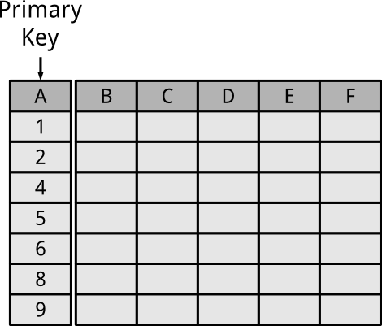
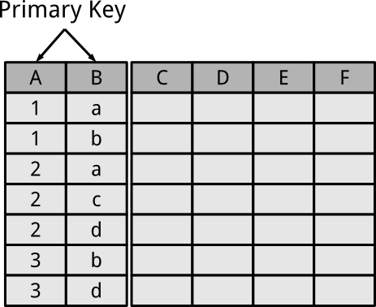
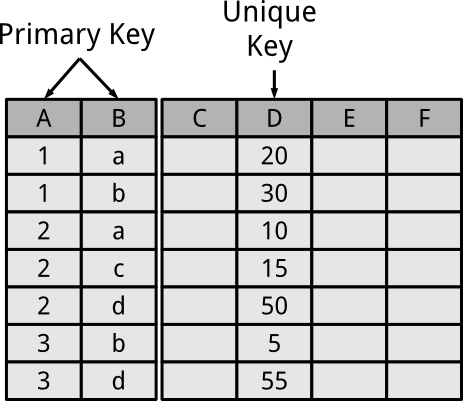
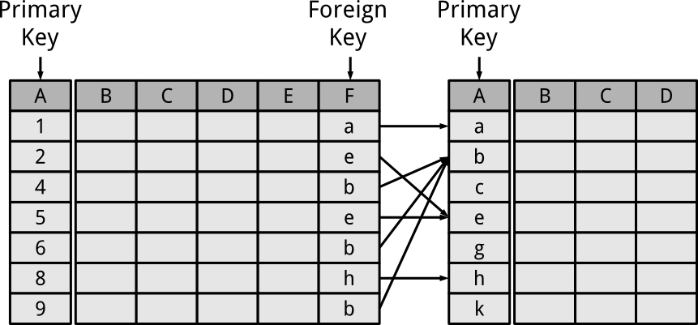
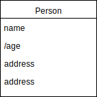
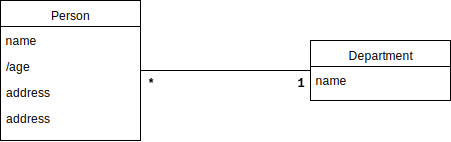

name: inverse
layout: true
class: center, middle, inverse
.indexlink[[<i class="fa fa-arrow-circle-o-up"></i>](#) [<i class="fa fa-list-ul"></i>](#index) [<i class="fa fa-tint"></i>](../change-color.php)[<i class="fa fa-file-pdf-o"></i>](download)]

---

name: normal
layout: true
class: left, middle
.indexlink[[<i class="fa fa-arrow-circle-o-up"></i>](#) [<i class="fa fa-list-ul"></i>](#index) [<i class="fa fa-tint"></i>](../change-color.php)[<i class="fa fa-file-pdf-o"></i>](download)]

---

template:inverse
# Relational Model
<a href="http://www.fe.up.pt/~arestivo">André Restivo</a>

---

template:inverse
name:index
# Index

.indexlist[
1. [Introduction](#intro)
1. [Constraints](#constraints)
1. [Operations](#operations)
1. [Conversion](#uml-to-mr)
1. [Example](#example)
]

---

template: inverse
name: intro
# Introduction

---

# Relational Model

* A simple **Database model** based on first-order predicate logic.
* First formulated and proposed in **1969** by Edgar F. **Codd**.
* But still the most used model for databases.
* Other models include *hierarchical* and *network* models.

---

# Principles

* Relational Model:

  * Set of relations: **tables**;
  * Composed by *tuples* (*records*) and *attributes*: **rows** and **columns**.

* Each relation:

  * Has **name**;
  * Contains **attributes**;
  * Subject to **constraints**.

---

# Relation

---

# Tuples

 * The **lines** of a relation;
 * **Ordered** sequence of values;
 * Tuples do not have a specific order between them;
 * Tuple values are **atomic** (no composite or multi-value).

---

# Notation

| | |
|-|-| 
| R (A1, A2, ..., An) | Relation schema R of degree n |
| Q, R, S | Relation names |
| t, u, v | Tuples |
| t (a1, a2, ..., an) | Tuple $t$ of a relation |
| t[Ai] | The value of the attribute *Ai* in the tuple *t* |
| t[Ai, Aj, Ak] | value of the attributes *Ai, Aj ,Ak* in the tuple *t* |

Example for an employee:

.box_example[
Employee (id, name, address, telephone)
]
---

name: constraints
template: inverse
# Constraints

---

# Domain

* The set of **possible** values for a given **attribute**.
* Can be considered a **constraint** on the value of the attribute.
* Examples:

 * integer values;
 * email addresses;
 * any text under 140 characters;
 * true or false.

---

# Not Null Constraint

For certain attributes, **null** can be a possible value. Others don't allow the null value.

Notation for **not null** attributes [NN]:

.box_example[
Employee (id, name [NN], address, telephone)
]

---

# Key Constraints

* No two tuples can have the same combination of values for
all their attributes;
* **Superkey**: set of attributes in a relation R such that no 2
different tuples will have the same values for that set of
attributes;
* **Key**: minimal set of attributes in relation R such that no 2
tuples have the same values;
* **Candidate key**: any key. 

---

# Primary Key

Key chosen to be used to **identify** tuples in a relation:

* Other candidate keys are **unique** keys;
* Every relation schema **must have** a primary key;
* The attribute values of the primary key **cannot** be *null*.

---

# Table with a Primary Key

---

# Notation

Notation for primary keys (underline):

.box_example[
Employee (<u>primary key</u>, attribute 1, addattribute 2, ..., attribute n)
]

Example for an employee:

.box_example[
Employee (<u>id</u>, name [NN], address, telephone)
]

---

# Table with a Double Primary Key

---

# Unique Keys

 * Unique keys are **similar to primary keys** but **allow null** values.
 * A relation can have **several** unique keys.

---

# Table with an Unique Key

---

# Notation

Notation for unique keys [UK]:

.box_example[
Employee (<u>primary key</u>, attribute 1 [UK], addattribute 2, ..., attribute n)
]

Example for an employee:

.box_example[
Employee (<u>id</u>, name [NN], address, telephone [UK])
]

---

# Foreign Keys

* An **attribute** (or set of attributes) that uniquely identifies a tuple of another, or the same, relation.
* Can be used to **cross-reference** relations.
* Possible to use the values of attributes in the referenced relation to restrict the domain of one or more attributes in the referencing relation.

---

## Table with a Foreign Key

---

## Notation

Notation for foreign keys (# and arrow):

.box_example[
Relation (<u>primary_key</u>, attribute, #foreign_key &rarr; Referenced Relation)
]

Example for an employee and a department:

.box_example[
Employee works at a department.
 
 
Employee (<u>id</u>, name [NN], telephone [UK], #num &rarr; Department)  
Department (<u>num</u>, name [NN])
]

---

# Constraints
## Summary

* **Primary key** values **cannot be null**.
* **Key values** (primary and unique) **cannot have repeated** values.
* **Values** have to belong to the attribute **domain**.
* Attributes with a **not null** constraint **cannot have null** values.
* **Foreign key** attributes can only have values that **exist in the referenced relation**.

---

template: inverse
name: operations
# Operations

---

# List of Operations

* **Insertion**: Inserts a new tuple into a relation.
* **Deletion**: Deletes one or more tuples from a relation.
* **Update**: Updates one or more tuples.

---

template: inverse
name: uml-to-mr

# UML to Relational

---

# Class

---

# Many-to-one

