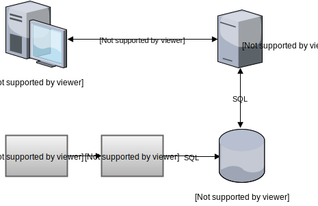

name: inverse
layout: true
class: center, middle, inverse
.indexlink[[<i class="fa fa-arrow-circle-o-up"></i>](#) [<i class="fa fa-list-ul"></i>](#index) [<i class="fa fa-tint"></i>](../change-color.php)[<i class="fa fa-file-pdf-o"></i>](download)[<i id="laser" class="fa fa-circle"></i>](#)]

---

name: normal
layout: true
class: left, middle
.indexlink[[<i class="fa fa-arrow-circle-o-up"></i>](#) [<i class="fa fa-list-ul"></i>](#index) [<i class="fa fa-tint"></i>](../change-color.php)[<i class="fa fa-file-pdf-o"></i>](download)[<i id="laser" class="fa fa-circle"></i>](#)]

---

template:inverse
# SIBD / ESIN
<a href="http://www.fe.up.pt/~arestivo">André Restivo</a>

---

template:normal

# Learning Outcomes

After completing this course you should be able to:

* Design a **relational database**
* Make **SQL** queries to relational databases
* Create and validate **HTML 5** documents
* Layout HTML 5 documents using **CSS**
* Create an **information system** implemented as a dynamic **web application** using PHP and relational databases

---

# Course Content

* Entity Relationship Model
* Relational Model
* Relational Algebra
* Database creation using SQL
* Querying Databases using SQL
* Document Specification using HTML 5
* Document Presentation using CSS
* Dynamic Websites using PHP, HTML, CSS and SQL

---

# Project

Implementation of an information system as a web application.

---

# Main Bibliography

* Michal Zalewski; The tangled Web. ISBN: 978-1-59327-388-0
* Jakob Nielsen; Designing web usability. ISBN: 1-56205-810-X
* Jeffrey D. Ullman, Jennifer Widom; A First Course in Database Systems. ISBN: 0-13-8687647-9
* Provided Slides
* Lots of Web resources and tutorials!

---

#Evaluation

* To obtain frequency, students may not exceed the maximum number allowed of missed classes. Attendance will be registered in practice sessions.
* It is necessary to obtain a minimum of **8 (out of 20)** in both the exam and the distributed evaluation component.
* Distributed evaluation refers to the implementation of a information system project.
* Final mark = 0.5 * Exam + 0.5 * Project
