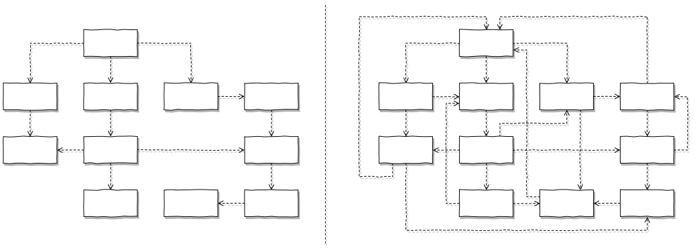
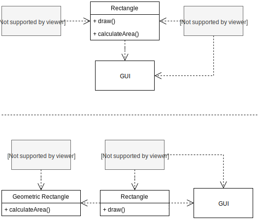
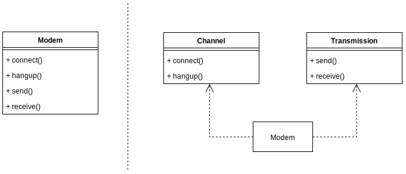
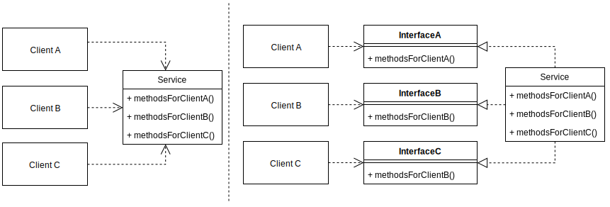
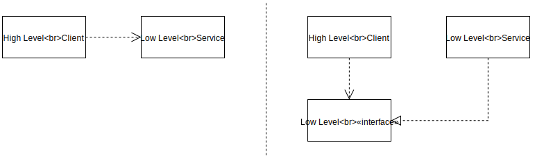
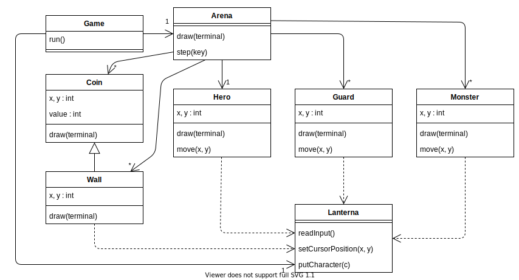
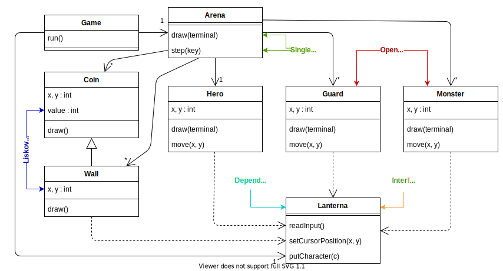
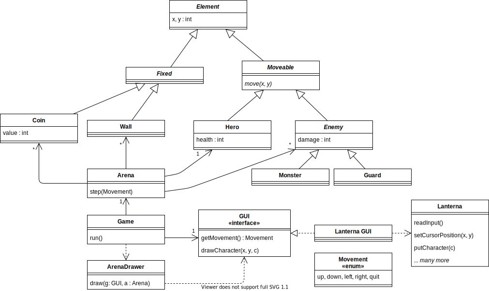

name: inverse
layout: true
class: center, middle, inverse
.indexlink[[<i class="fa fa-arrow-circle-o-up"></i>](#) [<i class="fa fa-list-ul"></i>](#index) [<i class="fa fa-tint"></i>](../change-color.php)[<i class="fa fa-file-pdf-o"></i>](download)]


---

name: normal
layout: true
class: left, middle
.indexlink[[<i class="fa fa-arrow-circle-o-up"></i>](#) [<i class="fa fa-list-ul"></i>](#index) [<i class="fa fa-tint"></i>](../change-color.php)[<i class="fa fa-file-pdf-o"></i>](download)]


---

template:inverse
# SOLID
...and other OO principles!

<a href="http://www.fe.up.pt/~arestivo">André Restivo</a>

---

template: inverse
name:index
# Index

.indexlist[
1. [Software Rot](#software-rot)
1. [Symptoms](#symptoms)
1. [Causes](#causes)
1. [SOLID Principles](#principles)
1. [Other Principles](#other)
]

---

# Reference

Directly from [Uncle Bob](https://www.google.com/search?q=Uncle+Bob):

> [Martin, R.C., 2000. "Design principles and design patterns". Object Mentor, 1(34), p.597.](https://scholar.google.com/scholar?cluster=3415379066410706654&hl=en&as_sdt=0,5&sciodt=0,5)

---

template: inverse
name:software-rot
# Software Rot

---

# Software Rot

Even when software design **starts** as a **pristine work of art**, portraying the **clean** and **elegant** image in the **mind** of the designer, it **eventually** starts to **rot**:

* It starts with a **small hack** but the overall beauty of the design is still there.

* The hacks start **accumulating**, each one another **nail** in the **coffin**.

* The code **eventually** becomes an incredibly **hard to maintain** mess.

---

# System Redesign

* At this point a **redesign** is needed. But the old code is still in **production**, **evolving** and **changing**.

* So the *system redesign* is trying to **shoot** at a **moving target**.

* **Problems** start to **accumulate** in the new design **before** it is even **released**.

---

template: inverse
name:symptoms
# Symptoms of Rotting Design

---

# Rigidity

* The **tendency** for software to be **difficult** to **change**.
* Every **change** causes a **cascade** of subsequent **changes**.
  
When software behaves this way, managers **fear** to allow engineers to **fix** non-critical **problems** (as they may disappear for long periods of time).

---

# Fragility

* The **tendency** of software to **break** in **many places** every time it is changed.
* Often in areas that have **no conceptual relationship** with the area that was changed.

When software behaves this way, managers and customers start to suspect that the **developers** have **lost control** of their software.

---

# Immobility

* The **inability** to **reuse** **software** from other projects or from parts of the same project.
* The **work** and **risk** required to **separate** the desirable parts of the software from the undesirable parts are **too great** to tolerate.

Software ends up being **rewritten**.

---

# Viscosity

Viscosity of the **design**: 
  * There is **more than one** way to make a change: preserving the **design**, and **hacks**.
  * The **design** preserving methods are **harder** to employ than the **hacks**.

Viscosity of the **environment**:
  * The development environment is **slow** and **inefficient** (long compile times, complicated and long check in procedures, ...).
  * Developers end up choosing solutions that require **as few changes** as possible, **regardless** of whether the **design** is **preserved**.

---

template: inverse
name:causes
# Causes of Rotting Design

---

# Changing Requirements

* **Requirements** change in ways that the **initial design** did **not anticipate**.

* Often **changes** are **urgent**, and **hacks** are **used** to make them; even if it **deviates** from the original design.

Changing requirements should **not** be **a surprise**, and blaming them is the **easy way out**:

* The **system design** must be **resilient** to these changes from the start.

---

# Dependency Hell

If we **analyze** the four **symptoms** of rotting design just presented, carefully, there is one **common theme** among them: **improper dependencies** between modules.

* The **initial design** properly separates the **responsibilities** of each module; dependencies seem **logic** and **stratified**.

* As **time** goes by, **hacks** (needed because of **unforseen** **requirement** **changes**), introduce **unwanted** dependencies.



---

template: inverse
name:causes
# Principles of Object-Oriented Design
## SOLID

---

# (S) The Single Responsibility Principle (SRP)

> "Each software module should have **one** and **only one** **reason** to **change**."

If a module assumes more than one responsibility, then: 

* There will be **more than one** **reason** for it to **change**.

* **Changes** to one responsibility may **impair** the **ability** to **meet** the **others**.

* It might **force** **unwanted** and **unneeded** **dependencies**.

---

# Example



---

# When to (or not to) use?



> Gather together the things that change for the same reasons. Separate those things that change for different reasons &mdash; [Uncle Bob, 2014](https://blog.cleancoder.com/uncle-bob/2014/05/08/SingleReponsibilityPrinciple.html)

* If the application is **not changing** in ways that cause the two
responsibilities to **change at different times**, then there is **no need to separate them**.

* It is **not wise** to apply the SRP if there is **no symptom** (needless complexity).

---

# Hiding Difficult Decisions


> “We have tried to demonstrate by these examples that it is almost always incorrect to begin the decomposition of a system into modules on the basis of a flowchart. We propose instead that one begins with a list of **difficult design decisions** or design decisions which are **likely to change**. Each module is then designed to **hide such a decision from the others**.” 
 
&mdash; Parnas, D.L., 1972. **On the criteria to be used in decomposing systems into modules**. Communications of the ACM, 15(12), pp.1053-1058.

---

# (O) The Open-Closed Principle (OCP)

> A module should be **open** for extension but **closed** for modification.

* We should **write** our modules so that they **can** be **extended**, **without requiring** them to be **modified**.

* So we can **add** new features to **existing** code, by only **adding** (and not modifying) new code.

---

# Example

There can be **many** **different** types of shapes:

```java
public class Shape {
    enum TYPE {SQUARE, CIRCLE}
    private TYPE type;
    
    public void draw() {
        switch (type) {
            case CIRCLE: drawCircle(); break;
            case SQUARE: drawSquare(); break;
        }
    }
}
```

What **happens** when we want to **add another** shape?

---

# Solution: Dynamic Polymorphism

```java
public abstract class Shape {
    public void draw();
}
```

```java
public class Square extends Shape {
    public void draw() {
        //...
    }
}
```

```java
public class Circle extends Shape {
    public void draw() {
        //...
    }
}
```

---

# Other Solution: Static Polymorphism

Also known as **generics** (more on that later):

```java
List<String> listOfStrings;
List<Shape> listOfShapes;
```

**No need** to **rewrite** the *List* class to use it with a **different** type.

---

# (L) The Liskov Substitution Principle (LSP)

> Subclasses should be substitutable for their base classes.

A **user** of a **base class** should **continue** to **function properly** if a **derivative** of that base class is **passed** to it.

This might seem **obvious** at first, but many times its **hard to detect** that this principle is being **broken**.

---

# The Rectangle-Square Dilemma

All **squares** are **rectangles** with **equal** **height** and **width**.

```java
public class Rectangle {
  public void setWidth(double width);
  public void setHeight(double height);
  public double getArea();
}

public class Square extends Rectangle {
  public void setWidth(double width) {
    this.width = width; this.height = width;
  }
  public void setHeight(double height) {
    this.width = height; this.height = height;
  }
}
```

---

# LSP Violation

A **client** should **rightfully** expect the following to **hold**:

```java
public void doSomething(Rectangle r) {
  r.setWidth(10);
  r.setHeight(20);
  assertEquals(200, r.getArea()); 
}
```

If this method really **needs** this to hold, then it has to **test** if the Rectangle is **really** a Rectangle:

```java
public void doSomething(Rectangle r) {
  if (!(r instanceof Square) {
    // ...
  }
}
```

And we are back at the **OCP** problem!

---

# LSP as Contracts

A **derived** class is **substitutable** for its **base** class if:

1. Its **preconditions** are no **stronger** than the **base** class method.
2. Its **postconditions** are no **weaker** than the **base** class method.

Or, in other words, **derived methods should expect no more and provide no less**.

---

# (I) The Interface Segregation Principle (ISP)

> **Many** **client specific** interfaces are better than **one** **general purpose** interface.

* Clients should **not be forced** to **depend** upon **interfaces** that they **do not use**.

* Clients should be **categorized** by their **type**, and **interfaces** for **each type** of client should be **created**.

* If **two or more** different client types **need** the **same method**, the method should be **added** to **both** of their interfaces.


---

# One Service, Different Interfaces



* Makes the code more **readable** and **manageable**.

* Promotes the **single responsibility principle** (SRP).

---

# (D) The Dependency Inversion Principle (DIP)

> **High-level** modules should **not depend** on **low-level** modules. **Both** should **depend** on **abstractions**.

And

> **Abstractions** should **not depend** on **details**. **Details** should **depend** on **abstractions**.

* We are **not just** changing **the direction** of the dependency.
  
* We are **splitting** the **dependency** by putting an **abstraction** in the **middle**.

---

# Why?

**Concrete** things change a **lot**, **abstract** things change much **less** frequently.



* No client code has to be **changed** simply because an object it **depends** on needs to be **changed** to a **different one** (loose coupling).

* Promotes **testability**.

* Promotes **replaceability**.

---

template: inverse
name:other
# Other Principles

---

# Principles of Package Architecture

---

# The Release Reuse Equivalency Principle (REP)

> The granule of reuse is the granule of release.

* Code should **not be reused** by **copying** it from one class and **pasting** it into another.

* Only **components** that are **released** through a **tracking system** can be **effectively** **reused**.
  
---

# The Common Closure Principle (CCP)

> Classes that change together, belong together.

* If the code in an application **must change**, changes should be **focused** into a **single package**.

* If two classes almost **always change together**, then they **belong** in the **same package**.

**Maintainability!**

---

# The Common Reuse Principle (CRP)

> Classes that **aren’t** **reused** together **should not** be **grouped** together.

* Generally **reusable** classes **collaborate** with other classes that are part of the **reusable** abstraction.

* These classes **belong** in the **same** package.

**Reusability!**

---

# The Package Coupling Principles

---

# The Acyclic Dependencies Principle (ADP)

> The **dependencies** between packages **must not form cycles**.

* The **dependency** **graph** should be a **DAG** (directed **acyclic** graph).

* **Cycles** in the dependency graph are **effectively large packages**.

* Cycles can be **broken** using the **dependency inversion principle** (DIP).

---

# The Stable Dependencies Principle (SDP)

> Depend in the direction of stability.

* **Stable** means "**hard** to **change**" (many clients), while **unstable** means "**easy** to **change**".

* Modules that are "**hard to change**" should **not depend** on modules that are "**easy to change**". 
  
* The reason is that it makes the "**easy to change**" module "**harder to change**" because of the **impact** on the depending module.

* You need "**easy to change**" packages, or your software **cannot change easily**.

---

# The Stable Abstractions Principle (SAP)

> Stable packages should be abstract packages.

* A package can be said to be "**harder to change**" as **more packages** **depend** on it. 

* So it should be made **abstract** so that it can be **extended** when necessary. 
  
* A package that is **not used** by other packages can be "**changed easily**", so it can remain **concrete**.

---

template: inverse
name:other
# An Example

---

# Bad Design



---

# Violated Principles




---

# Solid Design


