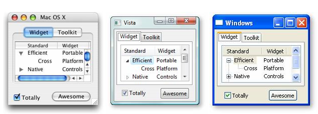
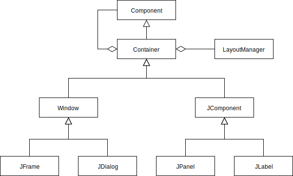
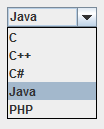
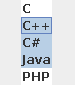
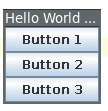
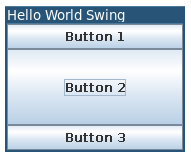
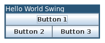
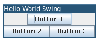
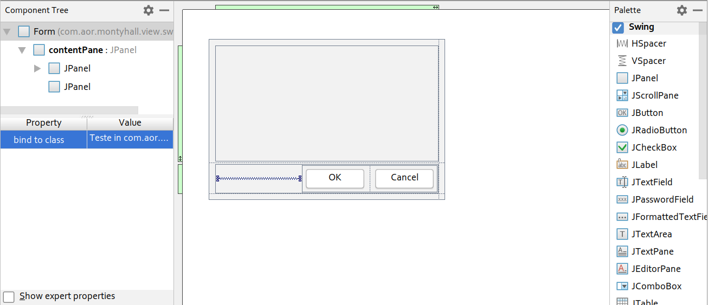

name: inverse
layout: true
class: center, middle, inverse
.indexlink[[<i class="fa fa-arrow-circle-o-up"></i>](#) [<i class="fa fa-list-ul"></i>](#index) [<i class="fa fa-tint"></i>](../change-color.php)[<i class="fa fa-file-pdf-o"></i>](download)]

---

name: normal
layout: true
class: left, middle
.indexlink[[<i class="fa fa-arrow-circle-o-up"></i>](#) [<i class="fa fa-list-ul"></i>](#index) [<i class="fa fa-tint"></i>](../change-color.php)[<i class="fa fa-file-pdf-o"></i>](download)]

---

template:inverse
# Swing
<a href="http://www.fe.up.pt/~arestivo">André Restivo</a>

---

template: inverse
name:index
# Index

.indexlist[
1. [Introduction](#intro)
1. [Swing](#swing)
1. [Components](#components)
1. [Layouts](#layouts)
1. [Events](#events)
1. [Custom Components](#custom)
]

---

template: inverse
name:intro
# Introduction

---

# Widget Toolkit

A library containing a set of graphical control elements (called **widgets**) used to construct the graphical user interface (**GUI**) of programs.

---

# Java Widget Toolkits

* **AWT** (Abstract Window Toolkit) provides a thin **level of abstraction** over the underlying native user-interface. This allows applications look like native applications.

* **Swing** not implemented by platform-specific code but provides a look and feel that **emulates** the look and feel of several platforms. An evolution of **AWT**.

* **SWT** (Standard Widget Toolkit) accesses the native GUI libraries of the operating system using Java Native Interface (**JNI**).

* **JavaFX** makes it possible for developers to use a common programming model while building an application targeted for both desktop and mobile devices.

---

template: inverse
name:swing
# Swing

---

# Structure

* **Container** a component that can contain other Swing components (**Composite pattern**).
* **Component** the abstract base class for the user-interface controls of Swing. 
* **LayoutManager** tells how components are layed out in containers.

.small[

]

---

# Hello World

~~~java
import javax.swing.*;

public class Main {
  public static void main(String[] args) {
    new Main().start();
  }

  private void start() {
    JFrame frame = new JFrame("Hello World Swing");
    frame.setLayout(new BoxLayout(frame.getContentPane(), BoxLayout.X_AXIS));

    JLabel label = new JLabel("Hello World");
    frame.getContentPane().add(label);

    frame.pack();
    frame.setVisible(true);
  }
}
~~~

---

template: inverse
name:components
# Components

---

# Button, Checkboxes and Radio Buttons

* **JButton** A common button that can be clicked.
* **JCheckBox** A check box button that can be checked or not.
* **JRadioButton** One of a group of radio buttons.
  
~~~java
JButton button = new JButton("Click Me");
frame.getContentPane().add(button);

JCheckBox checkbox = new JCheckBox("Check Me");
frame.getContentPane().add(checkbox);

ButtonGroup group = new ButtonGroup();
JRadioButton radioone = new JRadioButton("Select Me");
JRadioButton radiotwo = new JRadioButton("Or Me");
group.add(radioone);
group.add(radiotwo);
frame.getContentPane().add(radioone);
frame.getContentPane().add(radiotwo);
~~~

---

# Label and Text Fields

* **JLabel** An uneditable text label.
* **JTextField** and JPasswordField Visible and invisible single line text fields.
* **JTextArea** Multiple line text field.

~~~java
JLabel label = new JLabel("Registration");
frame.getContentPane().add(label);

JTextField username = new JTextField("username");
frame.getContentPane().add(username);

JTextField password = new JPasswordField("password");
frame.getContentPane().add(password);

JTextArea details = new JTextArea("details");
frame.getContentPane().add(details);
~~~

---

# Combo Box

A combination of a **drop-down** list and a single-line **editable** (or not) textbox.

~~~java
String[] choices = { "C", "C++", "C#", "Java", "PHP" };

JComboBox combobox = new JComboBox(choices);
combobox.setEditable(true);
combobox.setSelectedIndex(3);

frame.getContentPane().add(combobox);
~~~

---

# List

A list of items the user can select from.

~~~java
String[] choices = { "C", "C++", "C#", "Java", "PHP" };

JList<String> list = new JList(choices);
list.setSelectionMode(ListSelectionModel.MULTIPLE_INTERVAL_SELECTION);
list.setSelectedIndex(3);

frame.getContentPane().add(list);
~~~

[More components and how to use them...](https://www.cs.tut.fi/lintula/manual/java/tutorial/uiswing/components/components.html) 

---

template: inverse
name:layouts
# Layouts

---

# Layout Manager

A layout manager (or simply layout) tells a container how to layout its child components:

* **BoxLayout** puts components in a single row or column.
* **BorderLayout** places components in up to five areas: top, bottom, left, right, and center.
* **CardLayout** lets you implement an area that contains different components at different times.
* **FlowLayout** lays out components in a single row, starting a new row if its container is not sufficiently wide.
* **GridLayout** makes all components equal in size and displays them in the requested number of rows and columns.
* **GridBagLayout** a sophisticated, flexible layout manager that aligns components by placing them within a grid of cells, allowing components to span more than one cell.

---

# Pack

* Components don't have the same **size** in every operating system.
* The **content** of a component can also affect its size.
* Devices have very different **form factors**.
* This makes it **hard** to specify the location of each component using **absolute** coordinates.

And that's why we need Layout Managers...

* Each component has a method, called **getPreferredSize()**, that returns the preferred size of that component.
* The **pack()** method packs the components within the parent container trying to maintain the components preferred sizes.

~~~java
frame.pack();
frame.setVisible(true);
~~~

---

# Box Layout

Puts components in a single row or column.

~~~java
frame.setLayout(
  new BoxLayout(frame.getContentPane(), BoxLayout.Y_AXIS) // or X_AXIS
); 

JButton button1 = new JButton("Button 1");
JButton button2 = new JButton("Button 2");
JButton button3 = new JButton("Button 3");

frame.getContentPane().add(button1);
frame.getContentPane().add(button2);
frame.getContentPane().add(button3);
~~~

---

# Border Layout

Places components in up to **five** areas: top, bottom, left, right, and center. 

The center area is the default and may **stretch** both horizontally and vertically to fill any space left over. 

~~~java
frame.setLayout(new BorderLayout());

JButton button1 = new JButton("Button 1");
JButton button2 = new JButton("Button 2");
JButton button3 = new JButton("Button 3");

frame.getContentPane().add(button1, BorderLayout.NORTH);
frame.getContentPane().add(button2, BorderLayout.CENTER);
frame.getContentPane().add(button3, BorderLayout.SOUTH);
~~~

---

# Grid Bag Layout

The most complex and flexible of the layouts. Components are layed out on a **grid** with different column and row sizes. Components can occupy more than one cell.

Uses a **GridBagConstraints** class to specify the position and layout if each component:

* **gridx, gridy** the position of the top-left corner of the component (zero based).
* **gridwidth, gridheight** the number of columns and rows the component occupies.
* **fill** should the component fill the cell if there is more room (NONE, HORIZONTAL, VERTICAL, BOTH).
* ... and [more](https://docs.oracle.com/javase/tutorial/uiswing/layout/gridbag.html).

---

# Grid Bag Layout

~~~java
frame.setLayout(new GridBagLayout());

JButton button1 = new JButton("Button 1");
GridBagConstraints gbc1 = new GridBagConstraints();
gbc1.gridx = 0; gbc1.gridy = 0; 
gbc1.gridwidth = 2; gbc1.fill = GridBagConstraints.BOTH;

JButton button2 = new JButton("Button 2");
GridBagConstraints gbc2 = new GridBagConstraints();
gbc2.gridx = 0; gbc2.gridy = 1;

JButton button3 = new JButton("Button 3");
GridBagConstraints gbc3 = new GridBagConstraints();
gbc3.gridx = 1; gbc3.gridy = 1;

frame.getContentPane().add(button1, gbc1);
frame.getContentPane().add(button2, gbc2);
frame.getContentPane().add(button3, gbc3);
~~~

---

# Panels

Panels are generic containers that can be used to create more complex layouts.

~~~java
frame.setLayout(new BoxLayout(frame.getContentPane(), BoxLayout.Y_AXIS));

JPanel panel1 = new JPanel();
panel1.setLayout(new BoxLayout(panel1, BoxLayout.X_AXIS));

JPanel panel2 = new JPanel();
panel2.setLayout(new BoxLayout(panel2, BoxLayout.X_AXIS));

JButton button1 = new JButton("Button 1"); panel1.add(button1, );
JButton button2 = new JButton("Button 2"); panel2.add(button2);
JButton button3 = new JButton("Button 3"); panel2.add(button3);

frame.getContentPane().add(panel1);
frame.getContentPane().add(panel2);
~~~

---

# Mig Layout

A very simple and versatile layout manager that is not part of the Java Foundation Classes (**JFC**) but can be added to any Java project using **Gradle**:

~~~java
compile group: 'com.miglayout', name: 'miglayout-swing', version: '5.2'
~~~

In a MigLayout, components are layed out in order using very [simple rules](http://www.migcalendar.com/miglayout/mavensite/docs/cheatsheet.html) that are passed using strings.

~~~java
frame.setLayout(new MigLayout("wrap 2"));

JButton button1 = new JButton("Button 1");
JButton button2 = new JButton("Button 2");
JButton button3 = new JButton("Button 3");

frame.getContentPane().add(button1, "span 2, grow");
frame.getContentPane().add(button2);
frame.getContentPane().add(button3);
~~~

---

# Gui Designer

IntelliJ has a builtin **GUI designer** that simplifies the creation of graphical interfaces. To access it just do **New > Gui Form**. It also provides a simplified layout manager (**GridLayoutManager**).

.small[

]

By default it sets the **modal** property to **true**, you probably want it set to **false**. To **open** the window just do:

~~~java
form.pack();
form.setVisible(true);
~~~

---

template: inverse
name:events
# Events

---

# Events

Almost all GUI Toolkits use the **Observer Pattern** (or listener in this case) to deal with events and Swing is no exception.

These are some of the listeners you can use with Swing:

* **Component listener** changes in the component's size, position, or visibility.
* **Focus listener** whether the component gained or lost the keyboard focus.
* **Key listener** key presses; key events are fired **only by the component** that has the current **keyboard focus**.
* **Mouse listener** mouse clicks, mouse presses, mouse releases and mouse movement into or out of the component's drawing area.
* **Mouse-motion listener** changes in the mouse cursor's position over the component.
* **Mouse-wheel listener** mouse wheel movement over the component.

---

# Adapters

* Sometimes we don't care about all the methods declared by the listener interface. 

* In those cases we can use an **adapter**, instead of a listener, and only override the needed methods.

* An adapter is simply a class that implements the interface, having **empty** implementations for all the methods declared by the interface.

---

# Examples

When a user clicks a **button**:

~~~java
button.addActionListener(new ActionListener() {
    @Override
    public void actionPerformed(ActionEvent actionEvent) {
        System.out.println("Button clicked!");
    }
});

~~~

When a user types in the **keyboard**:

~~~java
frame.getContentPane().addKeyListener(new KeyAdapter() {
    @Override
    public void keyTyped(KeyEvent keyEvent) {
        System.out.println(keyEvent.getKeyChar());
    }
});
~~~

---

# Keyboard Events

To capture all keyboard events in a window or frame:

~~~java
KeyEventDispatcher keyEventDispatcher = new KeyEventDispatcher() {
    @Override
    public boolean dispatchKeyEvent(final KeyEvent e) {
        System.out.println(e);
        return false;
    }
};

KeyboardFocusManager
  .getCurrentKeyboardFocusManager()
  .addKeyEventDispatcher(keyEventDispatcher);
~~~

---

template: inverse
name:custom
# Custom Components

---

# Custom Component

To create our own custom component, we can start by extending the **JComponent** class:

Our custom component should also, at least, override the **getPreferredSize()** method so that layout managers can accommodate it:

~~~java
public class CustomComponent extends JComponent {
    @Override
    public Dimension getPreferredSize() {
        return new Dimension(100, 100);
    }
}
~~~

---

# Painting

When Swing needs to paint a component, it calls its **paint(Graphics)** methods. However we should not override (or call) this method directly.

Instead we should override one of the following three methods (all of them called by **paint**):

* **paintComponent(Graphics graphics)** paints the component. We normally want to override this one.
* **paintBorder(Graphics graphics)** paints the component border.
* **paintComponents(Graphics graphics)** calls paintComponent on this component children.

~~~java
public class MyComponent extends JComponent {
    @Override
    protected void paintComponent(Graphics graphics) {
        super.paintComponent(graphics);

        graphics.drawRect(10, 10, 80, 80);
    }

    // ...
}
~~~

---

# Graphics

The Graphics class is used to effectively do the painting. 

* You can use the **getGraphics()** method to get a Graphics object and then invoke operations on that object to draw on the component.

* In the paint method, you already receive a Graphics object and you should use that one.

Some methods provided by the Graphics class:

* **drawImage**(Image img, int x, int y, ImageObserver observer)
* **drawLine**(int x1, int y1, int x2, int y2)
* **drawOval**(int x, int y, int width, int height)
* **drawPolygon**(Polygon p)
* **drawPolyline**(int[] xPoints, int[] yPoints, int nPoints)
* **drawRect**(int x, int y, int width, int height)

---

# Resources

To draw images that come from IntelliJ resources:

~~~java
public void drawImage(String imageName, int x, int y) {
    URL resource = SwingWindow.class.getResource("/" + imageName);
    BufferedImage image = null;
    try {
        image = ImageIO.read(resource);
        gamePanel.getGraphics().drawImage(image, x, y, null);
    } catch (IOException e) { }
}
~~~