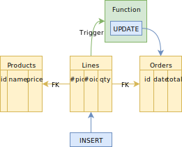

name: inverse
layout: true
class: center, middle, inverse
.indexlink[[<i class="fa fa-arrow-circle-o-up"></i>](#) [<i class="fa fa-list-ul"></i>](#index) [<i class="fa fa-tint"></i>](../change-color.php)[<i class="fa fa-file-pdf-o"></i>](download)]


---

name: normal
layout: true
class: left, middle
.indexlink[[<i class="fa fa-arrow-circle-o-up"></i>](#) [<i class="fa fa-list-ul"></i>](#index) [<i class="fa fa-tint"></i>](../change-color.php)[<i class="fa fa-file-pdf-o"></i>](download)]


---

template:inverse
# Triggers
<a href="http://www.fe.up.pt/~arestivo">André Restivo</a>

---

template:inverse
name:index
# Index

.indexlist[
1. [Introduction](#intro)
1. [Functions](#functions)
1. [Triggers](#triggers)
1. [PL/pgSQL](#plpgsql)
1. [Learn More](#learnmore)
]

---

template:inverse
name:intro
# Introduction

---

# Triggers


A stored procedure that automatically executes when an event occurs in the database server.



---

# Time

A trigger can be defined as to run **before**, **after** or **instead** of the operation that triggered it.

* Triggers that run **before** the operation can perform checks and change or prevent the operation from ever taking place if needed.

* Triggers that run **after** the operation cannot change it but can initiate other operations.

* Triggers that run **instead** of the operation supress the original operation that triggered it.

---

# Examples

* **Before** inserting a new product into an order, verify if there is enough stock to fulfil the order. If not, raise an error.

* **After** inserting a new product into an order, update the total cost of the order.

* **Instead** of deleting a user account, mark the account as disabled.

---

# Level

Triggers can be of two different levels:

* **Row** level triggers fire **once for each row** modified, deleted or inserted by the operation that triggered it.

* **Statement** level triggeres only fire only once per operation.

---

# Functions

While in other databases, the trigger and the code executed by the trigger can be defined **together**, in PostgreSQL, a trigger **always** executes a function.

PostgreSQL functions can be written in **many** different programming languages: **SQL**, C, **PL/pgSQL**, PL/Tcl, PL/Perl, and PL/Python are the **default** ones.

To avoid the added difficulty imposed by the C language, we will see how functions can be defined in SQL and PL/pgSQL.

---

template:inverse
name:functions
# Functions

---

# Creating Functions

To create a function in PostgreSQL, we use the *CREATE FUNCTION* command:

```sql
CREATE OR REPLACE FUNCTION <function_name>(<parameters>) 
RETURNS <return_type> 
AS '<function_code>' 
LANGUAGE <language>;
```

Example:

```sql
CREATE FUNCTION clean_employees() RETURNS void AS '
  DELETE FROM employee WHERE salary < 0;
' LANGUAGE SQL;
```

---

# Parameters

Parameters to the function are referenced in the function body using the syntax <code>$n</code>: <code>$1</code> refers to the first argument, <code>$2</code> to the second, and so on. 

Example:

```sql
CREATE FUNCTION disable_employee(integer) RETURNS void AS '
  UPDATE employee SET disabled = true WHERE id = $1;
' LANGUAGE SQL;
```

---

# Deleting Functions

To delete a function, we use the *DROP FUNCTION* command:

```sql
DROP FUNCTION disable_employee(integer);
```

---

# Alias

Function parameters can be given alias (names) to increase readability:

```sql 
CREATE FUNCTION disable_employee(disabled_id integer) RETURNS void AS '
  UPDATE employee SET disabled = true WHERE id = disabled_id;
' LANGUAGE SQL;
```

If the argument name is the same as any column name in the current SQL command within the function, the column name will take precedence. 

```sql 
CREATE FUNCTION disable_employee(id integer) RETURNS void AS '
  UPDATE employee SET disabled = true WHERE id = disable_employee.id;
' LANGUAGE SQL;
```

---

# Return

A function using SQL as its language can be composed of many SQL operations. The value returned by a function is the result of the last of these operations or null, if the last operation does not return anything.

Example:

```sql
-- Disables an employee and returns the total number
-- of disabled employees in the database.
CREATE FUNCTION disable_employee(integer) RETURNS void AS '
  UPDATE employee SET disabled = true WHERE id = $1;
  SELECT COUNT(*) FROM employees WHERE disabled = true;
' LANGUAGE SQL;
```

---

# Delimiters

The body of a function is considered a SQL text block and so its defined inside single quotes. In this way, single quotes inside the function body must be escaped by doubling them.

```sql
CREATE FUNCTION remove_empty() RETURNS void AS '
  DELETE FROM product WHERE description = '''';
' LANGUAGE SQL;
```

This can make the code hard to read, but you can also use $$ as a delimiter to simplify the code:

```sql
CREATE FUNCTION remove_empty() RETURNS void AS $$
  DELETE FROM product WHERE description = '';
$$ LANGUAGE SQL;
```

---

template:inverse
name:functions
# Triggers

---

# Creating Triggers

To create a trigger in PostgreSQL we use the *CREATE TRIGGER* command:

```sql
CREATE TRIGGER <name> { BEFORE | AFTER | INSTEAD OF } <event> [ OR ... ] }
ON <table_name>
[ FOR EACH { ROW | STATEMENT } ]
[ WHEN ( <condition> ) ]
EXECUTE PROCEDURE <function_name> ( <arguments> );
```

* **Name**: Name of the trigger.
* **When**: BEFORE, AFTER or INSTEAD OF the operation.
* **Event**: The operation, or operations, that fires this trigger (UPDATE, DELETE or INSERT).
* **Table Name**: The table where the operation must be executed on.
* **Type**: FOR EACH ROW or FOR EACH STATEMENT. INSTEAD OF triggers must be FOR EACH STATEMENT.
* **Condition**: Optional condition for the trigger to be fired.
* **Function**: The function name and arguments to be called.

---

# Example

Run the *check_account_update* function *before* updating *each row* of the *accounts* table:

```sql
CREATE TRIGGER check_update
BEFORE UPDATE ON accounts
FOR EACH ROW
EXECUTE PROCEDURE check_account_update();
```

Run the *update_orders_total* function *before* any row change in the *lines* table:

```sql
CREATE TRIGGER update_orders
BEFORE UPDATE or INSERT or DELETE ON lines
FOR EACH ROW
EXECUTE PROCEDURE update_orders_total();
```

---

# Deleting Triggers

To delete a trigger, we use the *DROP TRIGGER* command:

```sql
DROP TRIGGER check_update;
```

---

# Old and New

In row-level triggers, the trigger condition and the executed function have access to two especial variables that represent database tuples called OLD and NEW.

* The NEW variable contains the updated or inserted row.
* The OLD variable contains the row before being updated or deleted.

```sql
CREATE TRIGGER check_product_on_sale
BEFORE UPDATE ON products
FOR EACH ROW
WHEN NEW.price < OLD.price
EXECUTE PROCEDURE make_product_on_sale();
```

```sql
CREATE FUNCTION make_product_on_sale() RETURNS void AS $$
  UPDATE product SET on_sale = true WHERE id = NEW.id;
$$ LANGUAGE SQL;
```

---

template:inverse
name:plpgsql
# PL/PgSQL

---

# PL/PgSQL

A procedural programming language supported by PostgreSQLthat closely resembles Oracle's PL/SQL language.

The body of a PL/PgSQL function has the following format:

```sql
[ DECLARE
   declarations ]
BEGIN
    statements
END
```

---

# Declarations

All variables used in a block must be declared in the declarations section of the block. 

PL/pgSQL variables can have any SQL data type, such as integer, varchar, and char.

```sql
url varchar := 'http://mysite.com';
user_id integer := 10;
```

---

# Records

Variables can represent a tuple. If we want a variable to represent a tuple of a specific table we can use:

```sql
employee employees%ROWTYPE;
```

If we want to specify a tuple with no specific structure we can use the *RECORD* type:

```sql
employee RECORD;
```

---

# Statements

Assignment can be done using the := operator where expression can be any SQL expression:

```sql
variable := expression;
```

SQL commands that do not return any rows can just be written as normal SQL commands:

```sql
UPDATE employee SET disabled = true WHERE id = $1;
```

To execute a single SELECT query and discard the result we must use the PERFORM command:

```sql
PERFORM SELECT id, name FROM employees;
```

---

# Statements

To assign the result of a select to a variable, we use the *INTO* operator:

```sql
SELECT name INTO employee_name FROM employees WHERE id = $1;
``` 

Into multiple variables:

```sql
SELECT id, name INTO employee_id, employee_name 
FROM employees WHERE id = $1;
``` 

Into a record:

```sql
SELECT * FROM employees INTO employee 
FROM employees WHERE id = $1;
``` 

If the query returns multiple rows, only the first one is assigned.

---

# Returning

A function can return any expression (query result, variable, ...).

```sql
CREATE FUNCTION get_employee_salary(integer) RETURNS numeric AS $$
DECLARE
  employee_salary numeric;
BEGIN
  SELECT salary INTO employee_salary FROM employees WHERE id = $1;
  RETURN employee_salary;
END
$$ LANGUAGE plpgsql;
```

---

# Conditions

We can create conditional expressions using the IF, THEN and ELSE commands. A *ELSE IF* can also be written as *ELSEIF* or *ELSIF*.

*IF-THEN* and *IF-THEN-ELSE* blocks always end with an *END IF*.

```sql
IF type = 'admin' THEN
    disabled := false;
ELSE
    IF password IS NULL THEN
        disabled := true;
    END IF;
END IF;
```

---

# Query Conditions

After a SELECT query, we can test if the query did not return any rows:

```sql
SELECT * INTO employee FROM employees WHERE id = $1;
IF NOT FOUND THEN
  --- Id does not exist in the database
END IF;
```

---

# Simple Loops

Simple loops can be created using the *LOOP*, *EXIT*, *CONTINUE*, *WHILE*, and *FOR* statements.

* *EXIT* Exits a loop
* *CONTINUE* Ends the current loop iteration
* *LOOP* Creates a infinite loop

All loops end with a *END LOOP* statement:

```sql
LOOP
  IF count > 0 THEN
    EXIT
  END IF;
  ...
END LOOP; 
```

```sql
LOOP
  EXIT WHEN count > 0; -- alternative to IF-THEN
  ...
END LOOP; 
```

---

# Simple Loops

WHILE loops until a certain condition becomes false:

```sql
WHILE count <= 0 LOOP
  ...
END LOOP;
```

And FOR loops over a range of values:

```sql
FOR i IN 1..10 LOOP
    -- 1,2,3,4,5,6,7,8,9,10
END LOOP;

FOR i IN REVERSE 10..1 LOOP
    -- 10,9,8,7,6,5,4,3,2,1
END LOOP;

FOR i IN REVERSE 10..1 BY 2 LOOP
    -- 10,8,6,4,2
END LOOP;
```

---

# Query Loops

Using a different type of *FOR* loop, you can iterate through the results of a query:

```sql
FOR <target> IN <query> LOOP
    <statements>
END LOOP
```

Example:

```sql
FOR e IN SELECT name, salary FROM employee LOOP
    total := total + e.salary;
END LOOP
```

---

# Errors

The *RAISE* function can be used to signal any kind of errors or warnings:

```sql
RAISE <level> '<format>' [, expressions];
```

Levels can be: DEBUG, LOG, INFO, NOTICE, WARNING, and EXCEPTION. Exceptions is the only level that aborts the function.

Inside the format string, % is replaced by the next optional expression.

Examples:

```sql
RAISE EXCEPTION 'Expected positive price but received %', price
```

```sql
SELECT * INTO employee FROM employees WHERE id = $1;
IF NOT FOUND THEN
  RAISE EXCEPTION 'Employee % not found', $1
END IF;
```

---

template:inverse
name:learnmore
# Learn More

---

# Learn More

This was just a simple introduction to Triggers and the PL/PgSQL language. To learn more you can check the documentation:

* [Triggers](https://www.postgresql.org/docs/9.6/static/triggers.html)
* [PL/PgSQL](https://www.postgresql.org/docs/9.6/static/plpgsql.html)
* [SQL Functions](https://www.postgresql.org/docs/9.6/static/xfunc-sql.html)
* [Cursors](https://www.postgresql.org/docs/9.6/static/plpgsql-cursors.html)
* [Rules](https://www.postgresql.org/docs/9.6/static/rules.html)

