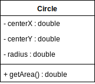
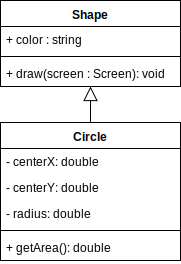
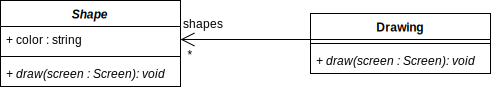
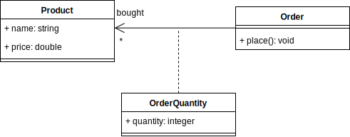
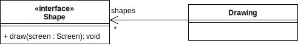
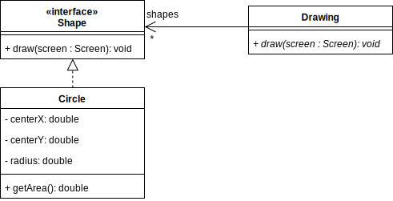
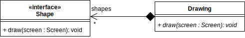

name: inverse
layout: true
class: center, middle, inverse
.indexlink[[<i class="fa fa-arrow-circle-o-up"></i>](#) [<i class="fa fa-list-ul"></i>](#index) [<i class="fa fa-tint"></i>](../change-color.php)[<i class="fa fa-file-pdf-o"></i>](download)]

---

name: normal
layout: true
class: left, middle
.indexlink[[<i class="fa fa-arrow-circle-o-up"></i>](#) [<i class="fa fa-list-ul"></i>](#index) [<i class="fa fa-tint"></i>](../change-color.php)[<i class="fa fa-file-pdf-o"></i>](download)]

---

template:inverse
# UML
## Class Diagrams

<a href="http://www.fe.up.pt/~arestivo">André Restivo</a>

---

template: inverse
name:index
# Index

.indexlist[
1. [Introduction](#introduction)
1. [Classes](#classe)
1. [Inheritance](#inheritance)
1. [Associations](#associations)
1. [Interfaces](#interfaces)
1. [Aggregation](#aggregation)
]

---

template: inverse
name:introduction
# Introduction

---

# Types of Diagrams

In UML, there are two basic categories of diagrams: 
  
* **Structure** diagrams show the static structure of the system being modeled: **class**, *component*, *deployment*, *object* diagrams, ...

* **Behavioral** diagrams show the dynamic behavior between the objects in the system: *activity*, *use case*, *communication*, *state machine*, *sequence* diagrams, ...

---

# Class Diagrams

Class diagrams show the **classes** of the system, their **relationships** (including inheritance, aggregation, and association), and the **operations** and **attributes** of the classes. 

Class diagrams are used for different purposes: 
  
* Conceptual **domain** modeling: 

  * Illustrates meaningful conceptual classes in problem domain.
  * Represents real world concepts, not software components.

* Detailed **design** modeling: 

  * Represents the concrete software components.

---

template: inverse
name:classes
# Classes

---

# Class

The UML representation of a class is a **rectangle** containing **three** **compartments** stacked **vertically**:

---

# Class Attribute List

The **middle** compartment lists each of the **attributes** of the class on a separate line.

Each line uses the following format:

  > name : attribute type

For example:

  > width : double

---

# Attribute Default Value

**Default** values can be specified (**optionally**) in the attribute list section by using the following **notation**:

  > name : attribute type = default value

For example:

  > width : double = 0

---

# Class Operations List

The **lowest** compartment lists each of the **operations** of the class on a separate line.

Each line uses the following format:

  > name(parameter list) : type of value returned

For example:

  > setRadius(radius : double) : void

---

# Operation Parameters

When an **operation** has **parameters**, they are put inside **parentheses**.

Each parameter uses the **format**:

 > parameter name : parameter type

They can also have a **optional** "in" or "out" marking specifying if the parameter is an **input** or **output** parameter.

For example:

  > setRadius(in radius : double) : void

---

template: inverse
name:inheritance
# Inheritance

---

# Inheritance

The ability of one class (child class) to **inherit** the identical **functionality** of another class (super class), and then **add** **new** **functionality** of its own.

Inheritance is indicated by a **solid line** with a **closed**, **unfilled** arrowhead **pointing** at the **super** **class**.

---

# Abstract classes and operations

**Abstract operations** are operations where the class only provides the operation **signature** and **not it's code**.

**Abstract classes** are classes that **contain** **abstract** operations and, therefore, cannot be instantiated.

> They are **both** represented in *italic*.

---

template: inverse
name:associations
# Associations

---

# Bi-directional association

Associations are assumed to be **bi-directional** by default. This means that both classes are aware of each other.

A bi-directional association is indicated by a **solid line** between the two classes.

At either end of the line, you place a **role** name and a **multiplicity** value.

---

# Multiplicity

Some examples of possible **multiplicities**:

.simple[
| Multiplicity 	| Option 	| Cardinality                             	|
|--------------	|--------	|-----------------------------------------	|
| 0..0         	| 0      	| Collection must be empty                	|
| 0..1         	|        	| No instances or one instance            	|
| 1..1         	| 1      	| Exactly one instance                    	|
| 0..*         	| *      	| Zero or more instances                  	|
| 1..*         	|        	| At least one instance                   	|
| 5..5         	| 5      	| Exactly 5 instances                     	|
| m..n         	|        	| At least m but no more than n instances 	|
]

---

# Uni-directional association

In a uni-directional association, **two classes** are **related**, but **only one** class **knows** that the relationship exists.

A uni-directional association is drawn as a **solid line** with an **open** **arrowhead** pointing to the **known** class. 

---

# Association Class

An **association class** includes **information** about a **relationship**.

It is represented like a **normal class** but has a **dotted line** **connecting** it to the **association**.

---

template: inverse
name:interfaces
# Interfaces

---

# Interface

* An interface is a **description** of the **actions** that an object **can do**.

* The **combination** of all **public** **methods** and **properties** of an **object**.

* Interfaces can also be seen as **contracts** that other classes must fulfil.

In UML, an interface is depicted just like a **class** but with a **«interface» keyword**.

---

# Implementation

A class can **declare** that it **implements** a certain **interface** in a very similar way to inheritance (but with the line **dotted** and not solid).

---

template: inverse
name:aggregation
# Aggregation

---

# Aggregation

* Aggregation is a special type of **association** used to model a "**whole** to its **parts**" relationship.

* An association with an **aggregation relationship** indicates that **one** class is a **part** of **another** class.

* In an aggregation relationship, the **child** class instance can **outlive** its **parent** class.

* To represent an aggregation we use an **unfilled diamond** shape on the **parent**'s association **end**.

---

# Composition

* The **composition aggregation** relationship is another, **stronger**, form of the aggregation relationship. 

* In an **composition aggregation** relationship, the **child** class instance **cannot** **outlive** its **parent** class.

* To represent a composition aggregation we use an **filled diamond** shape on the **parent**'s association **end**.

