name: inverse
layout: true
class: center, middle, inverse
.indexlink[[<i class="fa fa-arrow-circle-o-up"></i>](#) [<i class="fa fa-list-ul"></i>](#index) [<i class="fa fa-tint"></i>](../change-color.php)[<i class="fa fa-file-pdf-o"></i>](download)]

---

name: normal
layout: true
class: left, middle
.indexlink[[<i class="fa fa-arrow-circle-o-up"></i>](#) [<i class="fa fa-list-ul"></i>](#index) [<i class="fa fa-tint"></i>](../change-color.php)[<i class="fa fa-file-pdf-o"></i>](download)]

---

template:inverse
# UML
## Sequence Diagrams

<a href="http://www.fe.up.pt/~arestivo">André Restivo</a>

---

template: inverse
name:index
# Index

.indexlist[
1. [Introduction](#introduction)
1. [Lifelines](#lifelines)
1. [Messages](#messages)
1. [Fragments](#fragments)
1. [Gates](#gates)
]

---

template: inverse
name:introduction
# Introduction

---

# Types of Diagrams

In UML, there are two basic categories of diagrams: 
  
* **Structure** diagrams show the static structure of the system being modeled: *class*, *component*, *deployment*, *object* diagrams, ...

* **Behavioral** diagrams show the dynamic behavior between the objects in the system: *activity*, *use case*, *communication*, *state machine*, **sequence** diagrams, ...

---

# Sequence Diagrams

Sequence diagrams depict the interaction between **objects** in a **sequential** order. 

The main focus of sequence diagrams is the exchange of **messages** between objects and their **lifelines**.

Sequence diagrams are used **either** to model generic interactions (showing **all possible paths** through the interaction) or specific instances of a interaction (showing **just one path** through the interaction).

---

template: inverse
name:lifelines
# Lifelines

---

# Lifeline

Lifeline is a **named element** which represents an **individual participant** in the interaction.

A lifeline is composed by an **head**, a rectangle that identifies the participant element, and a vertical dashed **line**.

The element can be an **anonymous** representative of a certain class, or a **named** one.

---

# Axis

The **horizontal** axis of a sequence diagram represents the **object instances** (left to right) that participate in the interaction. Normally objects appear in the same order as they interact for the first time.

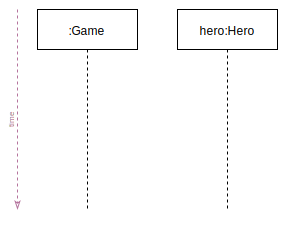

The **vertical** axis represents **time** (top to bottom). Time in a sequence diagram is all a about **ordering**, **not duration**. The vertical space in an interaction diagram is not relevant for the duration of the interaction.

---

# Actors

An **Actor** is always something (a system or person) that is **outside** the **scope** of the system.

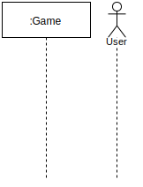

Actors are drawn as **stickman** figures (although they may not be users), and can be participants in sequence diagrams.

---

template: inverse
name:messages
# Messages

---

# Messages

Messages are represented by a **line** from the **sending** object's lifeline to the **receiving** object's lifeline with a **solid arrowhead** (if a *synchronous* signal) or with a **stick arrowhead** (if an *asynchronous* signal).

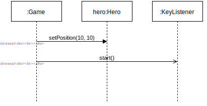

The message/method name is placed **above** the arrowed line and represents an **operation**/**method** that the receiving object's class implements.

---

# Return

Return messages are **optional** and are represented by a **dashed line** with a **stick arrowhead**.

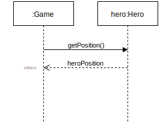

The return value, if needed, is place **above** the arrowed line. The returned value can either be a **concrete value** or just a **name**.

---

# Activation

An *optional* **thin rectangle** on a lifeline represents the **period** during which an element is performing an **operation**.

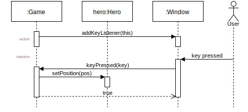

---

# Self Message

An object can send a message to **itself** (a **self message**).

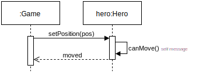

Optionally, you can represent the **recursive activation** created by this call. This can be useful if you want to show **which function** is interacting with other objects.

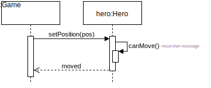

---

# Create Message

A **create message** is a kind of message that represents the instantiation of a lifeline.

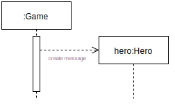

They are represented with a **dashed line** with **stick arrowhead**.

---

# Destroy Message

A **destroy message** is a kind of message that represents the destruction of a lifeline.

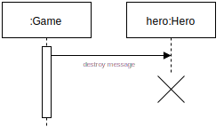

They don't have a specific representation besides the lifeline **terminating** with a **cross**.

---

# Duration Message

Duration messages are used to indicate that a particular message should **not** be considered as **instantaneous**.

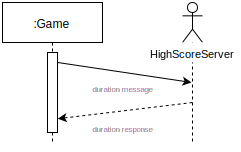

They are represented as a **slanted** line.

---

# Guards

Sometimes we want to represent more **complex** interaction flows.

A **guard** is a **condition** that can be attached to a message. The message will be sent **only if** the condition is met.

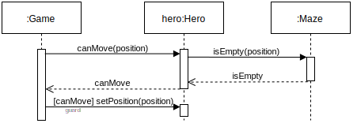

Guards are written inside **square brackets**.

---

template: inverse
name:fragments
# Combined fragments

---

# Combined Fragments

Sometimes **guards** are **not enough** to express the flow of a more **complex** sequence diagram.

A **combined** fragment is used to **group** sets of **messages** together to show **conditional** flow in a sequence diagram.

There are many types of interaction types for combined fragments. We will approach only the more useful.

---

# Option Combination

Option combinations are used to designate a set of messages that will only be sent if a certain condition is met.

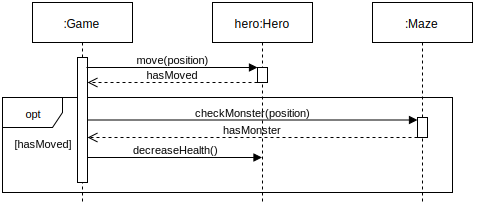

An alternative combination fragment element is drawn using a **frame** with the name **"opt"** (using guard like syntax)

---

# Alternative Combination

Alternative combinations are used to designate a **mutually exclusive** choice between **two or more** message sequences.

An alternative combination fragment element is drawn using a **frame** with the name **"alt"**.

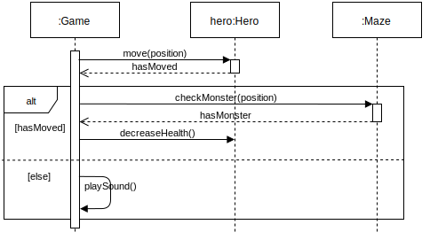

The frame is divided into **rectangles** representing alternative flows (using guard like syntax).

---

# Loop Combination

Loop combinations are used to designate a set of messages that are to be sent **a number of times**.

An alternative combination fragment element is drawn using a **frame** with the name **"loop"**.

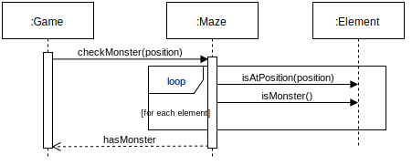

The number of iterations is defined inside square brackets (e.g. 5 times, for all elements, ...).

---

template: inverse
name:gates
# Gates

---

# Frames

Sequence diagrams can be drawn inside frames so that we can give them a name (and something more...).

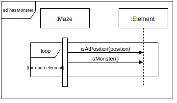

---

# Gates

A **gate** is a message with **one end** connected to the sequence diagram's **frame**'s edge and **the other** end connected to a **lifeline**. 

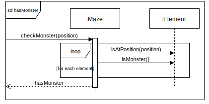

---

# References

Gates allow us to **reference** other sequence diagrams to create more **complex** ones.

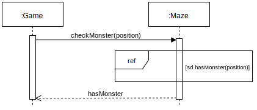

The referenced diagram, receives the same parameters as its gates.

