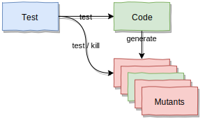

name: inverse
layout: true
class: center, middle, inverse
.indexlink[[<i class="fa fa-arrow-circle-o-up"></i>](#) [<i class="fa fa-list-ul"></i>](#index) [<i class="fa fa-tint"></i>](../change-color.php)[<i class="fa fa-file-pdf-o"></i>](download)]

---

name: normal
layout: true
class: left, middle
.indexlink[[<i class="fa fa-arrow-circle-o-up"></i>](#) [<i class="fa fa-list-ul"></i>](#index) [<i class="fa fa-tint"></i>](../change-color.php)[<i class="fa fa-file-pdf-o"></i>](download)]

---

template:inverse
# Unit Testing
## For Java, Using JUnit
<a href="http://www.fe.up.pt/~arestivo">André Restivo</a>

---

template: inverse
name:index
# Index

.indexlist[
1. [Introduction](#intro)
2. [Unit Testing](#unit-testing)
3. [JUnit](#junit)
4. [Test Isolation](#isolation)
4. [Mockito](#mockito)
5. [Code Coverage](#coverage)
6. [Mutation Testing](#mutation)
]

---

template: inverse
name:intro
# Introduction

---

# Software Testing

A **process** to evaluate the **quality** and **functionality** of a software system:

* Does the software meet the specified **requirements**, both **functional** and **non-functional**?

* Are there any **defects** (*aka* bugs)?

Software testing comes in **many forms** and can be done at **different levels** of the software development cycle.

---

# Automated Testing

Traditional software testing was done by **deploying** your application to a **test environment** and **manually** performing **black-box** tests. For example, by **clicking** through the **user interface** to find if something was **broken**.

Automated testing is a **technique** where the **tester/developer** writes **scripts** to test and compare the **actual** outcome with the **expected** outcome.

---

# Black-box vs. White-box

In **black-box** testing, the actual **internal** structure of the item being tested is **unknown** or **not taken into consideration**.


In **white-box** testing, the design of the test cases is **based** on the **internal structure** of the system being tested, so that the **maximum number** of different **code paths** are **covered**.

---

# Testing Levels

* **Unit Testing** - testing **individual units** of a software system in order to validate if they perform as designed.

* **Integration Testing** -	**individual units** are **combined** and tested **as a group** in order to expose faults in the **interaction** between them.

* **System Testing** -  the **complete software system** is **deployed** and **tested** to evaluate its **compliance** with the specified **requirements**.

* **Acceptance Testing** - the complete system is tested for **acceptability** to evaluate if it is **compliant** with the business **requirements** and acceptable for **delivery**.

---

# Testing Types

* **Smoke** - ensure that the **most important** features work.
* **Functional** - verify if **functional requirements** are met.
* **Usability** - verify if the system is easily **usable** by end-users.
* **Security** - uncover **vulnerabilities** of the system.
* **Performance** - test the **responsiveness** and **stability** of the system under a certain **load**.
* **Regression** - ensure that **previously** developed and tested software still performs after a **change**.
* **Compliance** - determine the **compliance** of a system with any **standards**.

---

template: inverse
name:unit-testing
# Unit Testing

---

# Unit Testing

Testing **individual units** of a software system in order to **validate** if they perform as designed.

There are several **advantages** to unit tests:

* Increases **confidence** in **changing**/**maintaining** code.
* In order to make unit testing **possible**, codes need to be **modular**, which makes them more **reusable**. Good unit testing **promotes** good code.
* Development becomes **faster** as system, as a whole, does not need to be run to test newly written code.
* When a test fails we know **which unit** is the **culprit**.

---

# FIRST

The [FIRST](https://github.com/ghsukumar/SFDC_Best_Practices/wiki/F.I.R.S.T-Principles-of-Unit-Testing) principles of unit testing:

* **Fast** - Unit tests should be **fast** so we can run them often.
* **Isolated** / **Independent** - Only test **one unit** at a time. Only test **one thing** at a time. **Order** of tests should **not matter**. 
* **Repeatable** - Results should be deterministic and not depend on the environment (time, available data, random values, ...).
* **Self-validating** - No manual checking necessary.
* **Thorough** / **Timely** - Cover every **use case** scenario (different from 100% code coverage). Test for **corner cases**, **large** data sets, **different** roles, **illegal** arguments and **bad** inputs...
  
---

# The 3 As

A unit test should be divided into **three** different parts:

* Arrange - Where the test is **setup** and the data is **arranged**.
* Act - Where the the actual method under test is **invoked**.
* Assert - Where a **single logical assert** is used to test the outcome.

**Helper** classes can be used to **setup** data to be **reused** in **several** tests cases. 

---

# Test Doubles

Test doubles are pretend objects that help reduce complexity and verify code independently from the rest of the system. They come in many [flavours](https://martinfowler.com/articles/mocksArentStubs.html):

* **Dummy** - never actually used; just to fill parameter lists.

* **Fake** - working implementations, but not suitable for production.

* **Stubs** - provide canned answers to calls made during the test.

* **Spies** - stubs that also record some information based on how they were called. 

* **Mocks** - pre-programmed with expectations which form a specification of the calls they are expected to receive.

---

# State vs. Behavior Testing

* **State Testing**: determine whether the exercised method worked correctly by examining **the state** after the method was exercised.

* **Behavior Testing**: specify **which methods** are to be invoked, thus verifying not that the ending state is correct, but that the **sequence of steps** performed was **correct**.

**Spies and Mocks** are usually needed for **behavior** testing.

---

template: inverse
name:junit
# JUnit

---

# JUnit

**JUnit** is a **testing framework** for **Java** specialized in **unit tests**.

A **JUnit** test is a **method**, contained in a **class**, which is **only used** for **testing**.

A **JUnit** test must have the **@Test** annotation.

A simple **test class** looks like this:

```java
import org.junit.Test;

public class TestDog {
    @Test
    public void testDogName() {
        Dog dog = new Dog("Max", "German Shepherd");
        
        assertEquals("Max", dog.getName());
    }
}
```

---

# Asserts

**JUnit** provides a series of **assert methods** to help test for certain **conditions**:

* **fail**([message]) - Fails the test.
* **assertTrue**([message,] condition)
* **assertFalse**([message,] condition)
* **assertEquals**([message,] expected, actual)
* **assertEquals**([message,] expected, actual, tolerance)
* **assertNull**([message,] object)
* **assertNotNull**([message,] object)
* **assertSame**([message,] expected, actual)
* **assertNotSame**([message,] expected, actual)

Message is an **optional message** specifying why the test failed.

---

# Set Up and Tear Down

The **@Before** and **@After** annotations allows us to define methods that run **before** or **after** each test method. 

These can be used to **setup** and **dispose** of any **data**/**classes** that are used by all tests, thus simplifying the **Arrange** phase.

There are also **@BeforeClass** and **@AfterClass** annotations that define methods that should be run only **once** for the **entire class**. These might help when test methods share a computationally **expensive** setup.

```java
import org.junit.Test;

public class TestDog {
    private DogDatabase database;

    @Before
    public void connectToDatabase() {
      database = new DogDatabase();
    }

    @Test
    public void testDogRetrieval() { /* ... */ }
}
```

---

template: inverse
name:isolation
# Test Isolation

---

# Test Isolation

One of the key features of **unit testing**, is that of test isolation. The whole point of **unit tests** is to **reduce the scope** of the system under test to a **small subset** that can be tested in isolation.

Most of the times this can be difficult without **changing our design**. For example, consider the following **class** and **test**:

<div style="display: flex; justify-content: space-around">
.small[
```java
public class DogFinder {
  private DogDatabase database = new DogDatabase();
 
  public List<Dog> findBreed(String breed) {
    List<Dog> allDogs = database.getAllDogs();
    List<Dog> breedDogs = new ArrayList<>();

    for (Dog dog : allDogs)
      if (dog.getBreed().equals(breed))
        breedDogs.add(dog);

    return breedDogs;
  }
}
```
]
.small[
```java
import org.junit.Test;

public class TestDogFinder {
    @Test
    public void testDogRetrieval() { 
      DogFinder finder = new DogFinder();
      List<Dog> dogs = finder.findBreed("Border Collie");
      for (Dog dog : dogs)
        if (!dog.getBreed().equals("Border Collie"))
          fail("Got dog from wrong breed!");
    }
}
```
]
</div>

Any test on the **DogFinder** class will depend on the **DogDatabase** class.

---

# Dependency Injection

One way to achieve **test isolation**, is to use **Dependency Injection**. With this technique, **classes** no longer **depend** on other classes but **on interfaces**. The **concrete instantiation** of each interface is **injected** into the class by a third-party class (the **Assembler**). 


---

# Show me the Code


<div style="display: flex; justify-content: space-around">
.small[
```java
public interface IDogDatabase {
    public List<Dog> getAllDogs() throws Exception;
}
```
]
.small[
```java
public class SQLDogDatabase implements IDogDatabase {
    @Override
    public List<Dog> getAllDogs() throws Exception { /* ... */ }
}
```
]
</div>

```java
public class DogFinder {
    private IDogDatabase database;

    public DogFinder(IDogDatabase database) {
        this.database = database;
    }

    public List<Dog> findBreed(String breed) throws Exception {
      /* Same code as in previous example */
    }
}
```

.small[
```java
public class Application {
    public static void main(String[] args) {
        try {
            DogFinder finder = new DogFinder(new SQLDogDatabase());
            finder.findBreed("Border Collie");
        } catch (Exception e) {
            e.printStackTrace();
        }
    }
}
```
]

---

# And now the Test

```java
public class DogFinderTest {
  class StubDatabase implements IDogDatabase {
    @Override
    public List<Dog> getAllDogs() throws Exception {
      List<Dog> dogs = new ArrayList<>();
      dogs.add(new Dog("Border Collie", "Iris"));
      dogs.add(new Dog("Border Collie", "Floyd"));
      dogs.add(new Dog("German Shepherd", "Max"));
      return dogs;
    }
  }


  @Test
  public void findBreed() throws Exception {
    DogFinder finder = new DogFinder(new MockDatabase());
    List<Dog> dogs = finder.findBreed("Border Collie");
    assertEquals("Didn't receive the expected number of dogs", 2, dogs.size());
  }
}
```

---

template: inverse
name:mockito
# Mockito

---

# Mockito

A simpler way to create **Mocks** and **Stubs** is to use a specialized framework like **Mockito**.

If we are using **Gradle**, the only thing we have to do to be able to use **Mockito** is add the **dependency** in our **"build.gradle"** file:

```bash
dependencies {
    testCompile group: 'junit', name: 'junit', version: '4.12'
    testCompile group: 'org.mockito', name: 'mockito-core', version: '2.24.5'
}
```

---

# Mockito Stubs

Creating **stubs** with **Mockito** is very simple:

```java
import org.mockito.Mockito;

public class DogFinderTest {
  private DogDatabase mockDatabase;

  @Before
  public void setUp() throws Exception {
    List<Dog> dogs = new ArrayList<>();
    dogs.add(new Dog("Border Collie", "Iris"));
    dogs.add(new Dog("Border Collie", "Floyd"));
    dogs.add(new Dog("German Shepherd", "Max"));

    mockDatabase = Mockito.mock(DogDatabase.class);   // really a stub
    when(mockDatabase.getAllDogs()).thenReturn(dogs); // with canned answers
  }

  @Test
  public void findBreed() throws Exception {
    DogFinder finder = new DogFinder(mockDatabase);
    List<Dog> dogs = finder.findBreed("Border Collie");
    assertEquals("Didn't receive the expected number of dogs", 2, dogs.size());
  }
}
```

---

# When and Then

The **when** and **then\*** keywords allows to configure **Mockito stubs** to return **canned answers** very [easily](https://www.baeldung.com/mockito-behavior):

```java
mockDatabase = Mockito.mock(DogDatabase.class);  // still a stub
when(mockDatabase.isConnected()).thenReturn(true);
when(mockDatabase.runSQL(null)).thenThrow(NullPointerException.class);
```

When the method returns void, the syntax is slightly different:

```java
ArrayList mockList = Mockito.mock(ArrayList.class);
doThrow(NullPointerException.class).when(mockList).clear();
```

---

# Verify

Until now we have been doing **state testing**. If we want to do **behavior testing** we need to use **mocks**, and **Mockito**, as the name implies, can [help us](https://www.baeldung.com/mockito-verify) with that.

```java
@Test
public void findBreedCallsDatabaseOnlyOnce() throws Exception {
  DogFinder finder = new DogFinder(mockDatabase);
  List<Dog> dogs = finder.findBreed("Border Collie");

  // Verify if the getAllDogs methods was called only once
  Mockito.verify(mockDatabase, times(1)).getAllDogs();
}
```

---

template: inverse
name:coverage
# Code Coverage

---

# Code Coverage

* Measures the **number** of **code lines** **covered** by the **test cases**. 

* Reports the **total** number of lines in the code and **number** of lines **executed** by tests. 

* The **degree** to which the source code of a program is exercised when a **test suite** runs. 

* The **higher** the code **coverage**, the **lower** the chance of having undetected software **bugs**. 

But, code coverage doesn't tell the **whole story**...

---

# Code Coverage Problems

* **High** coverage numbers are **too easy** to reach (we don't even need **asserts**).
  
* **Good testing practices** should result in **high coverage**. The inverse is not true.

So **why** do code **coverage** analysis:

* It helps us **find** **untested** parts of our source code that should be tested but are not.

---

# Code Coverage in IntelliJ

In **IntelliJ** you can **run** your **tests with coverage** to get a **percentage** of code covered per **class** and/or **package**, for **all test suites** or just for **a few**. 

You also get **indicators** throughout your code showing which lines are tested and which are not. 
---

template: inverse
name:mutation
# Mutation Testing

---

# Mutation Testing

A type of **software testing** where we **mutate** (change) certain statements in the **source code** and **check** if the test cases are able to **find** the errors.

The **goal** is to assess the **quality** of the **test cases** which should be **robust** enough to **fail mutant code**.



In the mutation testing **lingo**, **tests** are trying to **kill** as many **mutants** as possible (optimally 100% of them).

---

# PIT Mutation Testing

**PIT** is a mutation testing system, providing gold standard test coverage for **Java**.

With **Gradle**, installing **PIT** for your project in **IntelliJ** is as easy as adding this second line to your **plugins** section in your **"build.gradle"**:

```bash
plugins {
    id 'java'
    id 'info.solidsoft.pitest' version '1.4.6'
}
```

PIT can be configured directly in your **"build.gradle"** using the same [command line parameters](http://pitest.org/quickstart/commandline/) as the command line version uses:

```bash
pitest {
  targetClasses = ['com.example.*']
}
```

---

# Target Classes

By default, PIT uses the group defined in the **"build.gradle"** file to automatically infer the **targetClasses** parameter. For example, if your **"build.gradle"** file has:

```bash
group 'com.example'
```

Then it will **automatically** **infer** the following:

```bash
pitest {
  targetClasses = ['com.example.*']
}
```

---

# Running Mutation Tests

PIT will **automatically** generate a **Gradle** **task** called **"pitest"**. So you can **run mutations** tests simply by doing:

```bash
./gradlew pitest
```

**Reports** will be created under **"build/reports/pitest/&lt;timestamp&gt;/"** in **HTML** format by default.