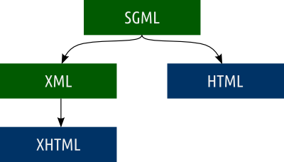
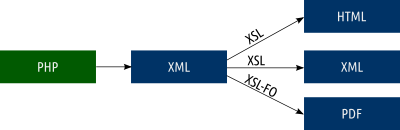

name: inverse
layout: true
class: center, middle, inverse
.indexlink[[<i class="fa fa-arrow-circle-o-up"></i>](#) [<i class="fa fa-list-ul"></i>](#index) [<i class="fa fa-tint"></i>](../change-color.php)[<i class="fa fa-file-pdf-o"></i>](download)]

---

name: normal
layout: true
class: left, middle
.indexlink[[<i class="fa fa-arrow-circle-o-up"></i>](#) [<i class="fa fa-list-ul"></i>](#index) [<i class="fa fa-tint"></i>](../change-color.php)[<i class="fa fa-file-pdf-o"></i>](download)]

---

template:inverse
# XML
<a href="http://www.fe.up.pt/~arestivo">André Restivo</a>

---

template: inverse
name:index
# Index

.indexlist[
1. [Introduction](#intro)
1. [XML](#xml)
1. [Valid XML](#valid)
1. [Namespaces](#namespaces)
1. [Technologies](#technologies)
1. [Applications](#applications)
]

---

template: inverse
name:intro
# Introduction

---

# Markup Languages

* A **markup language** is a set of words and symbols for describing the
  identity or function of the component parts of a document.
* Programs can use markup with a **stylesheet** to transform the document into
  output for screen, print, audio, video, Braille, or reprocessable data
  formats.

---

# XML

* E**x**tensible **M**arkup **L**anguage (XML) 
* A **markup language** that defines a set of rules for encoding documents in a
  format which is both human-readable and machine-readable.
* It is **extensible** because it is not a fixed format like HTML (which is a
  single, predefined markup language).
* XML is a metalanguage which lets you design your own markup languages for 
  limitless different types of documents.
  
---

# SGML

* SGML is the **S**tandard **G**eneralized **M**arkup **L**anguage, the
  international standard for defining markup to describe the structure of
  different types of electronic document.
* SGML is very **large**, **powerful**, and **complex**.
* XML is a **lightweight** cut-down version of SGML.

---

# SGML, XML and HTML



* SGML and XML are **metalanguages**. They allow users to develop their own
  languages.
* HTML and XHTML are **concrete** languages with a fixed format.

---

template: inverse
name: xml

# XML

---

# Well Formed

An XML document is considered well formed if it:

* contains **one** or **more** elements.
* it has exactly **one root**.
* elements **nest properly** with each other.

---

# Processing Instructions

Processing instructions allow documents to contain instructions for applications

Since **XML 1.1**, all XML documents must start with a processing instruction (prolog) indicating the XML version. If not, the document is considered to be **XML 1.0**.

```xml
<?xml version="1.1" encoding="utf-8"?>
```

The encoding is **utf-8** by default.

---

# Comments

Comments start with a ```<!--``` and end with ```-->```.

```xml
<!-- This is a comment -->
```

Comments cannot contain double hyphens (```--```).

---

# CDATA

CDATA sections are used to escape blocks of text containing characters which would otherwise be recognized as markup.

They begin with the string ```<![CDATA[``` and end with the string ```]]>```.

```xml
<![CDATA[
  <warning>These tags are not markup</warning>
]]> 
```

---

# Elements

* Elements are defined by a **start tag** and an **end tag**.
* All elements **must be closed**. 
* All elements opened inside an element must be closed **before** the **parent** element is **closed**.
* Element names are case sensitive. The element **start tag** must match the element **end tag** case.
* Empty elements can use a ```/``` in the end instead of a closing tag.

```xml
<?xml version="1.1"?>
<message>
	<to>Mr. John Doe</to>
	<from>Ms. Jane Doe</from>
	<text>How are you?</text>
	<private/> <!-- this is an empty element -->
</message>	
```

---

# Attributes

* Attributes are used to associate **name-value** pairs with elements.
* Attributes only appear in element **start** tags (or empty element tags).
* Attributes must be single or double **quoted**.

```xml
<?xml version="1.1"?>
<message date="2014-12-03" private="yes">
	<to>Mr. John Doe</to>
	<from>Ms. Jane Doe</from>
	<text>How are you?</text>
</message>	
```

Attributes should be used for **metadata**.

---

template: inverse
name: valid
# Valid XML

---

# Valid XML

XML is a **metalanguage** as it doesn't impose the use of a restricted set of elements.

If we want to **restrict** the structure of a document to a certain format we can use one of several existing **schema** languages:

* Document Type Definition (**DTD**)
* XML Schema Definition (**XSD**)
* Relax NG

An XML document is considered **valid** if it is **well-formed** and **conforms** to its **schema**.

---

# Document Type Definition (DTD)

Model that defines the structure of a valid XML document:

* specifies the **names** of all elements and attributes
* specifies the **type** of content of the elements and attributes
* specifies the **sequence** of the elements in the document
* specifies the document tree **structure**

**Document Type Declaration** used to associate DTD to XML document:

```xml
<?xml version="1.1"?>
<!DOCTYPE message SYSTEM "message.dtd">
<message>Hello, world!</message> 
```

---

# XML Schema Definition (XSD)

**W3C**’s proposal for replacing DTD

Design principles:
* More **expressive** than DTD.
* Use **XML** notation.
* [Self-describing](http://www.w3.org/2001/XMLSchema.xsd).
* **Simplicity**.
* Embedded **documentation**.

Technical requirements:
* **Namespace** support.
* User-defined **datatypes**.
* **Inheritance**.
* **Evolution**.

---

# Relax NG

An alternative to XML Schemas:

* Very **simple** to understand.
* **XML** Syntax (or compact non-XML).
* Supports **namespaces**.
* [Self-describing](http://relaxng.org/spec-20011203.html#IDA5MCS).

---

# Example
##XML

```xml
<addressBook>
  <card>
    <name>John Smith</name>
    <email>js@example.com</email>
  </card>
  <card>
    <name>Fred Bloggs</name>
    <email>fb@example.net</email>
  </card>
</addressBook>
```

---

# Example
## DTD

```xml
<!DOCTYPE addressBook [
<!ELEMENT addressBook (card*)>
<!ELEMENT card (name, email)>
<!ELEMENT name (#PCDATA)>
<!ELEMENT email (#PCDATA)>
]>
```

---

# Example
## XSD

```xml
<xs:schema elementFormDefault="qualified">
  <xs:element name="addressBook">
    <xs:complexType>
      <xs:sequence>
        <xs:element name="card" minOccurs="0" maxOccurs="unbounded">
          <xs:complexType>
            <xs:sequence>
              <xs:element name="name" type="xs:string"/>
              <xs:element name="email" type="xs:string"/>
            </xs:sequence>
          </xs:complexType>
        </xs:element>
      </xs:sequence>
    </xs:complexType>
  </xs:element>
</xs:schema>
```

---

# Example
## Relax NG

```xml
<element name="addressBook" xmlns="http://relaxng.org/ns/structure/1.0">
  <zeroOrMore>
    <element name="card">
      <element name="name">
        <text/>
      </element>
      <element name="email">
        <text/>
      </element>
    </element>
  </zeroOrMore>
</element>
```

---

template: inverse
name: namespaces
# Namespaces

---

# Motivation

A **single XML** document should be able to contain elements and attributes that are 
defined for and used by **multiple** software modules.

---

# Binding

* An XML **namespace** is identified by a **URI** reference. 
* To declare a **default** namespace the attribute ```xmlns``` is used. A default namespace declaration applies to all unprefixed element names within its scope.
* To declare a **prefixed** namespace an attribute of the form ```xmlns:prefix``` is used. Such a namespace declaration applies to all element and attribute names within its scope whose prefix matches that specified in the declaration.
* The prefix **xml** is by definition bound to the namespace name ```http://www.w3.org/XML/1998/namespace```.
* The prefix **xmlns** is used only to declare namespace bindings and is by definition bound to the namespace name ```http://www.w3.org/2000/xmlns/```.

---

# Example
##Namespace

```xml
<?xml version="1.0"?>
<bk:book xmlns:bk='urn:loc.gov:books'
         xmlns:isbn='urn:ISBN:0-395-36341-6'>
    <bk:title>Cheaper by the Dozen</bk:title>
    <isbn:number>1568491379</isbn:number>
</bk:book>
```

---

# Namespace Scope

The **scope** of a namespace declaration extends from the beginning of the **start-tag** in which it appears to the end of the corresponding **end-tag**.

```xml
<?xml version="1.0"?>
<!-- initially, the default namespace is "books" -->
<book xmlns='urn:loc.gov:books'
      xmlns:isbn='urn:ISBN:0-395-36341-6'>
    <title>Cheaper by the Dozen</title>
    <isbn:number>1568491379</isbn:number>
    <notes>
      <!-- make HTML the default namespace for some commentary -->
      <p xmlns='http://www.w3.org/1999/xhtml'>
          This is a <i>funny</i> book!
      </p>
    </notes>
</book>
```

---

template: inverse
name: technologies
# Technologies

---

#XSL(t) and XSL-FO

* XSLT (E**x**tensible **S**tylesheet **L**anguage **T**ransformations) is a language for transforming XML documents into other XML documents.
* XSL-FO (**XSL** **F**ormatting **O**bjects) is a markup language for XML document formatting which is most often used to generate PDFs.



---

#XPath

A query language for **selecting** nodes from an XML document.

Used in several other technologies like **XSL** and **XSD**.

---

#XQuery

A **query** and **functional** programming language that is designed to query and transform 
collections of structured and unstructured data, usually in the form of **XML**.

---

template: inverse
name: applications
# Applications

---

# Applications

* XHTML (a XML variant of HTML)
* CML - Chemical Markup Language
* MathML - Mathematical Markup Language
* RDF - Resource Description Framework
* GraphML - File Format for Graphs
* MusicXML - Digital Sheet Music
* SVG - Scalable Vector Graphics
* OSD - Open Software Description
* SOAP - Simple Object Access Protocol
* WSDL - Web Service Description Language
* UDDI - Universal Description Discovery and Integration


